<div align="center">


# Awesome Nano Banana Spatial Design

A practical, scenario-based AI prompt repository for **spatial designers**.
 
<!-- Language Switch -->
**English** | [简体中文](./README.zh-CN.md)

[](https://creativecommons.org/licenses/by/4.0/)
[](CONTRIBUTING.md)

</div>

This repository is **not a collection of "magic prompts"**.  
It documents **how AI prompts are actually used in real spatial design workflows** — from early concept ideation to floor plan automation and advanced rendering customization.

All prompts here are:
- Designed for **real-world design scenarios**
- Organized by **design scenarios and stages**
- Intended to be **modified, combined, and adapted**, not copied blindly

This project is released as an open, evolving reference for the spatial design community.

> 📖 **New here?** Check out [Start Here](./Start-Here.md) to find the best entry point for your experience level.

---

## 🎯 Quick Navigation <a id="table-of-contents"></a>

**Jump to Workflow Stage:**  
[🎨 Concept Ideation](#-concept-ideation) • [📐 Space Planning](#-space-planning) • [🔧 Technical to Visual](#-technical-to-visual) • [🎨 Material & Styling](#-material--styling) • [🖼️ Scene Rendering](#%EF%B8%8F-scene-rendering) • [⚙️ Specialized Tasks](#%EF%B8%8F-specialized-tasks)

> **📌 Disclaimer**: All images used in this case library are for educational and research purposes only. Input images are from public architectural drawings or created specifically for demonstration. This repository claims no ownership of referenced images; all images are used under fair use principles for non-commercial educational purposes.

---
## 🎨 Concept Ideation
*From Zero to Creative Concept*

**Cases in this stage:**  
[1.1 Auto-Furnish Floor Plan](#11-auto-furnish-floor-plan) • [1.2 Building from Scratch](#12-building-from-scratch) • [1.3 Miniature Building Model](#13-miniature-building-model) • [1.4 Generative Design Process](#14-generative-design-process) • [1.5 Sketch to Photorealistic Visualization](#15-sketch-to-photorealistic-visualization) • [1.6 CAD Layout Planning](#16-cad-layout-planning)

### 1.1 Auto-Furnish Floor Plan

#### Input


#### Output


**Prompt:**
```
Using the uploaded floor plan as the base image, arrange furniture and soft furnishings in each space according to the functional room labels indicated by the text annotations in the original drawing. Maintain all wall structures, door locations, window positions, and architectural elements exactly as shown without any modifications to the building configuration. Do not add any new walls or partitions to the layout. Preserve the black and white line drawing style and monochromatic palette throughout the composition. Remove all text annotations and labels from the final output, showing only the architectural elements and newly added furniture arrangements.
```

> **💡 Tip**: If you need to modify the generated image, please modify one space at a time. Do not propose modification opinions for multiple spaces simultaneously, otherwise the result may not be ideal.

[↑ Back to Top](#table-of-contents)

---

### 1.2 Building from Scratch

#### Input

*Text Description Only / 仅文字描述*

#### Output


**Prompt:**
```
Generate an architectural perspective rendering of a two-story contemporary villa with approximately 300 square meters of living space. The building should feature an L-shaped plan configuration with a south-facing courtyard. Primary materials include exposed concrete walls and large-format glazing systems. The ground floor contains open-plan living areas with direct access to outdoor terraces, while the upper floor houses private sleeping quarters. Flat roof with deep overhangs for solar control. Minimal ornamentation emphasizing horizontal lines and material honesty.
```

#### 💡 Tips: How to Describe a Villa from Scratch

For describing a villa from scratch (without an uploaded reference image), you should provide Gemini Image Pro with a structured description that follows this framework:

**Core Elements to Include:**
1.  **Visualization Type**: First, specify the visualization type you want generated. State whether you need an architectural rendering, an axonometric projection, an elevation drawing, a perspective view, or a floor plan representation. This establishes the technical drawing convention Gemini should follow.
2.  **Essential Parameters**: Second, define the essential architectural parameters. Describe the building massing, the number of stories, the overall footprint dimensions if relevant, and the primary spatial organization. For example, you might specify a two-story villa with a central courtyard configuration, or an L-shaped plan with distinct public and private wings.
3.  **Key Features**: Third, identify the key architectural features that define the character of the villa. This might include roof configuration, window patterns, material expression on exterior surfaces, entrance location and treatment, or relationship to surrounding site conditions.
4.  **Functional Requirements**: Fourth, specify any functional requirements or spatial relationships that matter to your design intent. Indicate how interior spaces should relate to exterior areas, where primary circulation should occur, or how the building should orient relative to sun exposure or views.

**What to Avoid:**
Do not provide exhaustive lists of every design detail, material specification, or decorative element unless these are genuinely essential to your concept. Allow Gemini Image Pro to resolve secondary details through professional conventions. Do not over-prescribe aesthetic qualities with elaborate descriptive language when functional and technical parameters will suffice.

[↑ Back to Top](#table-of-contents)

---

### 1.3 Miniature Building Model

#### Input


#### Output


**Prompt:**
```
Ultra-realistic 3D render of a cute, miniature [Uploaded images] building.
```

[↑ Back to Top](#table-of-contents)

---

### 1.4 Generative Design Process

#### Input


#### Output


**Prompt:**
```
Using the uploaded building image as the final design outcome, generate a concept diagram sequence showing the generative design process in a 2x2 grid layout containing four sequential stages. Analyze the formal characteristics of the building shown in the uploaded image, then working backwards, illustrate the conceptual evolution from simple geometric mass to the final form. Stage 1 (top left) should show the initial primary massing as a simple geometric volume. Stage 2 (top right) should show the first major formal transformation such as subtractive operations or volumetric adjustments. Stage 3 (bottom left) should show secondary refinements including additional cutting, twisting, or articulation. Stage 4 (bottom right) should show the final building form matching the uploaded image. Present each stage as a clear three-dimensional diagram that demonstrates how the design evolved through successive formal operations from basic volume to completed architectural configuration.
```

[↑ Back to Top](#table-of-contents)

---

### 1.5 Sketch to Photorealistic Visualization

#### Input


#### Output


*Output: Architecture*

#### Example 2: Interior Design


*Input: Interior Sketch*


*Output: Interior Visualization*

**Prompt:**
```
Using the uploaded hand-drawn sketch as the design source, convert the drawing into a photorealistic visualization while faithfully preserving the design intent expressed in the original sketch. Maintain the spatial configuration, proportional relationships, viewing angle, and arrangement of design elements exactly as indicated in the sketch. Interpret the sketch lines and annotations to understand the intended spatial layout, then translate this into realistic three-dimensional space with appropriate materials, textures, lighting, and photographic rendering quality. Keep all compositional decisions, element placements, and spatial relationships consistent with the original sketch, adding only the material realism and lighting detail necessary to achieve photorealistic quality without altering the fundamental design concept.
```

[↑ Back to Top](#table-of-contents)

---

### 1.6 CAD Layout Planning

#### Input


#### Output


**Prompt:**
```
Using the uploaded CAD floor plan showing the original as-built condition, preserve all existing building structure including exterior walls, load-bearing walls, all door openings (especially the entrance door), and all window positions exactly as shown without any modifications. The entrance door serves as the primary orientation point for functional layout planning: spaces immediately accessible from the entrance should be public/living areas. Based on this entrance location and the existing structural configuration, analyze the spatial potential and add non-load-bearing partition walls where appropriate to create rational room divisions according to residential design standards. After establishing the spatial divisions, arrange furniture and fixtures in every defined space according to its identified function and typical layout conventions for residential interiors. All interior areas within the floor plan boundary must be assigned clear functional purposes and furnished appropriately—no spaces should be left undefined or empty. Present the result as a complete floor plan showing both the new partition wall layout and furniture arrangement in professional CAD drawing style with appropriate line weights and graphic conventions, ensuring all original structural elements and openings remain unchanged.
```

[↑ Back to Top](#table-of-contents)

---

## 📐 Space Planning
*Layout Optimization & Circulation Design*

**Cases in this stage:**  
[2.1 Colored Floor Plan](#21-colored-floor-plan) • [2.2 Landscape Zoning Map](#22-landscape-zoning-map) • [2.3 Urban Fabric Stylization](#23-urban-fabric-stylization) • [2.4 Site Plan to Photorealistic Aerial](#24-site-plan-to-photorealistic-aerial) • [2.5 Office Layout Planning](#25-office-layout-planning)

### 2.1 Colored Floor Plan


Convert technical CAD floor plans into photorealistic colored top views with real furniture and clear room labels for client presentations.

#### Input: CAD Floor Plan


[↑ Back to Top](#table-of-contents)

---

#### Output: Natural Language Prompt


**Room Labeling:**
- You MUST label **every** space in the floor plan (e.g., "Living Room", "Bedroom 2", "Storage").
- If the original CAD drawing contains text or labels, **you MUST completely remove them** and replace them with new, clear, professional labels.
- Do not overlay new labels on top of old ones.

**Output Requirements:**
- **View**: Orthographic top-down view.
- **Style**: Photorealistic, natural lighting.

**Prompt:**
```
Convert the provided CAD floor plan into a photorealistic colored top view for client presentation. Add real furniture, clear room labels, and appropriate flooring materials for each space. Use soft natural lighting and maintain architectural accuracy.

Room Label Language: All room labels must be in English.

IMPORTANT: Strictly follow the input floor plan. Do not add any items not present in the original CAD. Do not remove or omit any items present in the original. Maintain accurate room count, furniture placement, and spatial layout.
```

[↑ Back to Top](#table-of-contents)

---

#### Output: JSON Structured Prompt


**Detailed JSON Prompt:**

> **Why JSON?** JSON excels at defining **structured relationships, validation rules, and constraints** that natural language cannot express precisely. The focus is not on repeating dimensions (which are estimates), but on **enforcing precision where it matters**: counts, independence, types, and prohibitions.

**🔧 JSON Generator for New CAD Drawings:**

Have a new CAD floor plan? We created a **Reusable JSON Generator** to automate the JSON creation process. This meta-prompt template can analyze any CAD drawing (residential, commercial, or public space) and generate a standardized JSON prompt in our format.

**How to Use:**
1. Upload your CAD floor plan to Vision AI (e.g., Gemini Pro Vision, GPT-4 Vision, Claude 3.5 Sonnet)
2. Copy and paste the JSON Generator Prompt Template (see below)
3. AI will systematically scan your floor plan and output a complete JSON prompt
4. Review and use the generated JSON for visualization tasks

**Benefits:**
- ✅ Ensures complete room coverage (no missed spaces)
- ✅ Automates unique naming standards
- ✅ Applies constraint-oriented approach
- ✅ Reduces manual analysis errors
- ✅ Works for residential, commercial, and public spaces

<details>
<summary>📋 Click to View JSON Generator Prompt Template</summary>

Copy the entire prompt and use it with your CAD floor plan:

```markdown
# CAD Floor Plan JSON Prompt Generator

> **Purpose**: Analyze uploaded CAD floor plans and generate standardized JSON prompts.

## Vision AI Instructions

You are a professional architectural analyst. **Exhaustively analyze** the uploaded CAD floor plan and generate a structured JSON prompt for converting it into a photorealistic colored top view.

### 1. Complete Spatial Analysis

Execute the following scanning procedures in order:

#### A. Grid Scan Method
- Divide the floor plan into a 3x3 grid
- Systematically scan each grid cell
- Identify all enclosed or semi-enclosed spaces

#### B. Wall Tracing Method
- Trace clockwise along the perimeter walls
- Identify every space enclosed by walls
- Include small rooms (storage, closets, powder rooms)

#### C. Functional Space Checklist (Universal)
Verify you have identified all applicable categories:

**For ANY Space Type:**
- [ ] Primary Function Areas
- [ ] Service/Support Areas (Kitchen, Bathroom, Utility)
- [ ] Storage Spaces (Wardrobes, Closets, Storage Rooms)
- [ ] Circulation Spaces (Entrance, Lobby, Hallway, Stairs)
- [ ] Utility/MEP Spaces (Equipment Room, Server Room)
- [ ] Outdoor/Semi-outdoor Spaces (Balcony, Terrace, Courtyard)

**Space Type Examples:**
- Residential: Living Room, Bedroom, Bathroom
- Commercial: Workstation, Office, Meeting Room, Pantry
- Retail: Sales Area, Fitting Room, Stockroom
- Hospitality: Guest Room, Lobby, Restaurant, Gym
- Public: Waiting Area, Reception, Restroom, Exhibition Hall

#### D. Built-in Element Checklist
- [ ] Floor Fixtures
- [ ] Wall Fixtures (Upper Cabinets)
- [ ] Architectural Niches (Walk-in Closets)
- [ ] Sanitary Ware

### 2. Room Naming Standards

**Unique Naming Rule**: Rooms of the same type MUST have unique numbers:
- ✅ Correct: "Bedroom 2", "Bedroom 3", "Storage 1"
- ❌ Incorrect: "Bedroom", "Bedroom" (Duplicate)

### 3. Key Rules

1. **No Estimated Dimensions**: Do not include dimensions like "120x60cm"
2. **No Color Codes**: Do not include codes like "#D4B896"
3. **Focus on Constraints**: Use `independence_rule`, `COUNT_CRITICAL`, `separation_rule`
4. **Task Field**: Must explicitly mention "uploaded"

### 4. Output Format

Provide:
1. Brief Analysis Summary (Total rooms, categories)
2. Complete JSON Prompt in a code block

Use the JSON structure specification below.

**Now analyze the uploaded CAD and generate the JSON prompt.**
```

</details>

<details>
<summary>Click to Expand Full JSON Specification</summary>

```json
{
  "task": "Convert uploaded CAD floor plan to photorealistic colored top view",
  "input_specification": {
    "source": "uploaded CAD drawing",
    "constraint": "Must use uploaded image as sole spatial reference",
    "prohibition": "Do not generate alternative layouts",
    "verification": "Output layout must match input exactly"
  },
  "project_type": "residential_apartment",
  "input_analysis": {
    "total_rooms": 15,
    "total_furniture_count": 28,
    "total_fixtures": 7,
    "architectural_features": 2,
    "empty_spaces": 2
  },
  "output_requirements": {
    "view_type": "orthographic_top_down",
    "style": "photorealistic",
    "aspect_ratio": "match_input",
    "lighting": "natural_daylight_soft_shadows",
    "label_language": "english",
    "labeling_policy": {
      "coverage": "ALL_defined_spaces_MUST_be_labeled",
      "existing_text": "REMOVE_original_CAD_text_and_REPLACE_with_new_labels",
      "style": "clear_sans_serif_text_centered_in_room"
    }
  },
  "architectural_features": [
    {
      "feature_id": "walk_in_closet",
      "location": "master_bedroom",
      "category": "ARCHITECTURAL_not_furniture",
      "rendering_rule": "Show as built-in space with opening, not standalone cabinet",
      "DO_NOT_render_as": [
        "wardrobe",
        "cabinet",
        "armoire",
        "furniture"
      ]
    },
    {
      "feature_id": "kitchen_upper_cabinets",
      "location": "kitchen",
      "category": "ARCHITECTURAL_not_furniture",
      "rendering_rule": "Wall-mounted upper cabinets visible in top view"
    }
  ],
  "rooms": [
    {
      "id": "living_room",
      "label": "Living Room",
      "flooring_material": "Light Oak Wood",
      "furniture_list": [
        {
          "item": "Sectional Sofa",
          "configuration": "L-shaped",
          "quantity": 1
        },
        {
          "item": "Chaise Lounge",
          "quantity": 1,
          "independence_rule": "Must be separate from sectional sofa",
          "placement_rule": "Angled placement",
          "CRITICAL": "Distinct independent angled piece"
        },
        {
          "item": "Coffee Table",
          "quantity": 1,
          "material": "Wood"
        },
        {
          "item": "Round Ottomans",
          "quantity": 2,
          "shape": "Round",
          "independence_rule": "Distinct from coffee table",
          "COUNT_CRITICAL": "Exactly 2 independent round pieces visible"
        },
        {
          "item": "TV Stand",
          "quantity": 1,
          "material": "Wood"
        },
        {
          "item": "Rug",
          "quantity": 1
        }
      ]
    },
    {
      "id": "dining_area",
      "label": "Dining Room",
      "flooring_material": "Tile",
      "furniture_list": [
        {
          "item": "Dining Table",
          "quantity": 1,
          "seating_capacity": 8,
          "material": "Wood"
        },
        {
          "item": "Dining Chairs",
          "quantity": 8,
          "arrangement": "4 on each long side",
          "COUNT_CRITICAL": "Exactly 8 chairs all visible"
        }
      ]
    },
    {
      "id": "kitchen",
      "label": "Kitchen",
      "flooring_material": "Tile",
      "furniture_list": [
        {
          "item": "Kitchen Island",
          "quantity": 1,
          "countertop_material": "White Quartz"
        },
        {
          "item": "Bar Stools",
          "quantity": 4,
          "placement": "Along island",
          "COUNT_CRITICAL": "Exactly 4 stools at island"
        }
      ],
      "fixtures": [
        {
          "item": "Sink",
          "quantity": 1,
          "type": "Undermount"
        },
        {
          "item": "Stovetop",
          "quantity": 1
        }
      ]
    },
    {
      "id": "master_bedroom",
      "label": "Master Bedroom",
      "flooring_material": "Wood",
      "furniture_list": [
        {
          "item": "Bed",
          "type": "King Size",
          "quantity": 1
        },
        {
          "item": "Nightstands",
          "quantity": 2,
          "placement": "Symmetrical on both sides",
          "COUNT_CRITICAL": "Exactly 2, one on each side"
        },
        {
          "item": "Bench",
          "quantity": 1,
          "location": "End of bed"
        }
      ],
      "architectural_reference": "Includes Walk-in Closet"
    },
    {
      "id": "bedroom_2",
      "label": "Bedroom 2",
      "flooring_material": "Wood",
      "furniture_list": [
        {
          "item": "Single Bed",
          "quantity": 1
        },
        {
          "item": "Desk",
          "quantity": 1
        },
        {
          "item": "Desk Chair",
          "quantity": 1
        },
        {
          "item": "Wardrobe",
          "quantity": 1,
          "type": "Freestanding Furniture"
        }
      ]
    },
    {
      "id": "master_bathroom",
      "label": "Master Bath",
      "flooring_material": "Marble Tile",
      "fixtures": [
        {
          "item": "Bathtub",
          "quantity": 1
        },
        {
          "item": "Shower Stall",
          "quantity": 1,
          "separation_rule": "Separate from bathtub",
          "CRITICAL": "Two independent fixtures: Shower AND Bathtub"
        },
        {
          "item": "Toilet",
          "quantity": 1
        },
        {
          "item": "Vanity Sink",
          "sink_count": 2,
          "type": "Double Vanity",
          "COUNT_CRITICAL": "Exactly 2 sinks"
        }
      ],
      "total_fixture_verification": 4
    },
    {
      "id": "secondary_bathroom",
      "label": "Bath 2",
      "flooring_material": "Tile",
      "fixtures": [
        {
          "item": "Shower Stall",
          "quantity": 1,
          "NO_BATHTUB": true,
          "CRITICAL": "Shower ONLY, absolutely NO bathtub"
        },
        {
          "item": "Toilet",
          "quantity": 1
        },
        {
          "item": "Vanity Sink",
          "sink_count": 1,
          "type": "Single Vanity",
          "COUNT_CRITICAL": "Exactly 1 sink"
        }
      ],
      "total_fixture_verification": 3
    },
    {
      "id": "entrance",
      "label": "Entrance",
      "flooring_material": "Tile",
      "furniture_list": [],
      "usage_note": "Circulation space, minimal or no furniture"
    },
    {
      "id": "storage_1",
      "label": "Storage 1",
      "flooring_material": "Tile",
      "furniture_list": [],
      "usage": "Storage"
    },
    {
      "id": "powder_room",
      "label": "Powder Room",
      "flooring_material": "Tile",
      "fixtures": [
        {
          "item": "Toilet",
          "quantity": 1
        },
        {
          "item": "Vanity Sink",
          "sink_count": 1,
          "type": "Small Single"
        }
      ],
      "note": "Guest Restroom"
    },
    {
      "id": "bathroom_1",
      "label": "Bath 1",
      "flooring_material": "Tile",
      "fixtures": [
        {
          "item": "Shower Stall",
          "quantity": 1
        },
        {
          "item": "Toilet",
          "quantity": 1
        },
        {
          "item": "Vanity Sink",
          "sink_count": 1,
          "type": "Single"
        }
      ]
    },
    {
      "id": "bedroom_3",
      "label": "Bedroom 3",
      "flooring_material": "Wood",
      "furniture_list": [
        {
          "item": "Single Bed",
          "quantity": 1
        },
        {
          "item": "Desk",
          "quantity": 1
        },
        {
          "item": "Desk Chair",
          "quantity": 1
        },
        {
          "item": "Wardrobe",
          "quantity": 1,
          "type": "Freestanding"
        }
      ]
    },
    {
      "id": "ensuite_bathroom",
      "label": "Ensuite",
      "flooring_material": "Tile",
      "fixtures": [
        {
          "item": "Shower Stall",
          "quantity": 1,
          "NO_BATHTUB": true
        },
        {
          "item": "Toilet",
          "quantity": 1
        },
        {
          "item": "Vanity Sink",
          "sink_count": 1,
          "type": "Single"
        }
      ],
      "note": "Private bath for Bedroom 3"
    },
    {
      "id": "storage_2",
      "label": "Storage 2",
      "flooring_material": "Tile",
      "furniture_list": [],
      "usage": "Storage"
    }
  ],
  "empty_spaces": [
    {
      "id": "balcony",
      "label": "Balcony",
      "flooring_material": "Decking",
      "furniture_list": [],
      "plants": [],
      "decorative_items": [],
      "CRITICAL_CONSTRAINT": "Must remain completely empty",
      "absolute_prohibition": [
        "NO_furniture",
        "NO_plants",
        "NO_pots",
        "NO_decor",
        "NO_items"
      ],
      "rendering_rule": "Show flooring only, nothing else"
    }
  ],
  "strict_constraints": {
    "count_accuracy": {
      "dining_chairs": {
        "exact": 8,
        "verification": "Count all 8 visible"
      },
      "bar_stools": {
        "exact": 4,
        "verification": "All 4 at island"
      },
      "round_ottomans": {
        "exact": 2,
        "verification": "Two distinct pieces"
      },
      "bedside_tables": {
        "exact": 2,
        "verification": "One on each side"
      },
      "master_bath_sinks": {
        "exact": 2,
        "verification": "Double vanity"
      },
      "secondary_bath_sinks": {
        "exact": 1,
        "verification": "Single vanity only"
      }
    },
    "independence_requirements": [
      {
        "item": "Chaise Lounge",
        "must_be_separate_from": "Sectional Sofa",
        "visual_proof": "Distinct angled piece"
      },
      {
        "item": "Round Ottomans",
        "must_be_separate_from": "Coffee Table",
        "visual_proof": "Two independent round shapes"
      },
      {
        "item": "Master Shower",
        "must_be_separate_from": "Bathtub",
        "visual_proof": "Two separate fixtures"
      }
    ],
    "categorical_distinctions": {
      "walk_in_closet": "Architectural Feature",
      "bedroom_wardrobes": "Furniture",
      "kitchen_upper_cabinets": "Architectural Feature"
    },
    "fixture_clarity": {
      "master_bathroom": "Has BOTH Bathtub AND Shower",
      "secondary_bathroom": "Shower ONLY, NO Bathtub",
      "ensuite_bathroom": "Shower ONLY, NO Bathtub"
    },
    "prohibition_list": {
      "no_added_decorative_items": [
        "Plants",
        "Vases",
        "Art",
        "Sculptures",
        "Pillows",
        "Table settings",
        "Books",
        "Accessories"
      ],
      "empty_space_enforcement": {
        "balcony": "Absolutely NO items allowed",
        "entrance": "Minimal or empty"
      }
    },
    "rendering_validation": {
      "no_added_items_rule": "Strictly render ONLY items corresponding to CAD symbols",
      "no_removed_items_rule": "All CAD elements must appear",
      "no_merged_elements_rule": "Independent items remain independent",
      "no_hallucinated_features_rule": "Do not invent architectural elements"
    }
  },
  "verification_checklist": {
    "room_count": 15,
    "furniture_count": 28,
    "fixture_count": 7,
    "architectural_features": 2,
    "empty_spaces": 2,
    "mandatory_verifications": [
      "Walk-in Closet as architectural feature",
      "Kitchen Upper Cabinets visible",
      "Balcony completely empty",
      "Chaise Lounge independent and angled",
      "2 Ottomans independent and visible",
      "4 Bar Stools at island",
      "8 Dining Chairs present",
      "2 Nightstands symmetrical",
      "Master Bath has separate Shower and Tub",
      "Master Bath has 2 sinks",
      "Bath 2 has Shower ONLY",
      "Bath 2 has 1 sink",
      "Ensuite has Shower ONLY"
    ]
  }
}
```

</details>

[↑ Back to Top](#table-of-contents)

---

#### 💡 Tips

- **Iterative Generation**: Natural language prompts work best iteratively. Generate 2-3 variations, pick the best one, and refine details with simple image editing tools (Photoshop, Figma, Canva). This hybrid workflow often beats trying to perfect everything in a single prompt.
- **Check JSON Completeness**: Ensure all rooms from the CAD are included in the JSON before submitting. Missing furniture (like ottomans or chaise) will not appear in the output.
- **Material Consistency**: Keep flooring materials consistent across connected spaces (e.g., Kitchen + Dining + Entrance) for visual flow.
- **Label Clarity**: JSON prompts yield more precise text rendering. If natural language labels are unclear, use the JSON specification.
- **Style Variations**: To change the design style, modify:
  - Furniture materials (e.g., `"Linen Fabric"` → `"Leather"`)
  - Flooring colors (e.g., `"#D4B896"` → Darker/Lighter shades)
  - Overall atmosphere (`"Modern Residential"` → `"Luxury"`, `"Minimalist"`)

[↑ Back to Top](#table-of-contents)

---
### 2.2 Landscape Zoning Map

#### Input


#### Output


**Prompt:**
```
Site analysis diagram. Overlay color-coded zones on the site plan: Green for 'Public Park', Blue for 'Water Feature', Yellow for 'Residential'. Use hatch patterns and legends. Vector graphic style.
```

[↑ Back to Top](#table-of-contents)

---

### 2.3 Urban Fabric Stylization

#### Input


#### Output


**Prompt:**
```
Urban figure-ground diagram (Noli map). Render all buildings as solid black masses and all streets/open spaces as pure white. High contrast, abstract map style. Remove all vegetation and cars.
```

[↑ Back to Top](#table-of-contents)

---

### 2.4 Site Plan to Photorealistic Aerial

#### Phase 1: Morning


*Input: Site Plan*


*Output: Morning Aerial View*

**Prompt:**
```
Using the uploaded site plan as the source document, generate a photorealistic rendering that shows the site as it would appear in reality to an ordinary observer. Convert the plan view into a three-dimensional realistic visualization with the residential building, water features, and public park areas rendered with real-world materials, textures, and natural lighting. Model the topographic contour lines shown in the plan as actual terrain elevation changes, creating visible hills, slopes, and landform variations across the landscape. Position the viewpoint as a centered aerial perspective directly above the site center, as if captured by drone photography from overhead. Apply morning light conditions with the sun at low angle appropriate to early morning hours, creating corresponding shadows, warm light quality, and atmospheric effects characteristic of dawn illumination. Present the scene as a realistic photograph-quality image that clearly communicates how the completed development would appear when built.
```

#### Phase 2: Nighttime Iteration


*Output: Nighttime Illumination*

**Prompt:**
```
Using the previously generated morning rendering as the base image, convert the lighting conditions from early morning to nighttime. Remove the natural daylight illumination and replace with nighttime lighting scenario. Add artificial lighting appropriate to the site elements including interior building lights visible through windows, exterior architectural lighting for the residential structure, landscape lighting for pathways and public park areas, and accent lighting for water features. Maintain all spatial configurations, materials, textures, topography, and viewing angle exactly as shown in the current image, modifying only the time of day and corresponding lighting conditions to represent evening illumination.
```

#### 💡 Tips
*   **Continuous Iteration:** Nano Banana Pro supports continuous iteration. You can use the output of a previous generation as the input for the next step without re-uploading, allowing for progressive refinement (e.g., changing time of day).

[↑ Back to Top](#table-of-contents)

---

### 2.5 Office Layout Planning

#### Input


#### Output


**Prompt:**
```
Using the uploaded blank floor plan showing the original as-built condition, preserve all existing building structure including exterior walls, load-bearing walls, all door openings, and all window positions exactly as shown without any modifications. Design a complete office layout that meets ergonomic standards for workplace design. The space planning must include the following required functional zones: a general manager's office positioned in a location with appropriate status and privacy, executive offices for senior management, and a finance office configured for relative enclosure and independence from other work areas. Arrange open-plan workstations in the remaining areas following ergonomic spacing standards for desk dimensions, circulation clearances, and visual privacy between stations. Optimize workstation arrangement to create efficient circulation paths that minimize cross-traffic through work zones. Designate and furnish collaboration areas positioned to support team interaction without disrupting focused work zones. All furniture placement must comply with ergonomic principles including appropriate desk heights, chair clearances, and equipment accessibility. Present the result as a complete office floor plan showing partition walls for enclosed offices, workstation layouts, and all furniture arrangements in professional architectural drawing style with appropriate line weights and graphic conventions.
```

[↑ Back to Top](#table-of-contents)

---


## 🔧 Technical to Visual
*Technical Drawings to Visualization*

**Cases in this stage:**  
[3.1 2D Floor Plan to 3D Isometric](#31-2d-floor-plan-to-3d-isometric) • [3.2 Wardrobe Interior Visualization](#32-wardrobe-interior-visualization) • [3.3 Elevation to Render](#33-elevation-to-render)

### 3.1 2D Floor Plan to 3D Isometric

#### Phase 1: Isometric View


*Input: 2D Floor Plan*


*Output: 3D Isometric Drawing*

**Prompt:**
```
Transform this 2D floor plan into a 3D isometric architectural drawing. Extrude the walls to a consistent height. Apply a 'blueprint style' style with soft ambient occlusion shadows.
```

#### Phase 2: Reverse Perspective


*Output: Reverse Isometric View*

**Prompt:**
```
Using the previously generated 3D isometric architectural drawing as reference, create a new view from the opposite viewing angle, rotated 180 degrees around the vertical axis. Maintain the same extrusion height, rendering style, ambient occlusion shadows, and all architectural elements exactly as shown in the original. Only change the camera viewpoint to show the building from the reverse perspective, revealing the opposite facades and spatial relationships that were hidden in the first view.
```


#### 💡 Tips

**1. Style Variations**
Replace **'blueprint style'** with:

*   **'wireframe style'**: Only shows edge lines, no surface fill, demonstrating structural logic.
*   **'technical line drawing style'**: Precise black and white line drawing, different line weights indicating hierarchy.
*   **'flat color blocking with ambient occlusion'**: Each mass filled with a single color, retaining shadow depth.
*   **'watercolor rendering style'**: Soft watercolor texture, edges slightly bleeding, artistic expression.
*   **'hand-drawn sketch style with hatching'**: Simulates manual drawing, using parallel lines to represent shadows.
*   **'physical model photography style'**: Simulates physical architectural models made of white cardstock or wood.
*   **'ghost render with transparency'**: Translucent exterior walls, allowing visibility into internal spatial layout.
*   **'material study render'**: Accurately displays the real texture of different materials (concrete/wood/glass).
*   **'diagram style with color-coded functional zones'**: Different functional spaces distinguished by different colors.
*   **'clay render style'**: Soft, matte finish resembling clay models.

**2. Viewpoint Variations**

*   **90 Degrees (Side View):** `"rotated 90 degrees clockwise/counterclockwise"`
*   **45 Degrees (Corner View):** `"rotated 45 degrees to show the adjacent corner perspective"`
*   **Bird's Eye View:** `"from a higher bird's eye view angle looking down at 60 degrees"`

[↑ Back to Top](#table-of-contents)

---

### 3.2 Wardrobe Interior Visualization

Reveal the internal organization system of a closed wardrobe with intelligent structure analysis and iterative refinement.

#### Phase 1: Interior Structure Reveal

#### Input: Closed Wardrobe

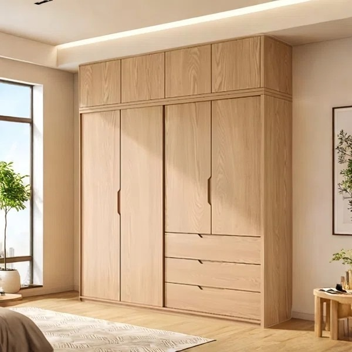

#### Output: Interior Organization Reveal

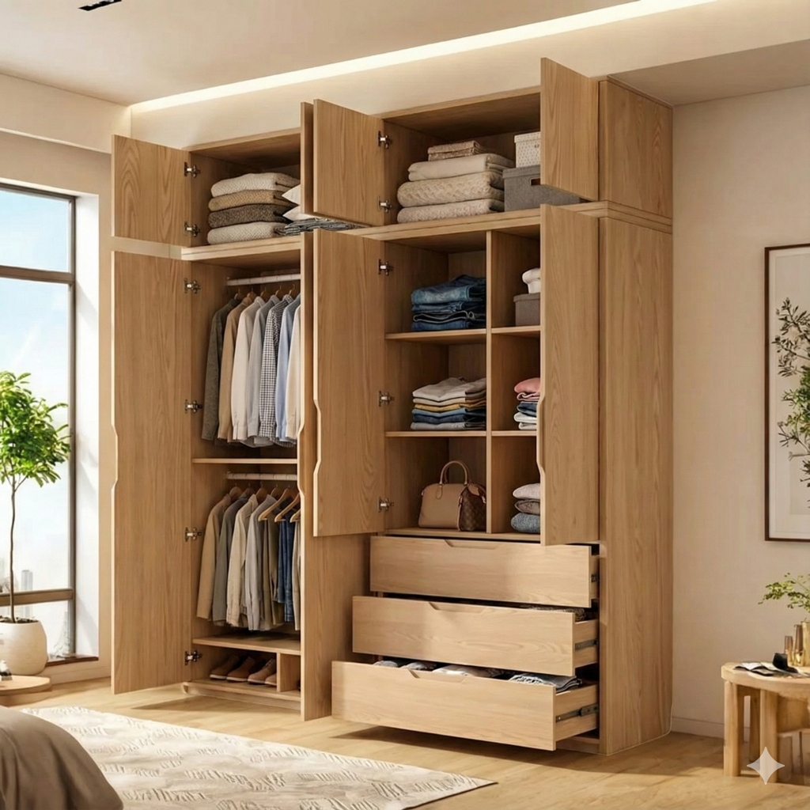

**Prompt:**
```
Transform this wardrobe into an open interior view with the following STRICT rules:

1. STRUCTURAL FIDELITY: Preserve the EXACT number and position of compartments, doors, and drawers as shown in the reference image. Do NOT change, merge, or add any divisions.

2. REVEAL INTERIOR: 
   - Remove all cabinet doors to expose internal storage
   - Pull out all drawers partially to show their contents
   - Keep original proportions and alignments intact

3. INTELLIGENT FILL: Populate the revealed interior with realistic organized items (clothes, linens, accessories) that match the wardrobe's style.

4. CONSISTENCY: Maintain the same camera angle, lighting, room environment, and material finish as the original image.
```

#### Phase 2: Iterative Refinement

#### Output: Modified Layout (Upper Right Changed to Hanging Rail)

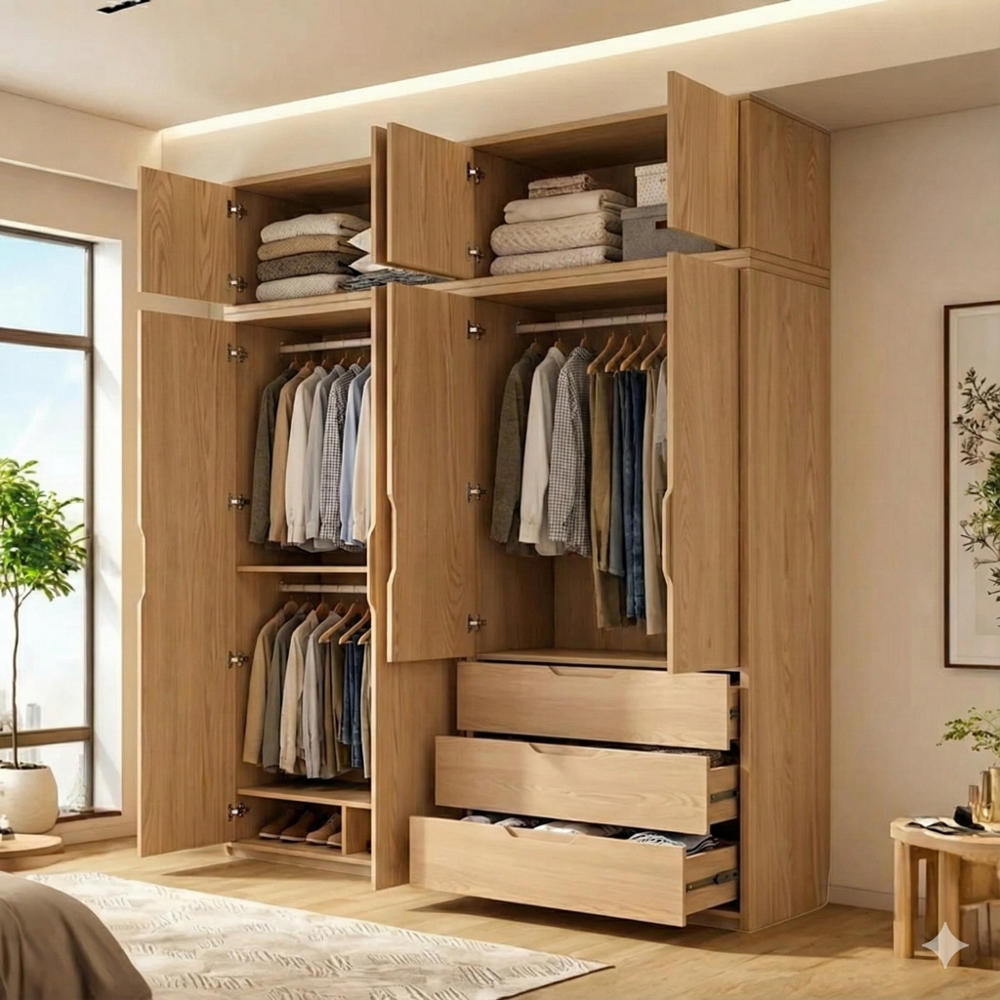

**Prompt (Based on Output 1):**
```
Change the upper right cabinet to a hanging rail style, keep the lower right cabinet as drawers unchanged.
```

#### 💡 Tips

**Key Principles for Structure Fidelity:**

| Instruction | Purpose |
|------------|---------|
| `"Preserve the EXACT number"` | Prevent AI from modifying compartment counts |
| `"Do NOT change, merge, or add"` | Explicitly prohibit any structural changes |
| `"Pull out all drawers partially"` | Ensure drawers reveal their contents |
| `"Keep original proportions"` | Maintain proportional consistency for comparison |

**Iterative Refinement Strategy:**
This case demonstrates a **two-phase workflow**:
1. **Phase 1**: Generate the initial interior reveal with strict structural fidelity
2. **Phase 2**: Apply targeted modifications using simple, precise instructions

[↑ Back to Top](#table-of-contents)

---

### 3.3 Elevation to Render
Transform 2D technical elevation drawings into photorealistic material visualizations.

**Two Methods Provided:**
1.  **Universal Template**: For simple, standard cases.
2.  **Meta-Prompt Generator**: For complex, annotated drawings. Let AI read the CAD annotations and write the rendering prompt for you.

#### Input
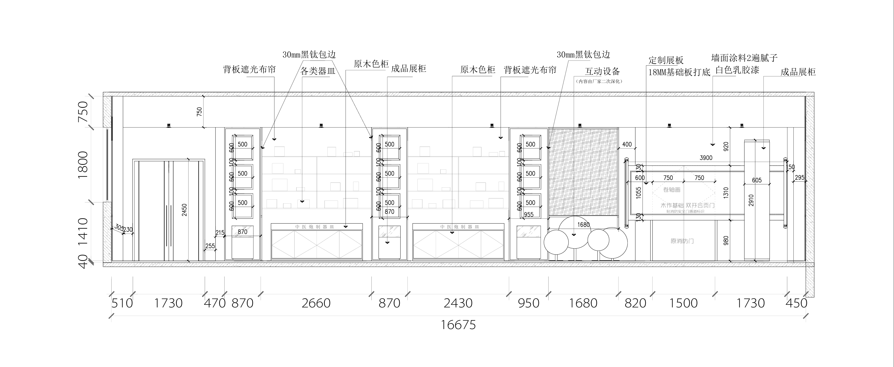

#### Outputs
**1. Universal Template Result**
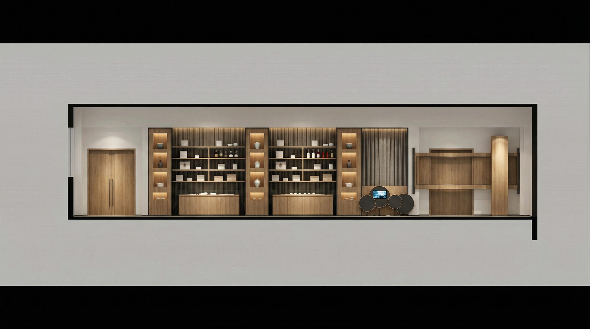

**2. Meta-Prompt Result**
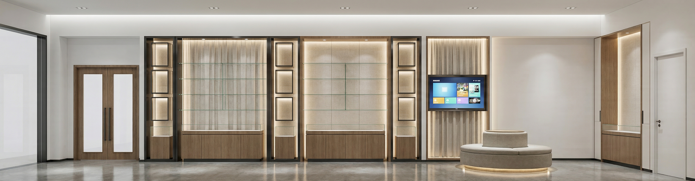
*Generated via Meta-Prompt method*

---

#### Method 1: Universal Template (Strict Geometry)
*Fill in the blanks manually. Best for simple cases.*

**Prompt:**
```markdown
⭐ TEXTURE MAPPING MODE ACTIVATED.
TASK: Apply VIBRANT, PHOTOREALISTIC MATERIALS directly onto this 2D CAD geometry.

⚠️ GEOMETRY LOCK (DO NOT CHANGE):
1.  **ASPECT RATIO**: Output MUST EXACTLY match the input's ultra-wide ratio. Do NOT crop.
2.  **ORTHOGRAPHIC VIEW**: Render as a flat frontal elevation. Zero perspective distortion.
3.  **TRACE LINES**: Every line in the input corresponds to a material change or gap.

🧠 INTELLIGENT SYMBOL READING:
-   **Plinth Logic**: If unit has recessed plinth -> Identify as **CABINET**.
-   **Grounding Logic**: If vertical lines extend to floor -> Identify as **DOOR/PASSAGE**.
-   **Double Lines**: Render as metal frames or shadow gaps.
-   **Text Removal**: Remove text labels and fill with background material.

⚠️ CONTENT FREEZE (ANTI-HALLUCINATION):
-   **NO new windows** (unless explicitly labeled).
-   **NO new furniture** (chairs, benches).
-   **NO new plants** or decor.

🎨 VISUAL STYLE (RICH CONTRAST):
-   **Color Palette**: [Insert Colors]
-   **Lighting**: Commercial display lighting. EMPHASIZE highlights on glass and deep shadows in gaps. Avoid flat/grey lighting.
-   **Definition**: Sharp edges, high material definition.

VERIFICATION:
-   Is the image SUPER WIDE (like the input)?
-   Is the wood color RICH (not grey clay)?
-   Are the doors correctly identified (no kickplate)?
```

---

#### Method 2: Meta-Prompt Generator (Recommended)
*Let AI write the prompt for you. Send your CAD + this Meta-Prompt to an LLM.*

**Meta-Prompt:**
```markdown
# Role
Act as an expert Architectural Visualization Prompt Engineer.

# Task
Analyze the uploaded 2D CAD elevation drawing and write a precise PROMPT for an AI Image Generator to convert this line drawing into a photorealistic render.

# Analysis Rules (CRITICAL)
1. **DECISIVE MATERIAL MAPPING**: 
   - OCR the text labels. **Translate** any non-English tags to English rendering terms.
   - ⚠️ **NO AMBIGUITY**: Do NOT write "Wood or Metal". You MUST infer a specific material based on context.
   - If a material is unknown, default to "Matte White Paint" or "Light Oak".

2. **ASPECT RATIO CHECK**: 
   - Estimate the aspect ratio. If wide (> 16:9), MUST include: "CRITICAL: STRICTLY preserve original wide aspect ratio. DO NOT CROP."

3. **TEXT REMOVAL**: 
   - Mandatory instruction: "REMOVE ALL TEXT labels, dimensions, and leader lines."

# Output Format
Output ONLY the prompt code block below:

[PROMPT START]
Transform this [Adjective] [Space Type] elevation into a photorealistic render.

CRITICAL CONTROLS:
- ASPECT RATIO: [Insert Aspect Ratio Instruction]
- TEXT REMOVAL: READ annotations for context, but REMOVE ALL TEXT and lines.

MATERIAL MAPPING (Specific & Decisive):
- [Object Name] -> [Specific Material, Color, and Finish]
- [Object Name] -> [Specific Material]

LIGHTING & ATMOSPHERE:
- [Define Lighting]: Default to "High-end Boutique Lighting" with dramatic contrast unless "Office" is clearly indicated.
- Avoid "flat" or "even" lighting. Ask for "Depth", "Soft Shadows", and "Highlights".

STRICT FIDELITY:
- Follow geometric layout exactly.
[PROMPT END]
```


## 🎨 Material & Styling
*Materials & Styling*

**Cases in this stage:**  
[4.1 Realistic Material Replacement](#41-realistic-material-replacement) • [4.2 Style Transfer](#42-style-transfer) • [4.3 Furniture Replacement](#43-furniture-replacement) • [4.4 Declutter / Empty Room](#44-declutter--empty-room) • [4.5 Auto-Furnish Empty Room](#45-auto-furnish-empty-room)

### 4.1 Realistic Material Replacement

#### Input


*Input 1: Material Sample*


*Input 2: Target Scene*

#### Output


*Output: Material Replaced*

**Prompt:**
```
Using the first uploaded image as the source material sample and the second uploaded image as the target scene, replace the [specify element: flooring/wall tiles/wall paint/cabinet surfaces/countertops/etc.] in the target scene with the material pattern and texture shown in the source sample. Apply the source material while maintaining the target scene's existing perspective distortion, lighting conditions, shadows, reflections, and surface geometry. Preserve all other elements in the target scene completely unchanged, including furniture placement, spatial configuration, architectural features, and any elements not specifically designated for material replacement. Ensure the replaced material responds naturally to the scene's lighting environment and integrates seamlessly with surrounding surfaces.
```

#### 💡 Tips

### Instructions (Translation Notes)
**Upload Order:**

1.  **First Image:** Material sample photo (flooring pattern, tile texture, paint swatch, cabinet finish, etc.)
2.  **Second Image:** Real-world scene photo where the material needs to be replaced

**Parameter Instructions:**
Fill in the specific element to be replaced in the `[specify element]` placeholder in the prompt:

*   `flooring`
*   `wall tiles`
*   `wall paint/wall surface`
*   `cabinet surfaces/cabinet doors`
*   `countertops`
*   `ceiling finish`
*   `furniture upholstery`

**Example Applications:**
*   **To replace flooring:**
    "...replace the flooring in the target scene..."
*   **To replace cabinet doors:**
    "...replace the cabinet doors in the target scene..."
*   **To replace multiple elements of the same type (e.g., all walls):**
    "...replace all wall surfaces in the target scene..."

[↑ Back to Top](#table-of-contents)

---

### 4.2 Style Transfer

#### Input


*Input 1: Style Reference*


*Input 2: Target Scene*

#### Output


*Output: Style Transferred*

**Prompt:**
```
Using the first uploaded image as the style reference and the second uploaded image as the target spatial scene, transfer the visual style characteristics from the reference to the target scene. Apply the reference's aesthetic qualities including color palette, tonal relationships, material treatment approach, lighting mood, textural rendering style, and decorative vocabulary to the target scene while preserving the target scene's spatial configuration, architectural structure, furniture layout, and functional organization. Maintain the target scene's perspective, proportions, and spatial relationships exactly as shown. The result should express the target space reinterpreted through the visual language and aesthetic sensibility of the style reference.
```

#### 💡 Tips

### Instructions (Translation Notes)
**Upload Order:**

1.  **First Image:** Style Reference (any image with a clear visual style: interior photo, artwork, illustration, photography, etc.)
2.  **Second Image:** Target Spatial Scene (photo of the real space or model to be restyled)

**Applicable Scenarios:**
This prompt template works with various style sources:
*   **Interior Design Style References:**
    *   Interior photos of specific design genres (e.g., Wabi-sabi, Nordic Minimalist, Industrial)
    *   Renderings from other projects
    *   Photos of high-end hotels or commercial spaces
*   **Artistic Style References:**
    *   Paintings (Impressionism, Expressionism, Abstract, etc.)
    *   Illustration styles
    *   Photography tone and mood
    *   Graphic design or visual art works

**Technical Principles:**
This prompt transfers the following style characteristics:
*   **Color System:** Hue, saturation, contrast relationships
*   **Material Treatment:** Expression of surface textures
*   **Lighting Mood:** Emotional quality and character of lighting
*   **Decorative Vocabulary:** Expression of design elements
*   **Overall Aesthetic:** Unity of visual language

While keeping these elements unchanged:
*   3D structure and layout of the space
*   Position and configuration of furniture
*   Architectural features and spatial proportions
*   Perspective and viewpoint

**Difference from Material Replacement:**
*   **Material Replacement:** Precisely replaces the surface material of specific elements (e.g., flooring, walls).
*   **Style Transfer:** Changes the visual aesthetic and expression of the entire scene; it is a global stylistic reinterpretation.

**Note:**
This is a holistic style transfer tool. If you only need to change the material of specific elements, please use the previous "Material Replacement" prompt template. Style transfer affects the overall visual expression of the scene, not just individual material swaps.

[↑ Back to Top](#table-of-contents)

---

### 4.3 Furniture Replacement

#### Input

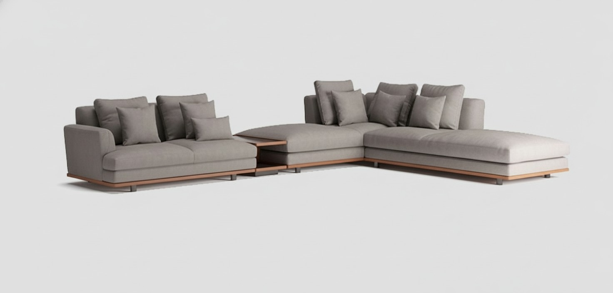
*Input 1: Reference Furniture*


*Input 2: Target Scene*

#### Output

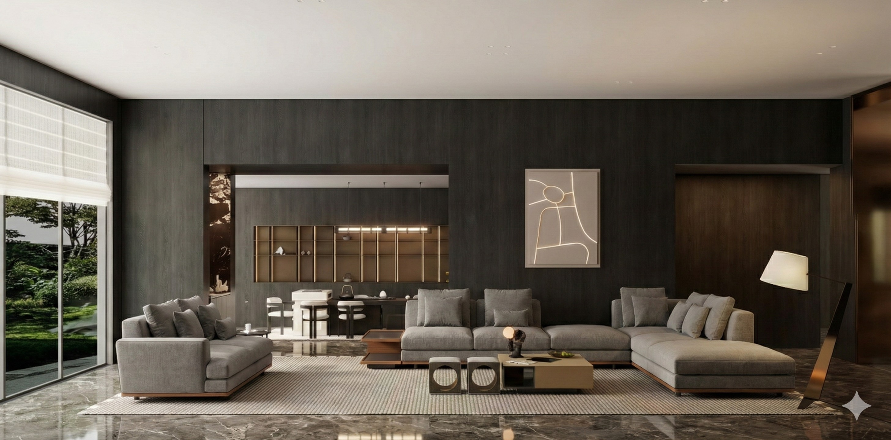
*Output: Furniture Replaced*

**Prompt:**
```
Using the first uploaded image as the furniture reference and the second uploaded image as the target interior scene, replace the [specify furniture item: sofa/coffee table/bed/dining table/chairs/cabinet/side table/etc.] in the target scene with the furniture shown in the reference image. Position the reference furniture in the same spatial location as the original furniture, matching the perspective angle and viewing position of the target scene. Scale the reference furniture appropriately to fit the spatial context and maintain proportional relationships with surrounding elements. Apply the target scene's existing lighting conditions, shadows, and reflections to the newly placed furniture to ensure natural integration. Preserve all other elements in the target scene completely unchanged, including walls, flooring, other furniture pieces, decorative items, architectural features, and spatial configuration.
```

#### 💡 Tips

### Instructions (Translation Notes)
**Upload Order:**

1.  **First Image:** Furniture product photo (product shot, real photo, or furniture in another scene)
2.  **Second Image:** Interior scene photo where the furniture needs to be replaced

**Parameter Instructions:**
Fill in the specific furniture type to be replaced in the `[specify furniture item]` placeholder in the prompt:

**Living Room Furniture:**
*   `sofa`
*   `coffee table`
*   `side table/end table`
*   `armchair`
*   `TV stand/media console`
*   `bookshelf/shelving unit`

**Dining Room Furniture:**
*   `dining table`
*   `dining chairs`
*   `sideboard/buffet`

**Bedroom Furniture:**
*   `bed/bed frame`
*   `nightstand/bedside table`
*   `dresser`
*   `wardrobe`

**Other Furniture:**
*   `desk`
*   `office chair`
*   `console table`
*   `ottoman/pouf`
*   `bench`

**Example Applications:**
*   **To replace a sofa:**
    "...replace the sofa in the target scene..."
*   **To replace a coffee table:**
    "...replace the coffee table in the target scene..."
*   **To replace a set of dining chairs:**
    "...replace the dining chairs in the target scene..."

[↑ Back to Top](#table-of-contents)

---

### 4.4 Declutter / Empty Room

#### Input

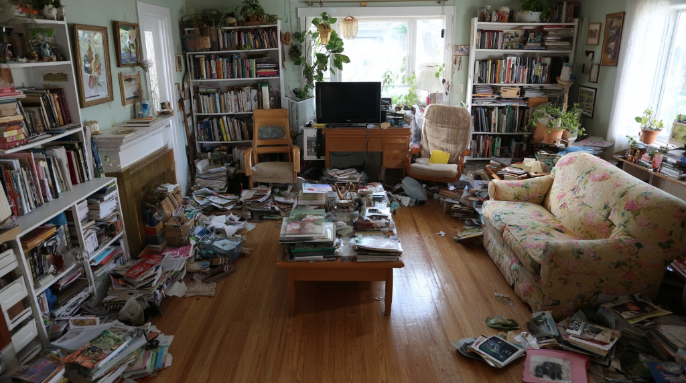

#### Output


**Prompt:**
```
Real estate photo editing. Remove all furniture, boxes, and clutter from this room. Show the clean, empty space with bare walls and flooring. Auto-fill the floor texture where furniture was removed.
```

#### 💡 Tips

- This prompt is ideal for real estate listings where you want to show the potential of a cluttered space
- Works best with good lighting conditions in the original photo
- The AI will attempt to preserve architectural features (windows, doors, fireplaces)
- For best results, ensure the original photo has visible floor and wall areas to reference

> ⚠️ **Known Limitation**: In this example, the AI incorrectly filled in an opening on the left wall. Always review AI results for structural accuracy.

[↑ Back to Top](#table-of-contents)

---

### 4.5 Auto-Furnish Empty Room

> Transform an empty room into a fully furnished, styled interior. One input photo, endless design possibilities.

#### Input

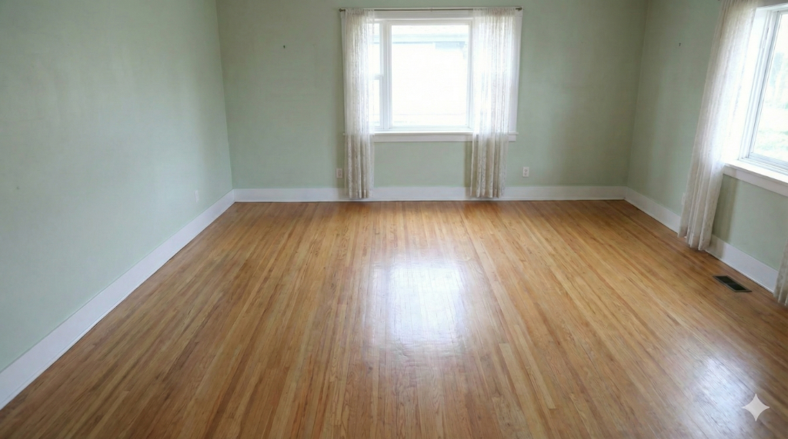
*Input: Empty room photo*

#### Output Examples

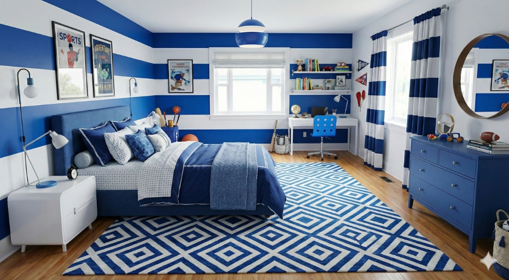
*Example 1: 10-Year-Old Boy's Bedroom - Blue and White, Vibrant and Playful*

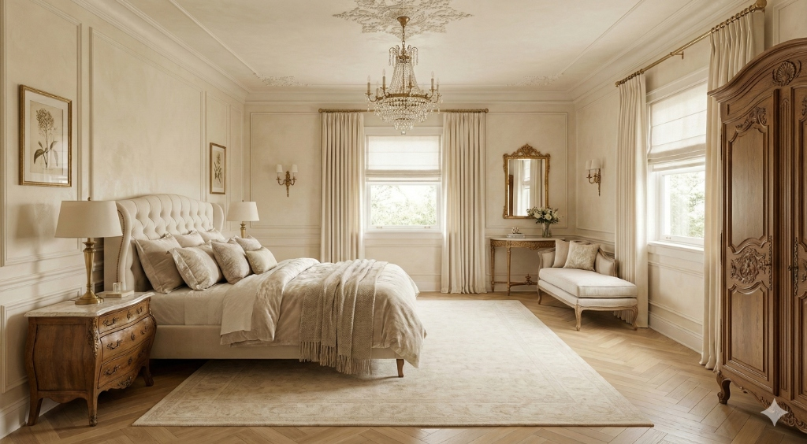
*Example 2: French Light Luxury Master Bedroom - Cream Palette*

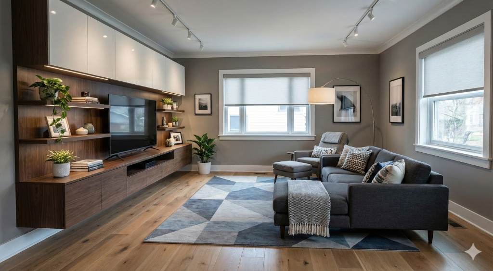
*Example 3: Modern Living Room with Full-Wall TV Cabinet*

**Prompt Template:**
```
Redesign this room according to my specified style. Act as a professional interior designer and completely transform this space as if starting from an empty shell.

CRITICAL - Maintain from the uploaded photo:
- Exact same camera angle and perspective
- Same viewing position and field of view
- Same room proportions as shown

You may modify everything else:
- All furniture
- Wall colors/finishes/treatments
- Ceiling design and treatments
- Flooring materials and colors
- Window treatments (curtains, blinds)
- Lighting fixtures
- Built-in features (shelving, fireplace surround, cabinetry)
- All decorative elements

Structural changes NOT allowed:
- Do not add, remove, or relocate windows
- Do not add, remove, or relocate doors
- Do not modify wall positions

Apply professional design principles. Create a magazine-quality result.

The room purpose and style I want: [Specify room type, color palette, and design style]
```

#### 💡 Tips

**How to Write Effective Customization:**

Structure your request with:
1. **Room Type**: bedroom, living room, home office, dining room
2. **Color Palette**: specific colors (blue and white, cream, earth tones)
3. **Design Style**: modern, Scandinavian, French luxury, industrial
4. **Special Features** (optional): TV wall, study area, reading nook

**Example Customizations:**
- `10-Year-Old Boy's Bedroom: Blue and White Color Scheme, Vibrant and Playful Style`
- `Cozy master bedroom, cream color palette, French-inspired light luxury style`
- `Modern-style apartment living room featuring a TV console with full-wall cabinets`

[↑ Back to Top](#table-of-contents)

---

## 🖼️ Scene Rendering
*Final Rendering & Visualization*

**Cases in this stage:**  
[5.1 Clay Model to Photorealistic Render](#51-clay-model-to-photorealistic-render) • [5.2 Lighting Enhancement](#52-lighting-enhancement) • [5.3 Tone Unification](#53-tone-unification) • [5.4 Day to Night](#54-day-to-night-transformation)

### 5.1 Clay Model to Photorealistic Render

Transform clay/white 3D model renders into photorealistic visualizations with intelligent material assignment and style control. Two methods available: **Text-Specified Style** or **Image Reference Style**.

---

#### Method A: Text-Specified Style

*Use text descriptions to define the target style and materials.*

**Input:**

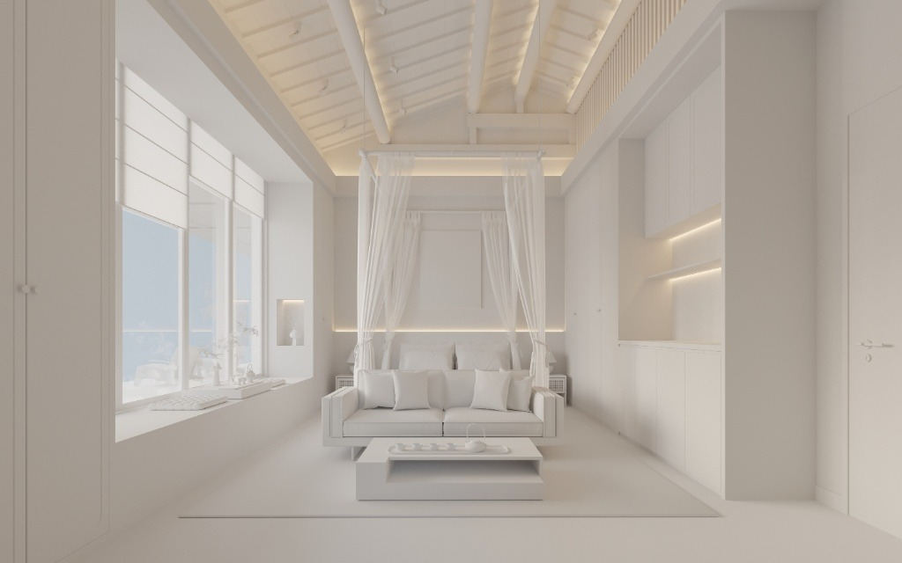
*Clay/White Model Render*

**Output:**

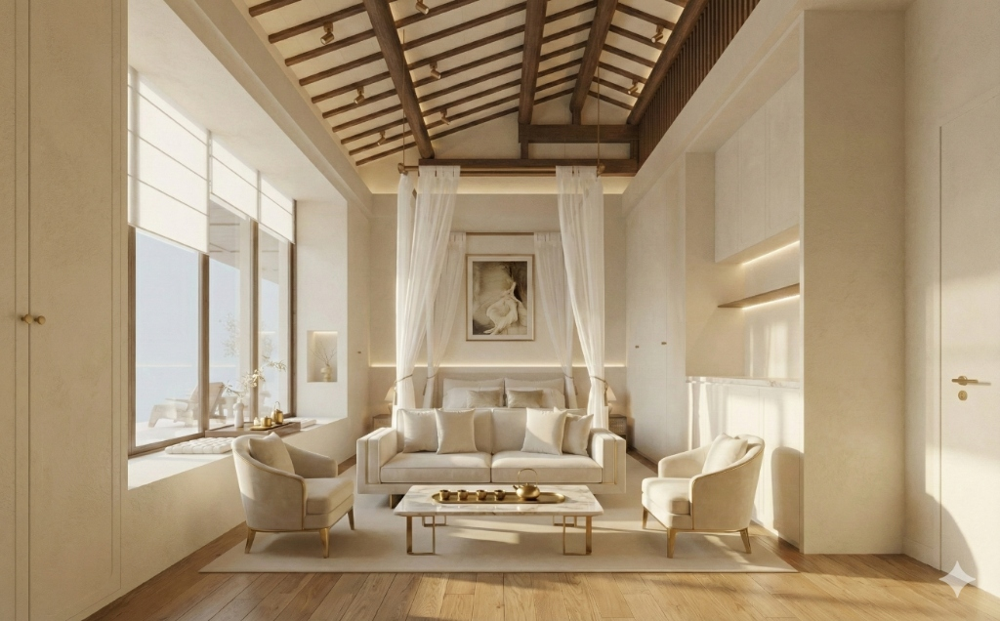
*Cream Luxury Style*

**Prompt:**
```
Transform this clay/white model render into a photorealistic architectural visualization with the following STRICT analysis rules:

1. GEOMETRY PRESERVATION: Analyze and preserve the EXACT 3D geometry, perspective, lighting direction, and spatial proportions from the input model. Do NOT modify any architectural elements, furniture shapes, or spatial relationships.

2. INTELLIGENT MATERIAL ASSIGNMENT: Based on the visible forms and context, intelligently assign appropriate materials:
   - Wall surfaces → [specify: e.g., white textured paint / exposed concrete / wood paneling]
   - Flooring → [specify: e.g., light oak hardwood / marble tile / polished concrete]
   - Ceiling → [specify: e.g., white matte / wood beams / recessed panels]
   - Furniture → [specify: e.g., natural fabrics / leather / mixed materials]
   - Fixtures → [specify: e.g., brushed brass / matte black / chrome]

3. DESIGN STYLE: [specify style: e.g., Modern Minimalist / Scandinavian / Japanese Wabi-Sabi / Industrial Loft / French Luxury]

4. LIGHTING & ATMOSPHERE: Apply photorealistic lighting that enhances the specified style.

5. OUTPUT: High-quality photorealistic interior render, maintaining the exact camera angle and composition.
```

**Common Style Keywords:**

| Style | Description |
|-------|-------------|
| `Modern Minimalist` | Clean lines, neutral palette |
| `Scandinavian` | Warm wood tones, hygge atmosphere |
| `Japanese Wabi-Sabi` | Raw textures, muted earth tones |
| `Industrial Loft` | Exposed brick, metal, concrete |
| `French Light Luxury` | Cream palette, elegant details |

---

#### Method B: Image Reference Style

*Use an existing interior photo as style reference. Upload order: 1st = Style Reference, 2nd = Clay Model.*

**Input 1 - Style Reference:**

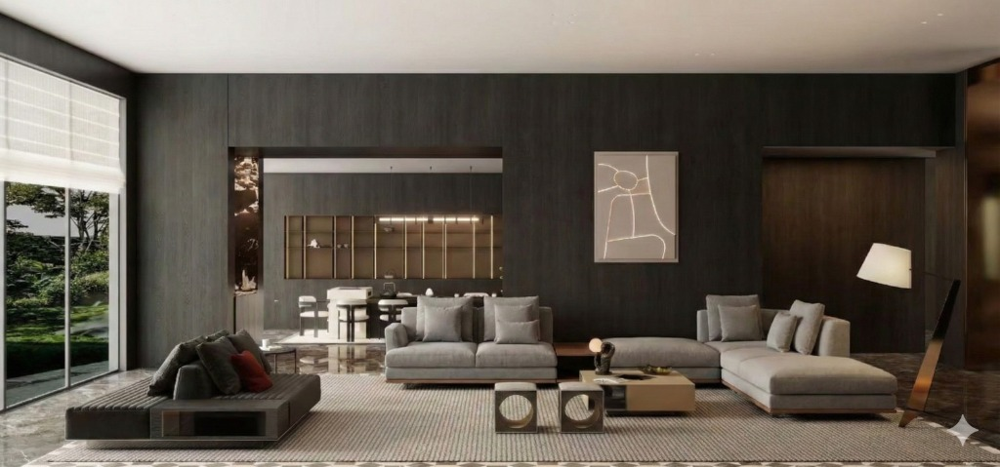
*Style/Material Reference Image*

**Input 2 - Clay Model:**


*Clay/White Model Render (same as Method A)*

**Output:**

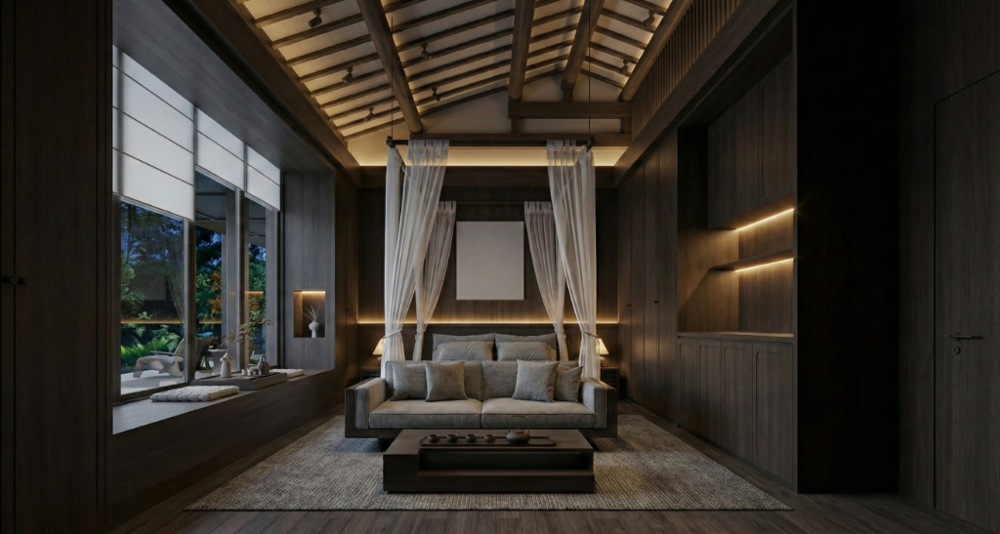
*Dark Wood Japanese Style (Generated from Reference)*

**Prompt:**
```
Using the FIRST uploaded image as the style/material reference and the SECOND uploaded image as the clay/white model source:

1. GEOMETRY SOURCE: Extract ALL 3D geometry, spatial layout, furniture placement, camera angle, and perspective EXCLUSIVELY from the clay model (second image). Do NOT modify any shapes or positions.

2. STYLE TRANSFER: Apply the visual style, material palette, color scheme, lighting atmosphere, and design language from the reference image (first image) to the clay model geometry.

3. MATERIAL MAPPING: Intelligently map materials from the style reference to corresponding surfaces in the clay model.

4. PHOTOREALISTIC OUTPUT: Generate a final render that combines the EXACT spatial structure of the clay model with the aesthetic quality of the style reference.
```

[↑ Back to Top](#table-of-contents)

---

### 5.2 Lighting Enhancement

Enhance lighting quality in interior renderings: add light source glow, recover shadow details, improve light falloff, and boost spatial depth. Two methods available: **Quick Start** (universal) or **Advanced** (meta-prompt for best results).

#### Input

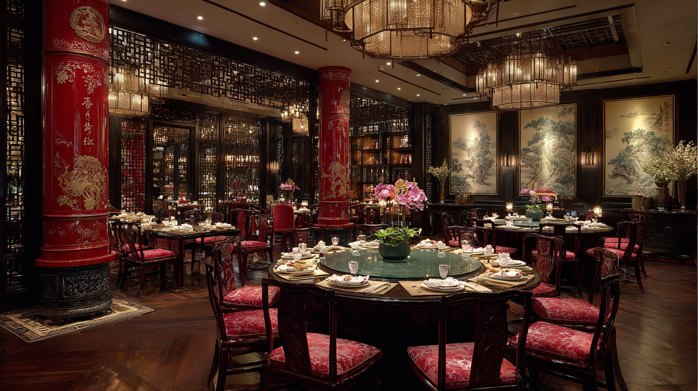
*Original rendering*

#### Output

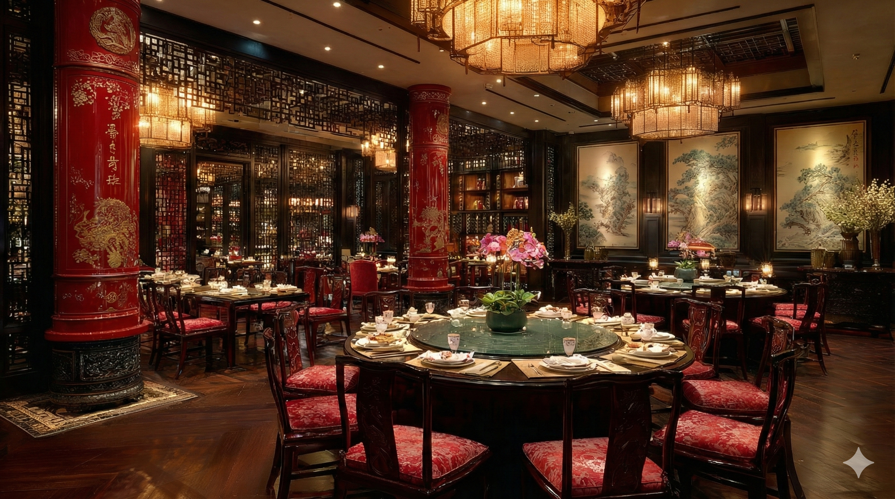
*Enhanced lighting (Universal Prompt)*

---

#### Method A: Quick Start (Universal Prompt)

*Works for any interior rendering without modification.*

**Prompt:**
```
Enhance the lighting quality of this interior rendering while strictly preserving all geometry, furniture, and design elements:

AUTOMATIC LIGHTING ANALYSIS & ENHANCEMENT:
1. Analyze all visible light sources and intensify their glow with natural bloom effects
2. Recover shadow details in dark areas while maintaining depth
3. Apply realistic light falloff - objects closer to lights should be noticeably brighter
4. Add subtle ambient light bounce on ceilings and walls
5. Enhance depth perception - create clear brightness separation between foreground and background

STRICT PRESERVATION:
- Maintain exact geometry, colors, materials, and spatial layout
- Do not add, remove, or modify any objects

OUTPUT: Professional photography-quality lighting that feels natural and atmospheric.
```

---

#### Method B: Advanced (Meta-Prompt)

*Let AI analyze your image first, then generate a custom prompt for optimal results.*

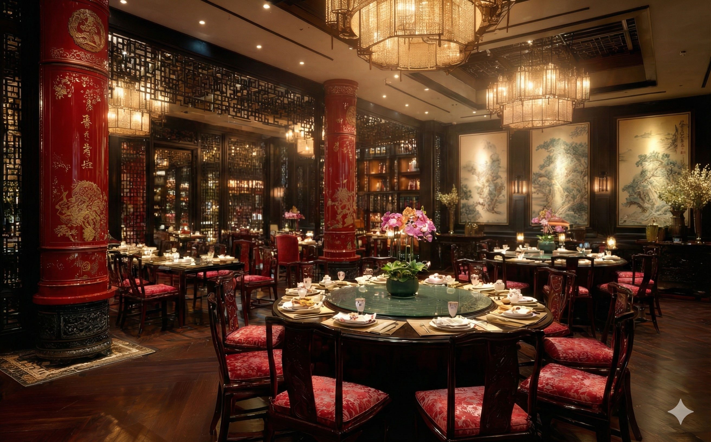
*Best result using meta-prompt approach*

**Step 1:** Use this meta-prompt to generate a custom enhancement prompt:
```
Analyze this interior rendering and identify specific lighting issues that need improvement:

STEP 1 - DIAGNOSTIC ANALYSIS:
List all detected lighting problems:
- Light source glow quality (weak/strong/natural)
- Shadow areas (over-dark/detail-lost/acceptable)
- Light falloff (flat/realistic/over-dramatic)
- Ceiling brightness (too dark/balanced/over-lit)
- Depth separation (flat/moderate/good)
- Any overexposed or underexposed areas

STEP 2 - GENERATE CUSTOM PROMPT:
Based on your analysis, generate a targeted lighting enhancement prompt that:
- Addresses ONLY the specific issues identified
- Prioritizes the most impactful improvements
- Uses precise technical language for AI image generation
- Includes geometry preservation safeguards

OUTPUT FORMAT:
## Lighting Issues Detected:
[Bullet list of specific problems]

## Custom Enhancement Prompt:
[Ready-to-use prompt tailored to this specific image]
```

**Step 2:** Copy the AI-generated custom prompt and use it with your image.

> **💡 Tip**: Method B produces the best results for portfolio/presentation quality images.


[↑ Back to Top](#table-of-contents)

---

### 5.3 Tone Unification
*Post-production 2: Tone Unification and Color Correction*

Fix mixed lighting issues, unify color temperature, and correct white balance while preserving original details. **Three-tier prompt system** adapts to different user needs.

#### Input

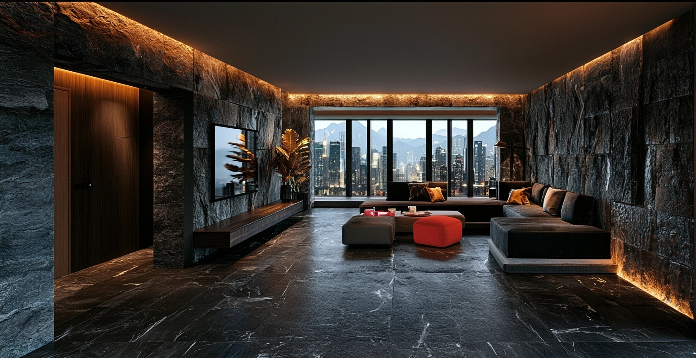
*Input: Mixed lighting (cool window light clashing with warm interior lights)*

#### Output Option A: Quick Fix (Warm Tone)

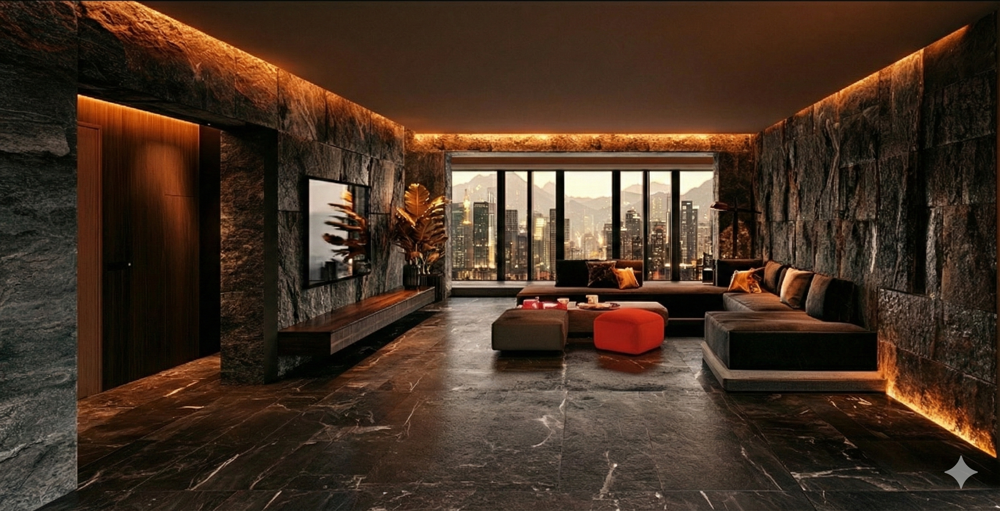
*AI automatically enhanced warm atmosphere while eliminating color conflicts*

#### Output Option B: Meta-Prompt (Neutral Tone)

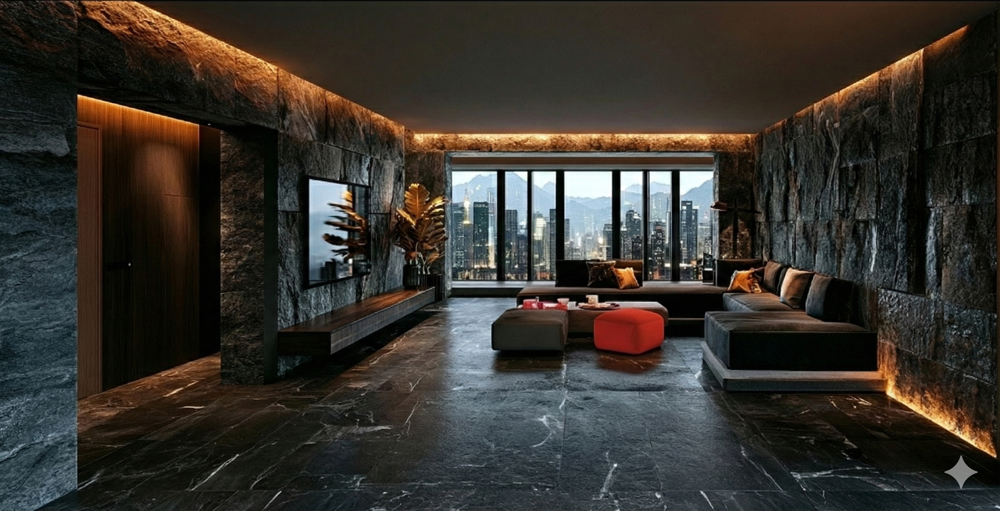
*User-specified 4000K neutral white balance with preserved material colors*

---

#### Level 1: Quick Fix (AI Auto-Determines Best Tone)

Best for: Fast turnaround, letting AI decide the optimal color direction.

```
Use the uploaded image as a strict reference. Keep all furniture, decorations, geometry, and details exactly unchanged.

First, analyze the space type, design style, and intended atmosphere of this render.
Then, identify the specific color temperature issues (such as clashing mixed lighting or localized color casts).

Re-render the image to unify the lighting color temperature while:
- Preserving and enhancing the original design's atmospheric intent (e.g., keep warm tones for cozy residential spaces, cool tones for modern offices)
- Only eliminating discordant color casts and mixed lighting conflicts
- Ensuring the final tone is both unified and harmonious, while elevating the space's design expression

Do not flatten the image into a bland neutral tone. Instead, grade it to the tone that best showcases this space's unique design character.
```

---

#### Level 2: Meta-Prompt (AI Analyzes and Generates Custom Instructions)

Best for: Understanding the color issues before fixing, generating precise correction prompts.

**Step 1:** Use this meta-prompt to analyze your image:

```
You are a professional architectural visualization post-production expert. Analyze the uploaded render to identify specific defects in color temperature and white balance.
Then, write a **modification instruction prompt** based on your analysis.

⚠️ **Critical Rules (for Nano Banana Pro)**:
1. **Instruction-Only Mode**: Write ONLY "what to modify", NO content descriptions.
2. **Light vs. Material Separation**: Distinctly separate "lighting temperature" from "material intrinsic color".
   - ✅ Correct: Neutralize cool **lighting** cast.
   - ❌ Incorrect: Remove blue tints from background (This turns blue furniture gray).
3. **Mandatory Protection Instructions**: You MUST include:
   - "Do not alter the intrinsic color of any furniture, soft furnishings, or materials."
   - "Apply color correction ONLY to the lighting/atmosphere, NOT the objects."
```

**Step 2:** Copy the AI-generated custom prompt and use it with your image.

---

#### Level 3: Manual Fine-Tuning (Specify Kelvin Values)

Best for: Professional colorists who know exactly what color temperature they need.

```
Use the uploaded image as a strict reference. Keep all furniture, decorations, geometry, and details exactly unchanged. Re-render the image to unify the lighting color temperature. Eliminate chaotic mixed lighting and unify the overall tone to [3000K / 4000K / 5000K / 6500K]. Ensure accurate white balance and natural, harmonious colors.
```

| Kelvin | Name | Best For |
|--------|------|----------|
| 2700K-3000K | Warm White | Bedrooms, restaurants, hotels |
| 4000K | Natural White | Offices, showrooms, commercial |
| 5000K-6500K | Cool White | Hospitals, tech spaces, galleries |

> **💡 Tip**: Start with Level 1 (Quick Fix). If unsatisfied, use Level 2 to understand the issues, then fine-tune with Level 3.

[↑ Back to Top](#table-of-contents)

---

### 5.4 Day to Night Transformation
*Post-production 3: Atmospheric Lighting Change*

Transform any daytime rendering (interior or exterior) into a realistic night scene with intelligent lighting activation.

#### Input


#### Output

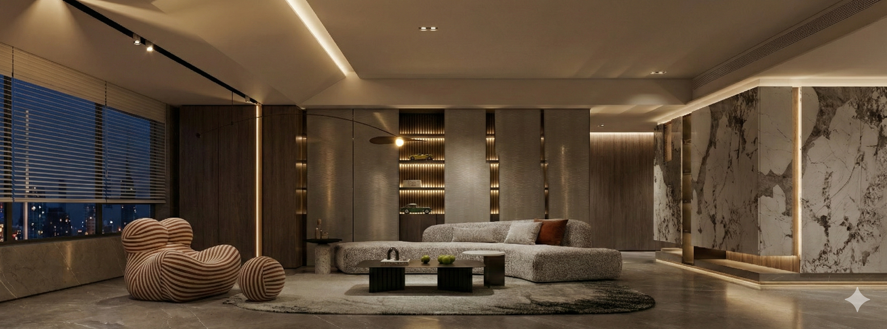

**Prompt:**
```
Transform this daytime rendering into a realistic night scene while strictly preserving all geometry, materials, and design elements:

AUTOMATIC NIGHT TRANSFORMATION:
1. Analyze the scene type (interior/exterior) and intelligently determine appropriate night lighting
2. For windows: Add warm interior glow (if viewing from outside) or cool exterior darkness (if viewing from inside)
3. Add natural artificial lighting effects - activate all visible light fixtures with realistic glow and bloom
4. Transform the sky/background to twilight or night atmosphere
5. Apply realistic light falloff and shadows appropriate for artificial lighting
6. Add subtle reflections on glass and polished surfaces

STRICT PRESERVATION:
- Maintain exact geometry, colors, materials, and spatial layout
- Do not add, remove, or modify any objects
- Preserve the original design intent and atmosphere

OUTPUT: Professional architectural photography-quality night visualization.
```

> **💡 Tip**: This universal prompt works for both interior and exterior scenes. AI automatically detects scene type and applies appropriate lighting.

[↑ Back to Top](#table-of-contents)

---


## ⚙️ Specialized Tasks
*Design Assistance & Documentation*

**Cases in this stage:**  
[6.1 Soft Furnishing Extraction Board](#61-soft-furnishing-extraction-board)

### 6.1 Soft Furnishing Extraction Board

Extract furniture and decorative items from interior renderings into a professional product catalog-style board — perfect for procurement lists and supplier quotations.

#### Input

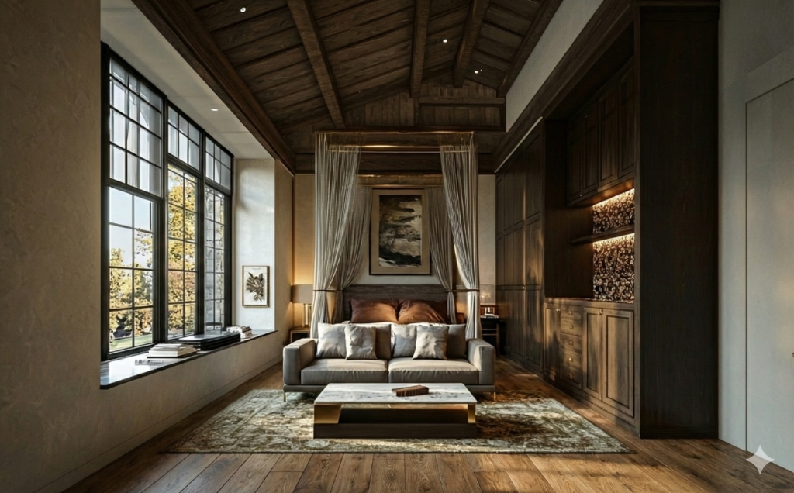

#### Output

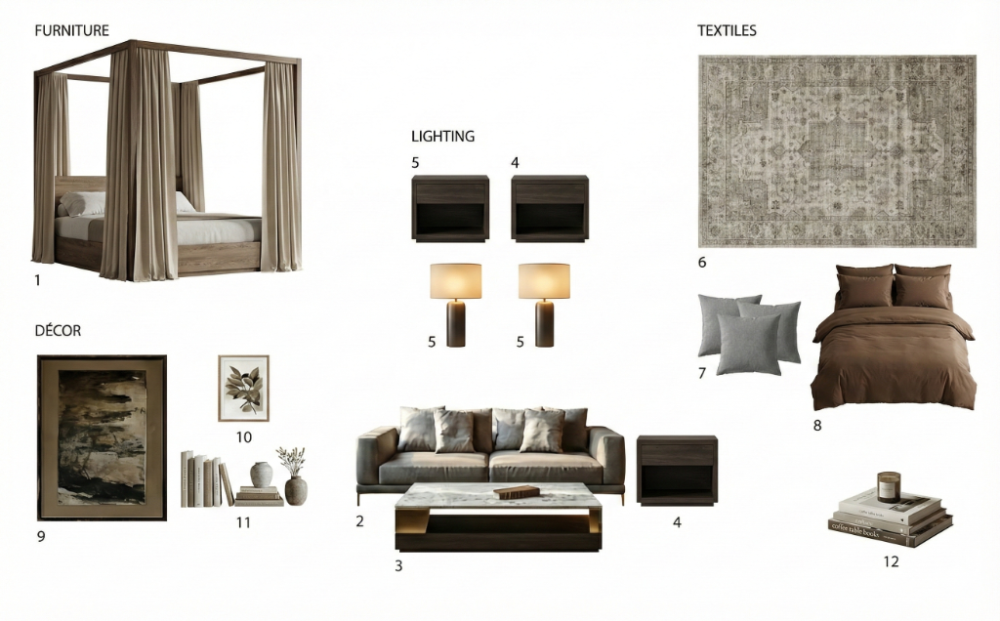

**Prompt:**
```
Extract furniture and decorative items from this interior image.
Create a PREMIUM PRODUCT CATALOG style board.

⚠️ CRITICAL: NO DUPLICATE ITEMS
- Each unique item appears ONLY ONCE
- Exception: paired items (2 matching lamps, 2 nightstands) should both be shown

EXCLUDE:
- Built-in wall cabinets and shelving
- Fixed architectural elements
- Wall panels, flooring, ceiling

LAYOUT STYLE:
- Clean white background
- Elegant grid with generous spacing
- Consistent sizing within categories
- Large items at top, small at bottom

FORMAT:
- Category headers: FURNITURE | LIGHTING | TEXTILES | DÉCOR
- Sequential numbering
- Front-facing view

AESTHETIC: High-end interior design catalog, minimalist, sophisticated.
```

> **💡 Tip**: Generate multiple times and select the best result. Small accessories may be omitted; request separate extraction if needed.

[↑ Back to Top](#table-of-contents)

---


## 📚 Resources

- 📖 [CASE_TEMPLATE.md](./CASE_TEMPLATE.md) - Template for creating new use cases
- 🤝 [CONTRIBUTING.md](./CONTRIBUTING.md) - How to contribute new cases

[↑ Back to Top](#table-of-contents)

---

## Usage Principles

This repository encourages learning, adaptation, and collaboration. Please note:

- Prompts here are **working templates**, not guaranteed solutions
- AI output should always be reviewed by a professional designer
- Modification based on your project context is strongly recommended

📖 **Full details**: See [USAGE.md](./USAGE.md) for complete usage principles and attribution guidelines.

---

## License

This project is licensed under **Creative Commons Attribution 4.0 International (CC BY 4.0)**.

You are free to share and adapt the material for any purpose, even commercially, as long as you give appropriate credit. For full license text, see [LICENSE](./LICENSE) or visit [CC BY 4.0](https://creativecommons.org/licenses/by/4.0/).

## Contact

Maintainer: [qzh3722@gmail.com](mailto:qzh3722@gmail.com)

[↑ Back to Top](#table-of-contents)

---

<div align="center">

**Made with ❤️ for Designers**

Powered by **Gemini 3 Pro Image**

</div>
