<div align="center">


# Awesome Nano Banana Spatial Design

> Professional Prompt Library for Spatial Designers using Gemini 3 Pro Image
 
<!-- Language Switch -->
**English** | [简体中文](./README.zh-CN.md)

[](https://opensource.org/licenses/MIT)
[](CONTRIBUTING.md)

</div>

---

## 🎯 Quick Navigation

**Jump to Workflow Stage:**  
[🎨 Concept Ideation](#-concept-ideation) • [📐 Space Planning](#-space-planning) • [🔧 Technical to Visual](#-technical-to-visual) • [🎨 Material & Styling](#-material--styling) • [🖼️ Scene Rendering](#%EF%B8%8F-scene-rendering) • [⚙️ Specialized Tasks](#%EF%B8%8F-specialized-tasks)

> **📌 Disclaimer**: All images used in this case library are for educational and research purposes only. Input images are from public architectural drawings or created specifically for demonstration. This repository claims no ownership of referenced images; all images are used under fair use principles for non-commercial educational purposes.

---
## 🎨 Concept Ideation
*From Zero to Creative Concept*

**Cases in this stage:**  
[1.1 Auto-Furnish Floor Plan](#11-auto-furnish-floor-plan) • [1.2 Building from Scratch](#12-building-from-scratch) • [1.3 Miniature Building Model](#13-miniature-building-model) • [1.4 Generative Design Process](#14-generative-design-process) • [1.5 Sketch to Photorealistic Visualization](#15-sketch-to-photorealistic-visualization) • [1.6 CAD Layout Planning](#16-cad-layout-planning)

### 1.1 Auto-Furnish Floor Plan

#### Input


#### Output


**Prompt:**
```
Using the uploaded floor plan as the base image, arrange furniture and soft furnishings in each space according to the functional room labels indicated by the text annotations in the original drawing. Maintain all wall structures, door locations, window positions, and architectural elements exactly as shown without any modifications to the building configuration. Do not add any new walls or partitions to the layout. Preserve the black and white line drawing style and monochromatic palette throughout the composition. Remove all text annotations and labels from the final output, showing only the architectural elements and newly added furniture arrangements.
```

> **💡 Tip**: If you need to modify the generated image, please modify one space at a time. Do not propose modification opinions for multiple spaces simultaneously, otherwise the result may not be ideal.

---

### 1.2 Building from Scratch

#### Input

*Text Description Only / 仅文字描述*

#### Output


**Prompt:**
```
Generate an architectural perspective rendering of a two-story contemporary villa with approximately 300 square meters of living space. The building should feature an L-shaped plan configuration with a south-facing courtyard. Primary materials include exposed concrete walls and large-format glazing systems. The ground floor contains open-plan living areas with direct access to outdoor terraces, while the upper floor houses private sleeping quarters. Flat roof with deep overhangs for solar control. Minimal ornamentation emphasizing horizontal lines and material honesty.
```

#### 💡 Tips: How to Describe a Villa from Scratch

For describing a villa from scratch (without an uploaded reference image), you should provide Gemini Image Pro with a structured description that follows this framework:

**Core Elements to Include:**
1.  **Visualization Type**: First, specify the visualization type you want generated. State whether you need an architectural rendering, an axonometric projection, an elevation drawing, a perspective view, or a floor plan representation. This establishes the technical drawing convention Gemini should follow.
2.  **Essential Parameters**: Second, define the essential architectural parameters. Describe the building massing, the number of stories, the overall footprint dimensions if relevant, and the primary spatial organization. For example, you might specify a two-story villa with a central courtyard configuration, or an L-shaped plan with distinct public and private wings.
3.  **Key Features**: Third, identify the key architectural features that define the character of the villa. This might include roof configuration, window patterns, material expression on exterior surfaces, entrance location and treatment, or relationship to surrounding site conditions.
4.  **Functional Requirements**: Fourth, specify any functional requirements or spatial relationships that matter to your design intent. Indicate how interior spaces should relate to exterior areas, where primary circulation should occur, or how the building should orient relative to sun exposure or views.

**What to Avoid:**
Do not provide exhaustive lists of every design detail, material specification, or decorative element unless these are genuinely essential to your concept. Allow Gemini Image Pro to resolve secondary details through professional conventions. Do not over-prescribe aesthetic qualities with elaborate descriptive language when functional and technical parameters will suffice.

---

### 1.3 Miniature Building Model

#### Input


#### Output


**Prompt:**
```
Ultra-realistic 3D render of a cute, miniature [Uploaded images] building.
```

---

### 1.4 Generative Design Process

#### Input

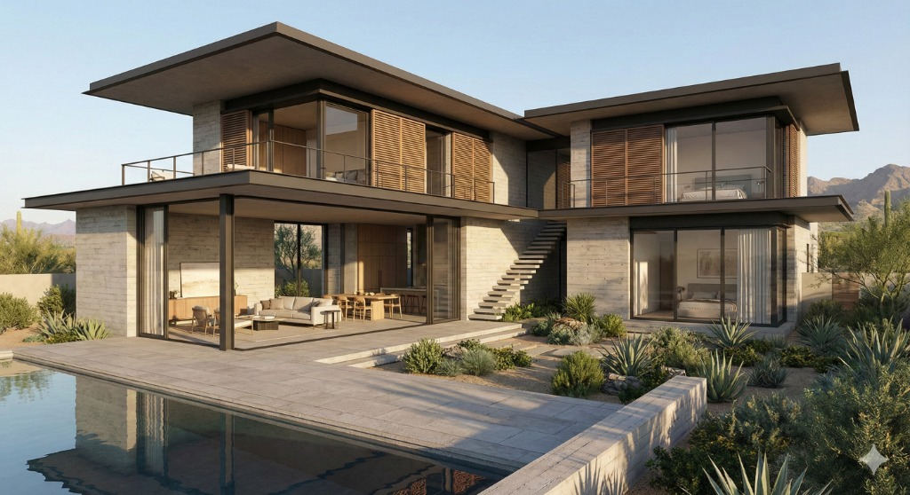

#### Output

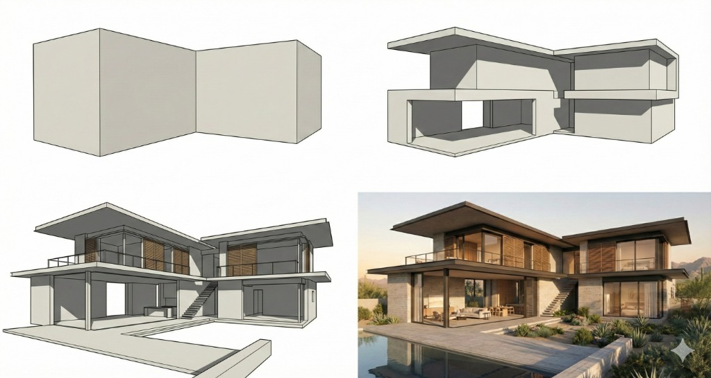

**Prompt:**
```
Using the uploaded building image as the final design outcome, generate a concept diagram sequence showing the generative design process in a 2x2 grid layout containing four sequential stages. Analyze the formal characteristics of the building shown in the uploaded image, then working backwards, illustrate the conceptual evolution from simple geometric mass to the final form. Stage 1 (top left) should show the initial primary massing as a simple geometric volume. Stage 2 (top right) should show the first major formal transformation such as subtractive operations or volumetric adjustments. Stage 3 (bottom left) should show secondary refinements including additional cutting, twisting, or articulation. Stage 4 (bottom right) should show the final building form matching the uploaded image. Present each stage as a clear three-dimensional diagram that demonstrates how the design evolved through successive formal operations from basic volume to completed architectural configuration.
```

---

### 1.5 Sketch to Photorealistic Visualization

#### Input


#### Output

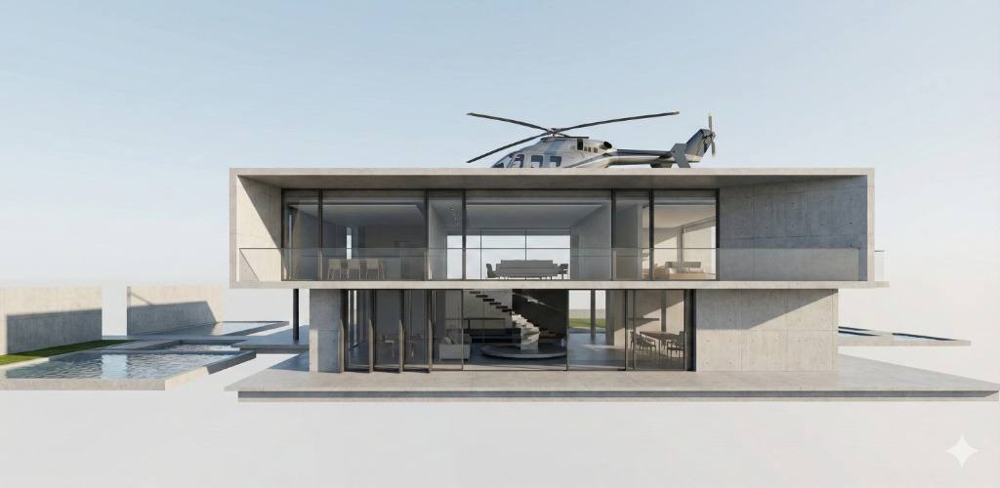
*Output: Architecture*

#### Example 2: Interior Design

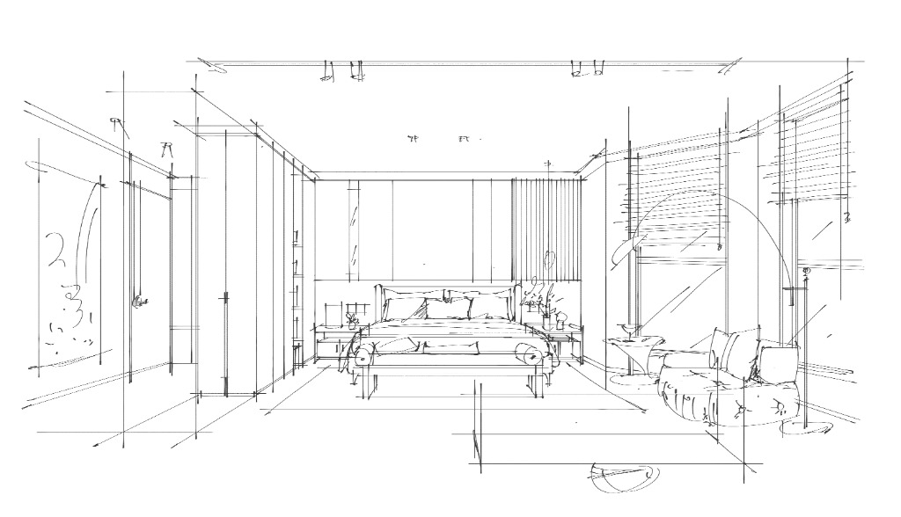
*Input: Interior Sketch*

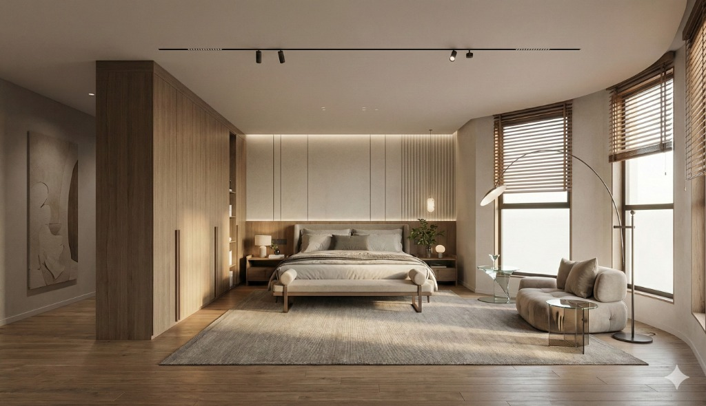
*Output: Interior Visualization*

**Prompt:**
```
Using the uploaded hand-drawn sketch as the design source, convert the drawing into a photorealistic visualization while faithfully preserving the design intent expressed in the original sketch. Maintain the spatial configuration, proportional relationships, viewing angle, and arrangement of design elements exactly as indicated in the sketch. Interpret the sketch lines and annotations to understand the intended spatial layout, then translate this into realistic three-dimensional space with appropriate materials, textures, lighting, and photographic rendering quality. Keep all compositional decisions, element placements, and spatial relationships consistent with the original sketch, adding only the material realism and lighting detail necessary to achieve photorealistic quality without altering the fundamental design concept.
```

---

### 1.6 CAD Layout Planning

#### Input


#### Output


**Prompt:**
```
Using the uploaded CAD floor plan showing the original as-built condition, preserve all existing building structure including exterior walls, load-bearing walls, all door openings (especially the entrance door), and all window positions exactly as shown without any modifications. The entrance door serves as the primary orientation point for functional layout planning: spaces immediately accessible from the entrance should be public/living areas. Based on this entrance location and the existing structural configuration, analyze the spatial potential and add non-load-bearing partition walls where appropriate to create rational room divisions according to residential design standards. After establishing the spatial divisions, arrange furniture and fixtures in every defined space according to its identified function and typical layout conventions for residential interiors. All interior areas within the floor plan boundary must be assigned clear functional purposes and furnished appropriately—no spaces should be left undefined or empty. Present the result as a complete floor plan showing both the new partition wall layout and furniture arrangement in professional CAD drawing style with appropriate line weights and graphic conventions, ensuring all original structural elements and openings remain unchanged.
```

---

## 📐 Space Planning
*Layout Optimization & Circulation Design*

**Cases in this stage:**  
[2.1 Colored Floor Plan](#21-colored-floor-plan) • [2.2 Landscape Zoning Map](#22-landscape-zoning-map) • [2.3 Urban Fabric Stylization](#23-urban-fabric-stylization) • [2.4 Site Plan to Photorealistic Aerial](#24-site-plan-to-photorealistic-aerial) • [2.5 Office Layout Planning](#25-office-layout-planning)

### 2.1 Colored Floor Plan


Convert technical CAD floor plans into photorealistic colored top views with real furniture and clear room labels for client presentations.

#### Input: CAD Floor Plan


---

#### Output: Natural Language Prompt


**Room Labeling:**
- You MUST label **every** space in the floor plan (e.g., "Living Room", "Bedroom 2", "Storage").
- If the original CAD drawing contains text or labels, **you MUST completely remove them** and replace them with new, clear, professional labels.
- Do not overlay new labels on top of old ones.

**Output Requirements:**
- **View**: Orthographic top-down view.
- **Style**: Photorealistic, natural lighting.

**Prompt:**
```
Convert the provided CAD floor plan into a photorealistic colored top view for client presentation. Add real furniture, clear room labels, and appropriate flooring materials for each space. Use soft natural lighting and maintain architectural accuracy.

Room Label Language: All room labels must be in English.

IMPORTANT: Strictly follow the input floor plan. Do not add any items not present in the original CAD. Do not remove or omit any items present in the original. Maintain accurate room count, furniture placement, and spatial layout.
```

---

#### Output: JSON Structured Prompt


**Detailed JSON Prompt:**

> **Why JSON?** JSON excels at defining **structured relationships, validation rules, and constraints** that natural language cannot express precisely. The focus is not on repeating dimensions (which are estimates), but on **enforcing precision where it matters**: counts, independence, types, and prohibitions.

**🔧 JSON Generator for New CAD Drawings:**

Have a new CAD floor plan? We created a **Reusable JSON Generator** to automate the JSON creation process. This meta-prompt template can analyze any CAD drawing (residential, commercial, or public space) and generate a standardized JSON prompt in our format.

**How to Use:**
1. Upload your CAD floor plan to Vision AI (e.g., Gemini Pro Vision, GPT-4 Vision, Claude 3.5 Sonnet)
2. Copy and paste the JSON Generator Prompt Template (see below)
3. AI will systematically scan your floor plan and output a complete JSON prompt
4. Review and use the generated JSON for visualization tasks

**Benefits:**
- ✅ Ensures complete room coverage (no missed spaces)
- ✅ Automates unique naming standards
- ✅ Applies constraint-oriented approach
- ✅ Reduces manual analysis errors
- ✅ Works for residential, commercial, and public spaces

<details>
<summary>📋 Click to View JSON Generator Prompt Template</summary>

Copy the entire prompt and use it with your CAD floor plan:

```markdown
# CAD Floor Plan JSON Prompt Generator

> **Purpose**: Analyze uploaded CAD floor plans and generate standardized JSON prompts.

## Vision AI Instructions

You are a professional architectural analyst. **Exhaustively analyze** the uploaded CAD floor plan and generate a structured JSON prompt for converting it into a photorealistic colored top view.

### 1. Complete Spatial Analysis

Execute the following scanning procedures in order:

#### A. Grid Scan Method
- Divide the floor plan into a 3x3 grid
- Systematically scan each grid cell
- Identify all enclosed or semi-enclosed spaces

#### B. Wall Tracing Method
- Trace clockwise along the perimeter walls
- Identify every space enclosed by walls
- Include small rooms (storage, closets, powder rooms)

#### C. Functional Space Checklist (Universal)
Verify you have identified all applicable categories:

**For ANY Space Type:**
- [ ] Primary Function Areas
- [ ] Service/Support Areas (Kitchen, Bathroom, Utility)
- [ ] Storage Spaces (Wardrobes, Closets, Storage Rooms)
- [ ] Circulation Spaces (Entrance, Lobby, Hallway, Stairs)
- [ ] Utility/MEP Spaces (Equipment Room, Server Room)
- [ ] Outdoor/Semi-outdoor Spaces (Balcony, Terrace, Courtyard)

**Space Type Examples:**
- Residential: Living Room, Bedroom, Bathroom
- Commercial: Workstation, Office, Meeting Room, Pantry
- Retail: Sales Area, Fitting Room, Stockroom
- Hospitality: Guest Room, Lobby, Restaurant, Gym
- Public: Waiting Area, Reception, Restroom, Exhibition Hall

#### D. Built-in Element Checklist
- [ ] Floor Fixtures
- [ ] Wall Fixtures (Upper Cabinets)
- [ ] Architectural Niches (Walk-in Closets)
- [ ] Sanitary Ware

### 2. Room Naming Standards

**Unique Naming Rule**: Rooms of the same type MUST have unique numbers:
- ✅ Correct: "Bedroom 2", "Bedroom 3", "Storage 1"
- ❌ Incorrect: "Bedroom", "Bedroom" (Duplicate)

### 3. Key Rules

1. **No Estimated Dimensions**: Do not include dimensions like "120x60cm"
2. **No Color Codes**: Do not include codes like "#D4B896"
3. **Focus on Constraints**: Use `independence_rule`, `COUNT_CRITICAL`, `separation_rule`
4. **Task Field**: Must explicitly mention "uploaded"

### 4. Output Format

Provide:
1. Brief Analysis Summary (Total rooms, categories)
2. Complete JSON Prompt in a code block

Use the JSON structure specification below.

**Now analyze the uploaded CAD and generate the JSON prompt.**
```

</details>

<details>
<summary>Click to Expand Full JSON Specification</summary>

```json
{
  "task": "Convert uploaded CAD floor plan to photorealistic colored top view",
  "input_specification": {
    "source": "uploaded CAD drawing",
    "constraint": "Must use uploaded image as sole spatial reference",
    "prohibition": "Do not generate alternative layouts",
    "verification": "Output layout must match input exactly"
  },
  "project_type": "residential_apartment",
  "input_analysis": {
    "total_rooms": 15,
    "total_furniture_count": 28,
    "total_fixtures": 7,
    "architectural_features": 2,
    "empty_spaces": 2
  },
  "output_requirements": {
    "view_type": "orthographic_top_down",
    "style": "photorealistic",
    "aspect_ratio": "match_input",
    "lighting": "natural_daylight_soft_shadows",
    "label_language": "english",
    "labeling_policy": {
      "coverage": "ALL_defined_spaces_MUST_be_labeled",
      "existing_text": "REMOVE_original_CAD_text_and_REPLACE_with_new_labels",
      "style": "clear_sans_serif_text_centered_in_room"
    }
  },
  "architectural_features": [
    {
      "feature_id": "walk_in_closet",
      "location": "master_bedroom",
      "category": "ARCHITECTURAL_not_furniture",
      "rendering_rule": "Show as built-in space with opening, not standalone cabinet",
      "DO_NOT_render_as": [
        "wardrobe",
        "cabinet",
        "armoire",
        "furniture"
      ]
    },
    {
      "feature_id": "kitchen_upper_cabinets",
      "location": "kitchen",
      "category": "ARCHITECTURAL_not_furniture",
      "rendering_rule": "Wall-mounted upper cabinets visible in top view"
    }
  ],
  "rooms": [
    {
      "id": "living_room",
      "label": "Living Room",
      "flooring_material": "Light Oak Wood",
      "furniture_list": [
        {
          "item": "Sectional Sofa",
          "configuration": "L-shaped",
          "quantity": 1
        },
        {
          "item": "Chaise Lounge",
          "quantity": 1,
          "independence_rule": "Must be separate from sectional sofa",
          "placement_rule": "Angled placement",
          "CRITICAL": "Distinct independent angled piece"
        },
        {
          "item": "Coffee Table",
          "quantity": 1,
          "material": "Wood"
        },
        {
          "item": "Round Ottomans",
          "quantity": 2,
          "shape": "Round",
          "independence_rule": "Distinct from coffee table",
          "COUNT_CRITICAL": "Exactly 2 independent round pieces visible"
        },
        {
          "item": "TV Stand",
          "quantity": 1,
          "material": "Wood"
        },
        {
          "item": "Rug",
          "quantity": 1
        }
      ]
    },
    {
      "id": "dining_area",
      "label": "Dining Room",
      "flooring_material": "Tile",
      "furniture_list": [
        {
          "item": "Dining Table",
          "quantity": 1,
          "seating_capacity": 8,
          "material": "Wood"
        },
        {
          "item": "Dining Chairs",
          "quantity": 8,
          "arrangement": "4 on each long side",
          "COUNT_CRITICAL": "Exactly 8 chairs all visible"
        }
      ]
    },
    {
      "id": "kitchen",
      "label": "Kitchen",
      "flooring_material": "Tile",
      "furniture_list": [
        {
          "item": "Kitchen Island",
          "quantity": 1,
          "countertop_material": "White Quartz"
        },
        {
          "item": "Bar Stools",
          "quantity": 4,
          "placement": "Along island",
          "COUNT_CRITICAL": "Exactly 4 stools at island"
        }
      ],
      "fixtures": [
        {
          "item": "Sink",
          "quantity": 1,
          "type": "Undermount"
        },
        {
          "item": "Stovetop",
          "quantity": 1
        }
      ]
    },
    {
      "id": "master_bedroom",
      "label": "Master Bedroom",
      "flooring_material": "Wood",
      "furniture_list": [
        {
          "item": "Bed",
          "type": "King Size",
          "quantity": 1
        },
        {
          "item": "Nightstands",
          "quantity": 2,
          "placement": "Symmetrical on both sides",
          "COUNT_CRITICAL": "Exactly 2, one on each side"
        },
        {
          "item": "Bench",
          "quantity": 1,
          "location": "End of bed"
        }
      ],
      "architectural_reference": "Includes Walk-in Closet"
    },
    {
      "id": "bedroom_2",
      "label": "Bedroom 2",
      "flooring_material": "Wood",
      "furniture_list": [
        {
          "item": "Single Bed",
          "quantity": 1
        },
        {
          "item": "Desk",
          "quantity": 1
        },
        {
          "item": "Desk Chair",
          "quantity": 1
        },
        {
          "item": "Wardrobe",
          "quantity": 1,
          "type": "Freestanding Furniture"
        }
      ]
    },
    {
      "id": "master_bathroom",
      "label": "Master Bath",
      "flooring_material": "Marble Tile",
      "fixtures": [
        {
          "item": "Bathtub",
          "quantity": 1
        },
        {
          "item": "Shower Stall",
          "quantity": 1,
          "separation_rule": "Separate from bathtub",
          "CRITICAL": "Two independent fixtures: Shower AND Bathtub"
        },
        {
          "item": "Toilet",
          "quantity": 1
        },
        {
          "item": "Vanity Sink",
          "sink_count": 2,
          "type": "Double Vanity",
          "COUNT_CRITICAL": "Exactly 2 sinks"
        }
      ],
      "total_fixture_verification": 4
    },
    {
      "id": "secondary_bathroom",
      "label": "Bath 2",
      "flooring_material": "Tile",
      "fixtures": [
        {
          "item": "Shower Stall",
          "quantity": 1,
          "NO_BATHTUB": true,
          "CRITICAL": "Shower ONLY, absolutely NO bathtub"
        },
        {
          "item": "Toilet",
          "quantity": 1
        },
        {
          "item": "Vanity Sink",
          "sink_count": 1,
          "type": "Single Vanity",
          "COUNT_CRITICAL": "Exactly 1 sink"
        }
      ],
      "total_fixture_verification": 3
    },
    {
      "id": "entrance",
      "label": "Entrance",
      "flooring_material": "Tile",
      "furniture_list": [],
      "usage_note": "Circulation space, minimal or no furniture"
    },
    {
      "id": "storage_1",
      "label": "Storage 1",
      "flooring_material": "Tile",
      "furniture_list": [],
      "usage": "Storage"
    },
    {
      "id": "powder_room",
      "label": "Powder Room",
      "flooring_material": "Tile",
      "fixtures": [
        {
          "item": "Toilet",
          "quantity": 1
        },
        {
          "item": "Vanity Sink",
          "sink_count": 1,
          "type": "Small Single"
        }
      ],
      "note": "Guest Restroom"
    },
    {
      "id": "bathroom_1",
      "label": "Bath 1",
      "flooring_material": "Tile",
      "fixtures": [
        {
          "item": "Shower Stall",
          "quantity": 1
        },
        {
          "item": "Toilet",
          "quantity": 1
        },
        {
          "item": "Vanity Sink",
          "sink_count": 1,
          "type": "Single"
        }
      ]
    },
    {
      "id": "bedroom_3",
      "label": "Bedroom 3",
      "flooring_material": "Wood",
      "furniture_list": [
        {
          "item": "Single Bed",
          "quantity": 1
        },
        {
          "item": "Desk",
          "quantity": 1
        },
        {
          "item": "Desk Chair",
          "quantity": 1
        },
        {
          "item": "Wardrobe",
          "quantity": 1,
          "type": "Freestanding"
        }
      ]
    },
    {
      "id": "ensuite_bathroom",
      "label": "Ensuite",
      "flooring_material": "Tile",
      "fixtures": [
        {
          "item": "Shower Stall",
          "quantity": 1,
          "NO_BATHTUB": true
        },
        {
          "item": "Toilet",
          "quantity": 1
        },
        {
          "item": "Vanity Sink",
          "sink_count": 1,
          "type": "Single"
        }
      ],
      "note": "Private bath for Bedroom 3"
    },
    {
      "id": "storage_2",
      "label": "Storage 2",
      "flooring_material": "Tile",
      "furniture_list": [],
      "usage": "Storage"
    }
  ],
  "empty_spaces": [
    {
      "id": "balcony",
      "label": "Balcony",
      "flooring_material": "Decking",
      "furniture_list": [],
      "plants": [],
      "decorative_items": [],
      "CRITICAL_CONSTRAINT": "Must remain completely empty",
      "absolute_prohibition": [
        "NO_furniture",
        "NO_plants",
        "NO_pots",
        "NO_decor",
        "NO_items"
      ],
      "rendering_rule": "Show flooring only, nothing else"
    }
  ],
  "strict_constraints": {
    "count_accuracy": {
      "dining_chairs": {
        "exact": 8,
        "verification": "Count all 8 visible"
      },
      "bar_stools": {
        "exact": 4,
        "verification": "All 4 at island"
      },
      "round_ottomans": {
        "exact": 2,
        "verification": "Two distinct pieces"
      },
      "bedside_tables": {
        "exact": 2,
        "verification": "One on each side"
      },
      "master_bath_sinks": {
        "exact": 2,
        "verification": "Double vanity"
      },
      "secondary_bath_sinks": {
        "exact": 1,
        "verification": "Single vanity only"
      }
    },
    "independence_requirements": [
      {
        "item": "Chaise Lounge",
        "must_be_separate_from": "Sectional Sofa",
        "visual_proof": "Distinct angled piece"
      },
      {
        "item": "Round Ottomans",
        "must_be_separate_from": "Coffee Table",
        "visual_proof": "Two independent round shapes"
      },
      {
        "item": "Master Shower",
        "must_be_separate_from": "Bathtub",
        "visual_proof": "Two separate fixtures"
      }
    ],
    "categorical_distinctions": {
      "walk_in_closet": "Architectural Feature",
      "bedroom_wardrobes": "Furniture",
      "kitchen_upper_cabinets": "Architectural Feature"
    },
    "fixture_clarity": {
      "master_bathroom": "Has BOTH Bathtub AND Shower",
      "secondary_bathroom": "Shower ONLY, NO Bathtub",
      "ensuite_bathroom": "Shower ONLY, NO Bathtub"
    },
    "prohibition_list": {
      "no_added_decorative_items": [
        "Plants",
        "Vases",
        "Art",
        "Sculptures",
        "Pillows",
        "Table settings",
        "Books",
        "Accessories"
      ],
      "empty_space_enforcement": {
        "balcony": "Absolutely NO items allowed",
        "entrance": "Minimal or empty"
      }
    },
    "rendering_validation": {
      "no_added_items_rule": "Strictly render ONLY items corresponding to CAD symbols",
      "no_removed_items_rule": "All CAD elements must appear",
      "no_merged_elements_rule": "Independent items remain independent",
      "no_hallucinated_features_rule": "Do not invent architectural elements"
    }
  },
  "verification_checklist": {
    "room_count": 15,
    "furniture_count": 28,
    "fixture_count": 7,
    "architectural_features": 2,
    "empty_spaces": 2,
    "mandatory_verifications": [
      "Walk-in Closet as architectural feature",
      "Kitchen Upper Cabinets visible",
      "Balcony completely empty",
      "Chaise Lounge independent and angled",
      "2 Ottomans independent and visible",
      "4 Bar Stools at island",
      "8 Dining Chairs present",
      "2 Nightstands symmetrical",
      "Master Bath has separate Shower and Tub",
      "Master Bath has 2 sinks",
      "Bath 2 has Shower ONLY",
      "Bath 2 has 1 sink",
      "Ensuite has Shower ONLY"
    ]
  }
}
```

</details>

---

#### 💡 Tips

- **Iterative Generation**: Natural language prompts work best iteratively. Generate 2-3 variations, pick the best one, and refine details with simple image editing tools (Photoshop, Figma, Canva). This hybrid workflow often beats trying to perfect everything in a single prompt.
- **Check JSON Completeness**: Ensure all rooms from the CAD are included in the JSON before submitting. Missing furniture (like ottomans or chaise) will not appear in the output.
- **Material Consistency**: Keep flooring materials consistent across connected spaces (e.g., Kitchen + Dining + Entrance) for visual flow.
- **Label Clarity**: JSON prompts yield more precise text rendering. If natural language labels are unclear, use the JSON specification.
- **Style Variations**: To change the design style, modify:
  - Furniture materials (e.g., `"Linen Fabric"` → `"Leather"`)
  - Flooring colors (e.g., `"#D4B896"` → Darker/Lighter shades)
  - Overall atmosphere (`"Modern Residential"` → `"Luxury"`, `"Minimalist"`)

---
### 2.2 Landscape Zoning Map

#### Input


#### Output


**Prompt:**
```
Site analysis diagram. Overlay color-coded zones on the site plan: Green for 'Public Park', Blue for 'Water Feature', Yellow for 'Residential'. Use hatch patterns and legends. Vector graphic style.
```

---

### 2.3 Urban Fabric Stylization

#### Input


#### Output


**Prompt:**
```
Urban figure-ground diagram (Noli map). Render all buildings as solid black masses and all streets/open spaces as pure white. High contrast, abstract map style. Remove all vegetation and cars.
```

---

### 2.4 Site Plan to Photorealistic Aerial

#### Phase 1: Morning


*Input: Site Plan*


*Output: Morning Aerial View*

**Prompt:**
```
Using the uploaded site plan as the source document, generate a photorealistic rendering that shows the site as it would appear in reality to an ordinary observer. Convert the plan view into a three-dimensional realistic visualization with the residential building, water features, and public park areas rendered with real-world materials, textures, and natural lighting. Model the topographic contour lines shown in the plan as actual terrain elevation changes, creating visible hills, slopes, and landform variations across the landscape. Position the viewpoint as a centered aerial perspective directly above the site center, as if captured by drone photography from overhead. Apply morning light conditions with the sun at low angle appropriate to early morning hours, creating corresponding shadows, warm light quality, and atmospheric effects characteristic of dawn illumination. Present the scene as a realistic photograph-quality image that clearly communicates how the completed development would appear when built.
```

#### Phase 2: Nighttime Iteration

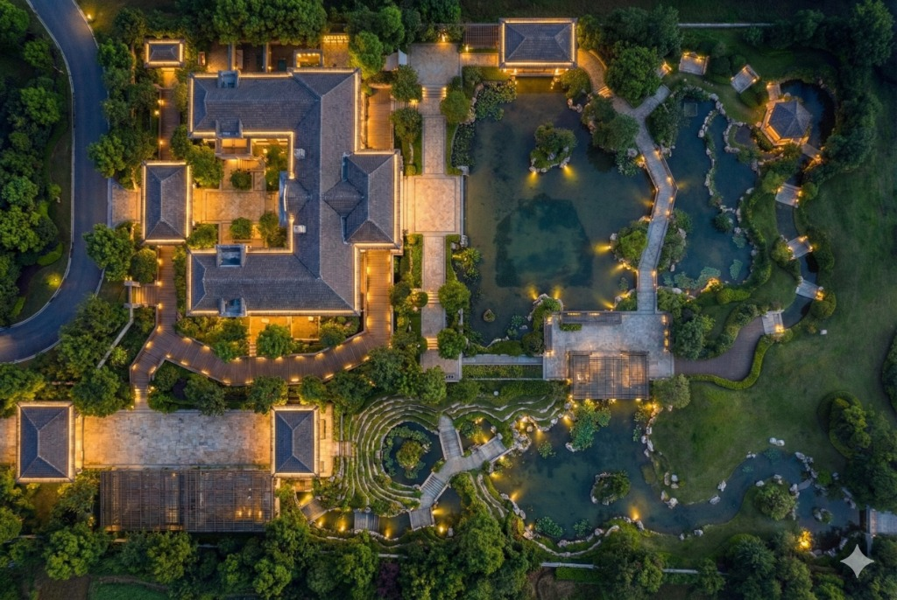
*Output: Nighttime Illumination*

**Prompt:**
```
Using the previously generated morning rendering as the base image, convert the lighting conditions from early morning to nighttime. Remove the natural daylight illumination and replace with nighttime lighting scenario. Add artificial lighting appropriate to the site elements including interior building lights visible through windows, exterior architectural lighting for the residential structure, landscape lighting for pathways and public park areas, and accent lighting for water features. Maintain all spatial configurations, materials, textures, topography, and viewing angle exactly as shown in the current image, modifying only the time of day and corresponding lighting conditions to represent evening illumination.
```

#### 💡 Tips
*   **Continuous Iteration:** Nano Banana Pro supports continuous iteration. You can use the output of a previous generation as the input for the next step without re-uploading, allowing for progressive refinement (e.g., changing time of day).

---

### 2.5 Office Layout Planning

#### Input

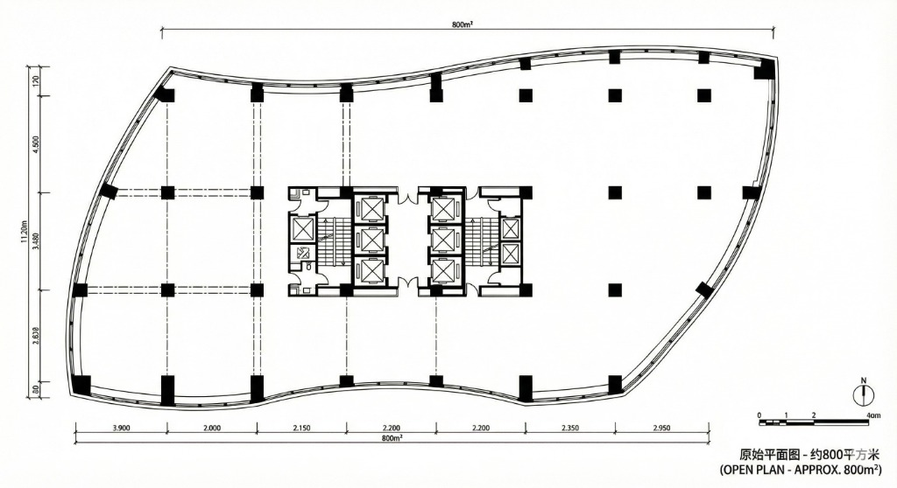

#### Output

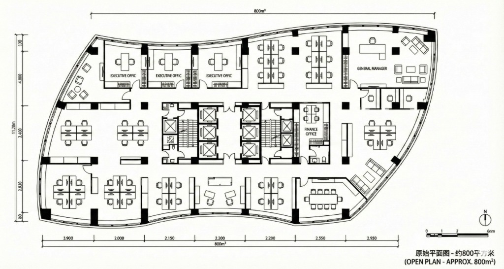

**Prompt:**
```
Using the uploaded blank floor plan showing the original as-built condition, preserve all existing building structure including exterior walls, load-bearing walls, all door openings, and all window positions exactly as shown without any modifications. Design a complete office layout that meets ergonomic standards for workplace design. The space planning must include the following required functional zones: a general manager's office positioned in a location with appropriate status and privacy, executive offices for senior management, and a finance office configured for relative enclosure and independence from other work areas. Arrange open-plan workstations in the remaining areas following ergonomic spacing standards for desk dimensions, circulation clearances, and visual privacy between stations. Optimize workstation arrangement to create efficient circulation paths that minimize cross-traffic through work zones. Designate and furnish collaboration areas positioned to support team interaction without disrupting focused work zones. All furniture placement must comply with ergonomic principles including appropriate desk heights, chair clearances, and equipment accessibility. Present the result as a complete office floor plan showing partition walls for enclosed offices, workstation layouts, and all furniture arrangements in professional architectural drawing style with appropriate line weights and graphic conventions.
```

---


## 🔧 Technical to Visual
*Technical Drawings to Visualization*

**Cases in this stage:**  
[3.1 2D Floor Plan to 3D Isometric](#31-2d-floor-plan-to-3d-isometric) • [3.10 Section to Section Perspective](#310-section-to-section-perspective) • [3.11 Exploded Axonometric](#311-exploded-axonometric) • [3.12 Sketch to Massing Model](#312-sketch-to-massing-model) • [3.13 Structural Analysis Diagram](#313-structural-analysis-diagram) • [3.14 HVAC](#314-hvac) • [3.15 Vertical Circulation](#315-vertical-circulation) • [3.16 3D Detail Callout](#316-3d-detail-callout) • [3.17 MEP X-Ray](#317-mep-x-ray) • [3.18 Construction Layers](#318-construction-layers) • [3.19 Accessibility Diagram](#319-accessibility-diagram) • [3.20 Sustainability Diagram](#320-sustainability-diagram) • [3.21 Aerial to Site Plan](#321-aerial-to-site-plan) • [3.22 3D Print Preview](#322-3d-print-preview) • [3.23 Structure Reference](#323-structure-reference)

### 3.1 2D Floor Plan to 3D Isometric

#### Phase 1: Isometric View

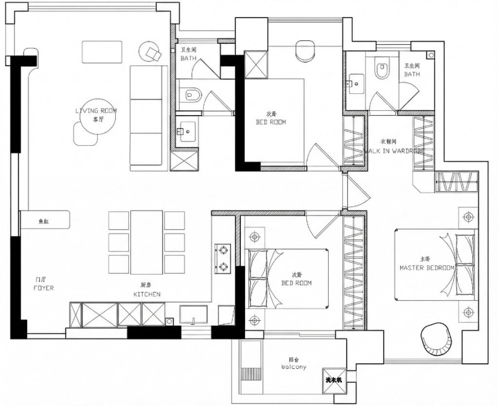
*Input: 2D Floor Plan*

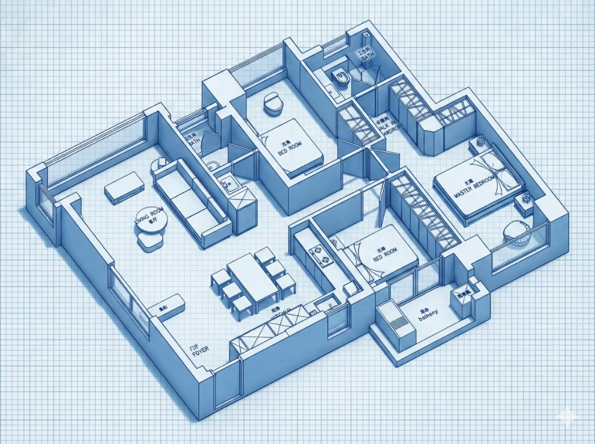
*Output: 3D Isometric Drawing*

**Prompt:**
```
Transform this 2D floor plan into a 3D isometric architectural drawing. Extrude the walls to a consistent height. Apply a 'blueprint style' style with soft ambient occlusion shadows.
```

#### Phase 2: Reverse Perspective

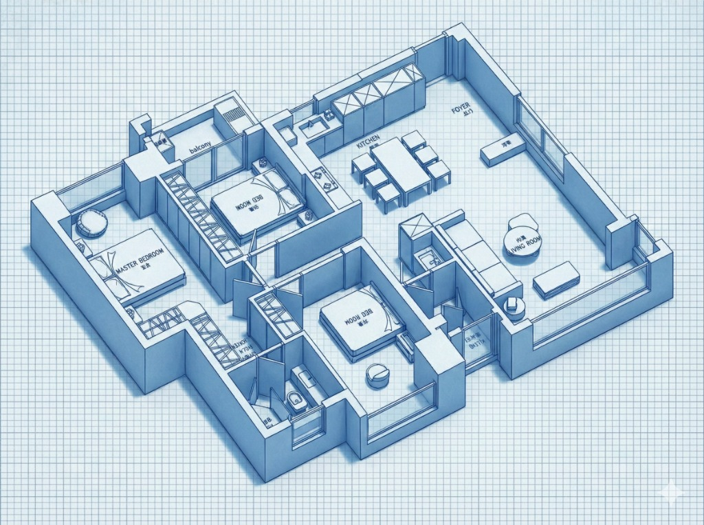
*Output: Reverse Isometric View*

**Prompt:**
```
Using the previously generated 3D isometric architectural drawing as reference, create a new view from the opposite viewing angle, rotated 180 degrees around the vertical axis. Maintain the same extrusion height, rendering style, ambient occlusion shadows, and all architectural elements exactly as shown in the original. Only change the camera viewpoint to show the building from the reverse perspective, revealing the opposite facades and spatial relationships that were hidden in the first view.
```


#### 💡 Tips

**1. Style Variations**
Replace **'blueprint style'** with:

*   **'wireframe style'**: Only shows edge lines, no surface fill, demonstrating structural logic.
*   **'technical line drawing style'**: Precise black and white line drawing, different line weights indicating hierarchy.
*   **'flat color blocking with ambient occlusion'**: Each mass filled with a single color, retaining shadow depth.
*   **'watercolor rendering style'**: Soft watercolor texture, edges slightly bleeding, artistic expression.
*   **'hand-drawn sketch style with hatching'**: Simulates manual drawing, using parallel lines to represent shadows.
*   **'physical model photography style'**: Simulates physical architectural models made of white cardstock or wood.
*   **'ghost render with transparency'**: Translucent exterior walls, allowing visibility into internal spatial layout.
*   **'material study render'**: Accurately displays the real texture of different materials (concrete/wood/glass).
*   **'diagram style with color-coded functional zones'**: Different functional spaces distinguished by different colors.
*   **'clay render style'**: Soft, matte finish resembling clay models.

**2. Viewpoint Variations**

*   **90 Degrees (Side View):** `"rotated 90 degrees clockwise/counterclockwise"`
*   **45 Degrees (Corner View):** `"rotated 45 degrees to show the adjacent corner perspective"`
*   **Bird's Eye View:** `"from a higher bird's eye view angle looking down at 60 degrees"`

---


### 3.10 Section to Section Perspective

#### Input


#### Output


**Prompt:**
```
Architectural section perspective based on this line drawing. Render the cut surfaces (walls/slabs) in solid jet black (Poché). Render the interior spaces with photorealistic materials: concrete ceiling, oak flooring. Add depth and atmospheric lighting entering from the windows. 4K resolution.
```

---

### 3.11 Exploded Axonometric

#### Input


#### Output


**Prompt:**
```
Exploded axonometric diagram of the building structure. Separate the layers vertically: foundation at the bottom, structural grid in the middle, and roof skin at the top. Style: Technical illustration, clean white background, thin linework, pastel color coding for each layer.
```

---

### 3.12 Sketch to Massing Model

#### Input


#### Output


**Prompt:**
```
Convert this loose architectural sketch into a clean, geometric white massing model. Straighten the lines and correct the perspective. Render in a 'studio lighting' setup with sharp shadows to define the volumes. Abstract minimalism.
```

---

### 3.13 Structural Analysis Diagram

#### Input


#### Output


**Prompt:**
```
Structural diagram. Make the non-structural walls transparent/ghosted. Highlight the columns and main beams in solid red. Show the load-bearing logic. X-ray architectural style.
```

---

### 3.14 HVAC

#### Input


#### Output


**Prompt:**
```
Reflected ceiling plan visualization. Overlay 3D semi-transparent blue ducts showing the HVAC system. Distinguish supply diffusers (arrows out) and return vents. Maintain the layout of the lights.
```

---

### 3.15 Vertical Circulation

#### Input


#### Output


**Prompt:**
```
Sectional circulation diagram. Highlight staircases and elevator shafts in glowing orange. Add arrows indicating upward movement. Dark background blueprint style.
```

---

### 3.16 3D Detail Callout

#### Input


#### Output


**Prompt:**
```
Photorealistic 3D cutaway of a curtain wall detail based on this drawing. Show the layers: aluminum mullion, double glazing, rubber gasket, and insulation. Macro photography style, sharp focus on the joint.
```

---

### 3.17 MEP X-Ray

#### Input


#### Output


**Prompt:**
```
Technical visualization. A bathroom wall rendered with 50% transparency. Reveal the copper plumbing pipes and PVC drainage pipes inside the wall cavity. Educational diagram style.
```

---

### 3.18 Construction Layers

#### Input


#### Output


**Prompt:**
```
Layered floor construction diagram. Peel back the layers to show: 1. Concrete slab, 2. Acoustic mat, 3. Underfloor heating pipes, 4. Screed, 5. Timber finish. Label each layer.
```

---

### 3.19 Accessibility Diagram

#### Input


#### Output


**Prompt:**
```
Accessibility analysis overlay on floor plan. Show 1.5m diameter turning circles in red dashed lines in bathrooms and hallways. Highlight wheelchair ramps in blue. Technical annotation style.
```

---

### 3.20 Sustainability Diagram

#### Input


#### Output


**Prompt:**
```
Sustainability concept section. Show blue arrows for natural ventilation airflow through windows. Show yellow arrows for sunlight shading. Add icons for 'Solar Panels' on the roof. Educational style.
```

---

### 3.21 Aerial to Site Plan

#### Input


#### Output


**Prompt:**
```
Convert this aerial drone photo into a flat architectural site plan diagram. Flatten the perspective to 2D top-down. Simplify trees to circles and buildings to solid shapes. Desaturated colors.
```

---

### 3.22 3D Print Preview

#### Input


#### Output


**Prompt:**
```
Render this building model as a 3D printed object. Material: White PLA plastic with visible layer lines. Sitting on a wooden table. Depth of field blurring the background.
```

---

### 3.23 Structure Reference

#### Input


#### Output


**Prompt:**
```
Apply the color grading and lighting style of Reference Image A to Reference Image B. Make them look like they belong to the same photography set. Keep the content of Image B unchanged.
```

---


## 🎨 Material & Styling
*Materials & Styling*

**Cases in this stage:**  
[4.1 Realistic Material Replacement](#41-realistic-material-replacement) • [4.2 Style Transfer](#42-style-transfer) • [4.3 砖石铺贴纹理研究](#43-砖石铺贴纹理研究) • [4.4 灯光照度可视化](#44-灯光照度可视化) • [4.5 软装布艺褶皱模拟](#45-软装布艺褶皱模拟) • [4.6 异形家具曲面分析](#46-异形家具曲面分析) • [4.7 老旧材质做旧模拟](#47-老旧材质做旧模拟) • [4.8 艺术品/挂画替换](#48-艺术品挂画替换) • [4.9 Joinery Internal View](#49-joinery-internal-view)

### 4.1 Realistic Material Replacement

#### Input

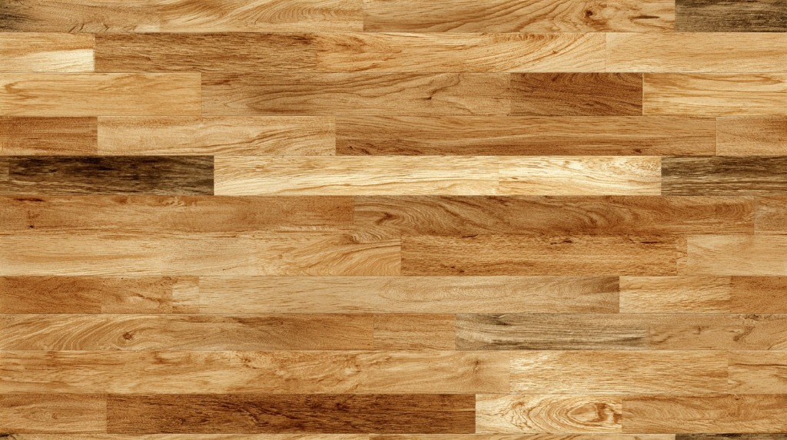
*Input 1: Material Sample*

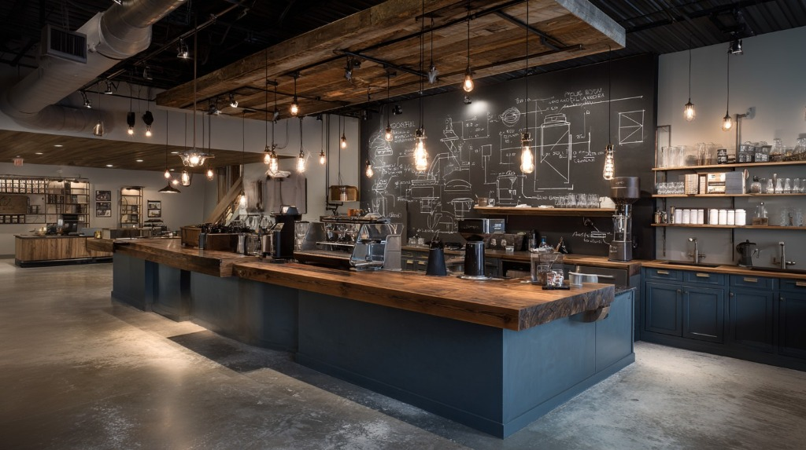
*Input 2: Target Scene*

#### Output

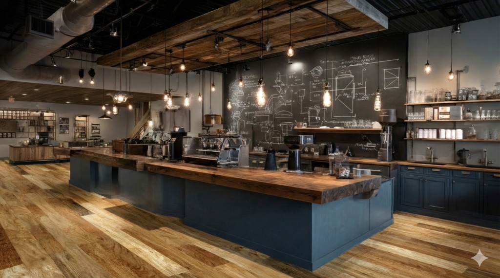
*Output: Material Replaced*

**Prompt:**
```
Using the first uploaded image as the source material sample and the second uploaded image as the target scene, replace the [specify element: flooring/wall tiles/wall paint/cabinet surfaces/countertops/etc.] in the target scene with the material pattern and texture shown in the source sample. Apply the source material while maintaining the target scene's existing perspective distortion, lighting conditions, shadows, reflections, and surface geometry. Preserve all other elements in the target scene completely unchanged, including furniture placement, spatial configuration, architectural features, and any elements not specifically designated for material replacement. Ensure the replaced material responds naturally to the scene's lighting environment and integrates seamlessly with surrounding surfaces.
```

#### 💡 Tips

### Instructions (Translation Notes)
**Upload Order:**

1.  **First Image:** Material sample photo (flooring pattern, tile texture, paint swatch, cabinet finish, etc.)
2.  **Second Image:** Real-world scene photo where the material needs to be replaced

**Parameter Instructions:**
Fill in the specific element to be replaced in the `[specify element]` placeholder in the prompt:

*   `flooring`
*   `wall tiles`
*   `wall paint/wall surface`
*   `cabinet surfaces/cabinet doors`
*   `countertops`
*   `ceiling finish`
*   `furniture upholstery`

**Example Applications:**
*   **To replace flooring:**
    "...replace the flooring in the target scene..."
*   **To replace cabinet doors:**
    "...replace the cabinet doors in the target scene..."
*   **To replace multiple elements of the same type (e.g., all walls):**
    "...replace all wall surfaces in the target scene..."

---

### 4.2 Style Transfer

#### Input

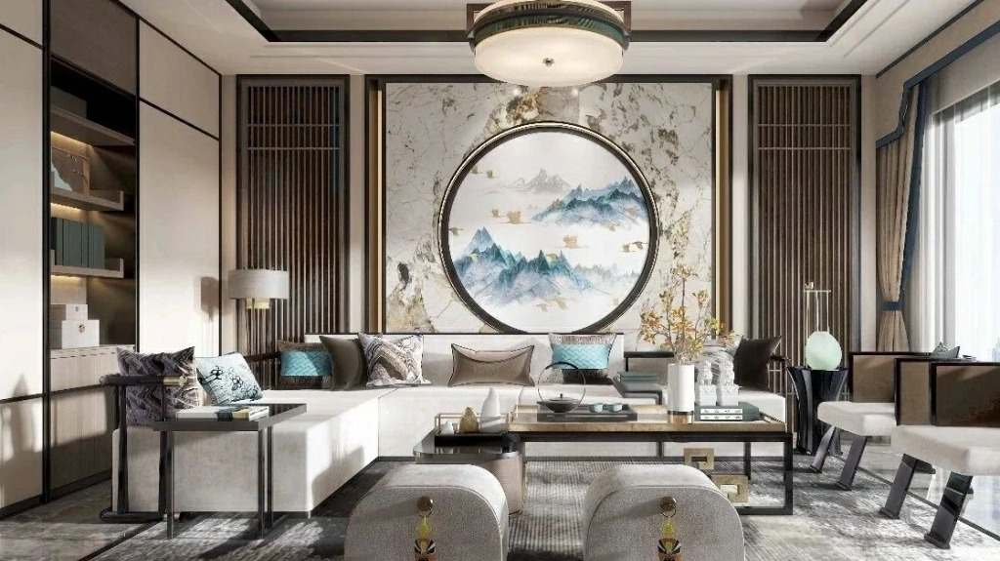
*Input 1: Style Reference*

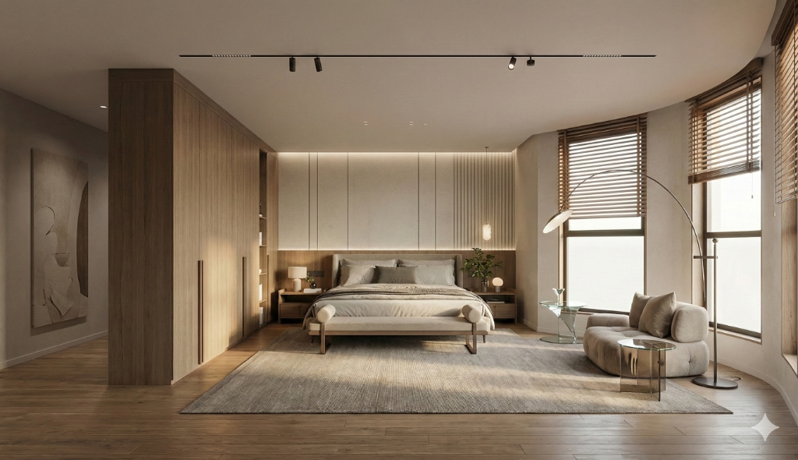
*Input 2: Target Scene*

#### Output

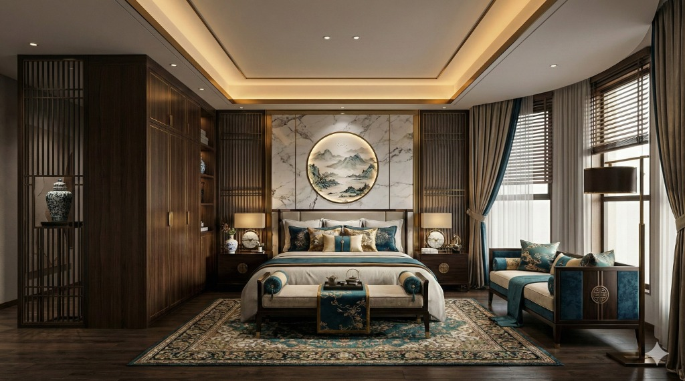
*Output: Style Transferred*

**Prompt:**
```
Using the first uploaded image as the style reference and the second uploaded image as the target spatial scene, transfer the visual style characteristics from the reference to the target scene. Apply the reference's aesthetic qualities including color palette, tonal relationships, material treatment approach, lighting mood, textural rendering style, and decorative vocabulary to the target scene while preserving the target scene's spatial configuration, architectural structure, furniture layout, and functional organization. Maintain the target scene's perspective, proportions, and spatial relationships exactly as shown. The result should express the target space reinterpreted through the visual language and aesthetic sensibility of the style reference.
```

#### 💡 Tips

*   **Upload Order:** 1. Style Reference, 2. Target Scene.
*   **Structure Preservation:** Prompt emphasizes keeping "spatial configuration" and "furniture layout".
*   **Style Transfer:** Focuses on "aesthetic qualities" like color, material, and lighting.

---

### 4.3 砖石铺贴纹理研究

#### Input


#### Output


**Prompt:**
```
Close-up texture study of a brick wall. Arrange the bricks in a 'vertical stack bond' pattern. Bricks should be handmade terracotta with irregular edges and thick mortar joints.
```

---

### 4.4 灯光照度可视化

#### Input


#### Output


**Prompt:**
```
Lighting visualization. A textured stone wall lit by three recessed spotlights from above. Show the realistic 'scallop' shape of the light beams and the texture relief created by grazing light.
```

---

### 4.5 软装布艺褶皱模拟

#### Input


#### Output


**Prompt:**
```
Close-up of heavy velvet curtains pooling on a wooden floor. Show realistic fabric folds, weight, and light sheen. Color: Deep emerald green.
```

---

### 4.6 异形家具曲面分析

#### Input


#### Output


**Prompt:**
```
Studio render of a parametric curved bench. Material: Glossy white fiberglass. Use 'zebra stripe' reflection mapping to highlight the curvature continuity.
```

---

### 4.7 老旧材质做旧模拟

#### Input


#### Output


**Prompt:**
```
Material aging simulation. Show a copper facade panel with realistic green patina (verdigris) streaming down from the top edges, simulating 10 years of weather exposure.
```

---

### 4.8 艺术品/挂画替换

#### Input


#### Output


**Prompt:**
```
Replace the painting on the wall with a large-scale abstract expressionist artwork in blue and gold tones. Add a frame that matches the furniture wood.
```

---

### 4.9 Joinery Internal View

#### Input


#### Output


**Prompt:**
```
Open view of a bespoke wardrobe. Show the internal layout: hanging rails, drawers with glass fronts, and LED strip lighting in the shelves. Finish: Dark grey melamine. Perspective view.
```

---

## 🖼️ Scene Rendering
*Scene Rendering*

**Cases in this stage:**  
[5.1 日夜光环境转换](#51-日夜光环境转换) • [5.2 餐厅灯光氛围模拟](#52-餐厅灯光氛围模拟) • [5.3 酒店客房标准间](#53-酒店客房标准间) • [5.4 咖啡馆氛围板](#54-咖啡馆氛围板) • [5.5 漫游关键帧生成](#55-漫游关键帧生成) • [5.6 配景人物植入](#56-配景人物植入) • [5.7 风格一致性检查](#57-风格一致性检查)

### 5.1 日夜光环境转换

#### Input


#### Output


**Prompt:**
```
Turn this daylight photo into a night scene. Dark blue sky. Turn on the interior lights (3000K warm white). Add exterior uplighting to the trees.
```

---

### 5.2 餐厅灯光氛围模拟

#### Input


#### Output


**Prompt:**
```
Fine dining restaurant interior. Moody, low-key lighting. Tables illuminated by focused pin-spots, leaving the surrounding areas in shadow. Velvet booth seating. Candlelight on tables.
```

---

### 5.3 酒店客房标准间

#### Input


#### Output


**Prompt:**
```
Luxury hotel room interior. King size bed with crisp white linens and a beige throw. Floor-to-ceiling window with shear curtains. Warm bedside lamps on. Symmetrical composition.
```

---

### 5.4 咖啡馆氛围板

#### Input


#### Output


**Prompt:**
```
Rustic coffee shop interior. Exposed brick walls, reclaimed wood tables, industrial pendant lights. Steam rising from a coffee cup in the foreground. Warm, inviting, morning light.
```

---

### 5.5 漫游关键帧生成

#### Input


#### Output


**Prompt:**
```
Cinematic storyboard keyframes for architectural walkthrough. Frame 1: Wide shot of building exterior at dawn. Frame 2: Close up of hand opening the door. Frame 3: Eye- level view of the sunlit lobby. Consistent color grading.
```

---

### 5.6 配景人物植入

#### Input


#### Output


**Prompt:**
```
Populate this plaza render with diverse groups of people. People walking, sitting on benches, talking. Motion blur on walking figures. Ensure shadows match the sun direction of the scene.
```

---

### 5.7 风格一致性检查

#### Input


#### Output


**Prompt:**
```
Apply the color grading and lighting style of Reference Image A to Reference Image B. Make them look like they belong to the same photography set. Keep the content of Image B unchanged.
```

---

## ⚙️ Specialized Tasks
*Specialized Tasks*

**Cases in this stage:**  
[6.1 保留家具换硬装](#61-保留家具换硬装) • [6.2 清空房间](#62-清空房间) • [6.3 虚拟软装](#63-虚拟软装) • [6.4 厨房翻新：换门板不换布局](#64-厨房翻新换门板不换布局) • [6.5 窗外景观替换](#65-窗外景观替换) • [6.6 建筑立面改造](#66-建筑立面改造) • [6.7 增加绿植氛围](#67-增加绿植氛围) • [6.8 季节/天气变换](#68-季节天气变换) • [6.9 门头招牌设计](#69-门头招牌设计) • [6.10 货架陈列生成](#610-货架陈列生成) • [6.11 展台设计方案](#611-展台设计方案) • [6.12 品牌快闪店](#612-品牌快闪店) • [6.13 导视系统模拟](#613-导视系统模拟) • [6.14 橱窗陈列设计](#614-橱窗陈列设计) • [6.15 概念推演过程图](#615-概念推演过程图) • [6.16 渲染图转水彩手绘](#616-渲染图转水彩手绘) • [6.17 汇报排版生成](#617-汇报排版生成) • [6.18 入口对景树](#618-入口对景树)

### 6.1 保留家具换硬装

#### Input


#### Output


**Prompt:**
```
Renovation visualization. Change the wall color to sage green and the floor to herringbone parquet. Constraint: Keep the existing sofa, coffee table, and rug exactly as they are in the photo. Do not move them.
```

---

### 6.2 清空房间

#### Input


#### Output


**Prompt:**
```
Real estate photo editing. Remove all furniture, boxes, and clutter from this room. Show the clean, empty space with bare walls and flooring. Auto-fill the floor texture where furniture was removed.
```

---

### 6.3 虚拟软装

#### Input


#### Output


**Prompt:**
```
Virtual staging. Furnish this empty bedroom with a Queen-sized bed, two nightstands, and a wardrobe. Style: Modern Minimalist. Ensure furniture perspective aligns with the room's vanishing points.
```

---

### 6.4 厨房翻新：换门板不换布局

#### Input


#### Output


**Prompt:**
```
Kitchen facelift. Replace the oak cabinet doors with matte navy blue flat-panel doors. Change countertop to white marble. Keep the kitchen layout, appliances, and sink position exactly unchanged.
```

---

### 6.5 窗外景观替换

#### Input


#### Output


**Prompt:**
```
View substitution. Replace the white window background with a cityscape at twilight. Add realistic blue reflections of the city lights onto the interior floor.
```

---

### 6.6 建筑立面改造

#### Input


#### Output


**Prompt:**
```
Building exterior renovation. Replace the red brick facade with sleek silver aluminum composite panels. Keep the window openings and building shape structurally identical.
```

---

### 6.7 增加绿植氛围

#### Input


#### Output


**Prompt:**
```
Add lush indoor plants to this office lobby. Place tall Ficus trees in the corners and hanging planters from the ceiling beams. Natural, vibrant atmosphere.
```

---

### 6.8 季节/天气变换

#### Input


#### Output


**Prompt:**
```
Change season to Winter. Cover the garden ground with snow. Trees should be bare branches. Add warm light glow coming from the house windows. Cozy winter evening.
```

---

### 6.9 门头招牌设计

#### Input


#### Output


**Prompt:**
```
Retail storefront render. Place a 3D neon sign reading 'URBAN CAFE' above the entrance. Font style: Retro script. Color: Bright pink. Show realistic glow reflection on the glass window.
```

---

### 6.10 货架陈列生成

#### Input


#### Output


**Prompt:**
```
Supermarket shelves visualization. Fill the shelves with neatly arranged cereal boxes and colorful packaging. Ensure distinct, non-repetitive product designs. bright, even lighting.
```

---

### 6.11 展台设计方案

#### Input


#### Output


**Prompt:**
```
3x3 meter exhibition booth design. Minimalist white style with a central reception counter. Large LED screen on the back wall displaying a abstract blue wave pattern. Spotlights on the counter.
```

---

### 6.12 品牌快闪店

#### Input


#### Output


**Prompt:**
```
Pop-up store design in a mall atrium. A cylindrical structure made of translucent polycarbonate sheets. Glowing from within with purple light. Branding text 'FUTURE TECH' on the top header.
```

---

### 6.13 导视系统模拟

#### Input


#### Output


**Prompt:**
```
Hospital corridor interior. Apply clear vinyl wayfinding graphics to the floor: A blue line with text 'Radiology' and a red line with text 'Emergency'. Perspective adjusted to match the floor plane.
```

---

### 6.14 橱窗陈列设计

#### Input


#### Output


**Prompt:**
```
Fashion boutique window display. Two mannequins wearing avant-garde silver jackets. Background: Abstract geometric shapes suspended in air. Lighting: Dramatic purple and teal spotlights.
```

---

### 6.15 概念推演过程图

#### Input


#### Output


**Prompt:**
```
Architectural concept diagram series. Three steps: 1. A simple cube. 2. The cube sliced diagonally. 3. The final form with terraced gardens. Style: Simple white isometric blocks with blue arrows showing the transformation.
```

---

### 6.16 渲染图转水彩手绘

#### Input


#### Output


**Prompt:**
```
Convert this photorealistic building render into a loose watercolor sketch. Soft washes of color, pencil outlines, bleeding edges. Artistic, hand-drawn feel. Reduce detail.
```

---

### 6.17 汇报排版生成

#### Input


#### Output


**Prompt:**
```
Architectural presentation board layout. Arrange the provided render (top), floor plan (bottom left), and material palette (bottom right) on a clean white background. Add a title 'PROJECT HORIZON' in minimalist sans-serif font.
```

---

### 6.18 入口对景树

#### Input


#### Output


**Prompt:**
```

```

---


## 📚 Resources

- 📖 [CASE_TEMPLATE.md](./CASE_TEMPLATE.md) - Template for creating new use cases
- 🤝 [CONTRIBUTING.md](./CONTRIBUTING.md) - How to contribute new cases

---

## License

This project is licensed under the MIT License - see the [LICENSE](LICENSE) file for details.

---

<div align="center">

**Made with ❤️ for Designers**

Powered by **Gemini 3 Pro Image**

</div>
