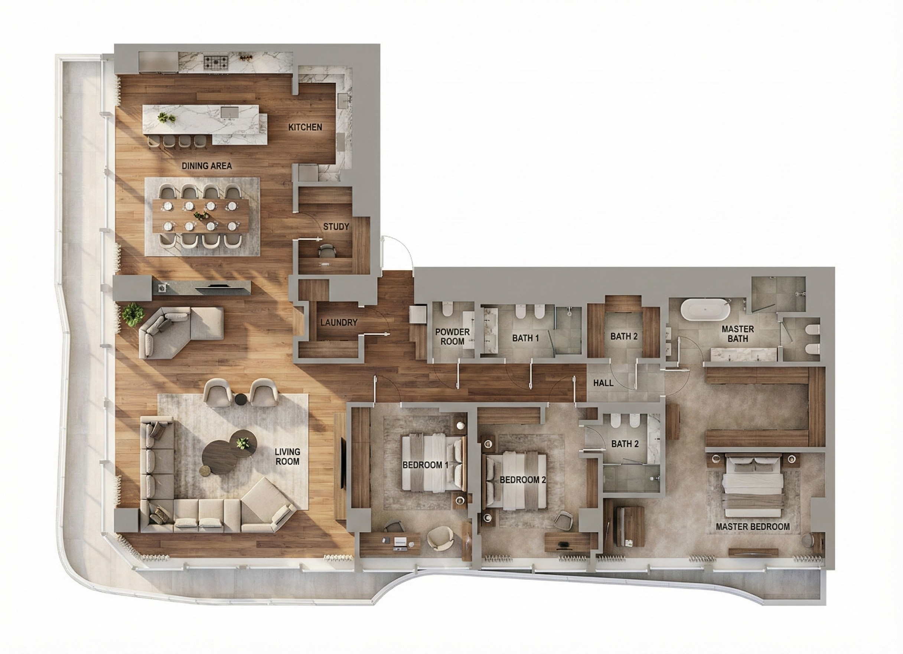
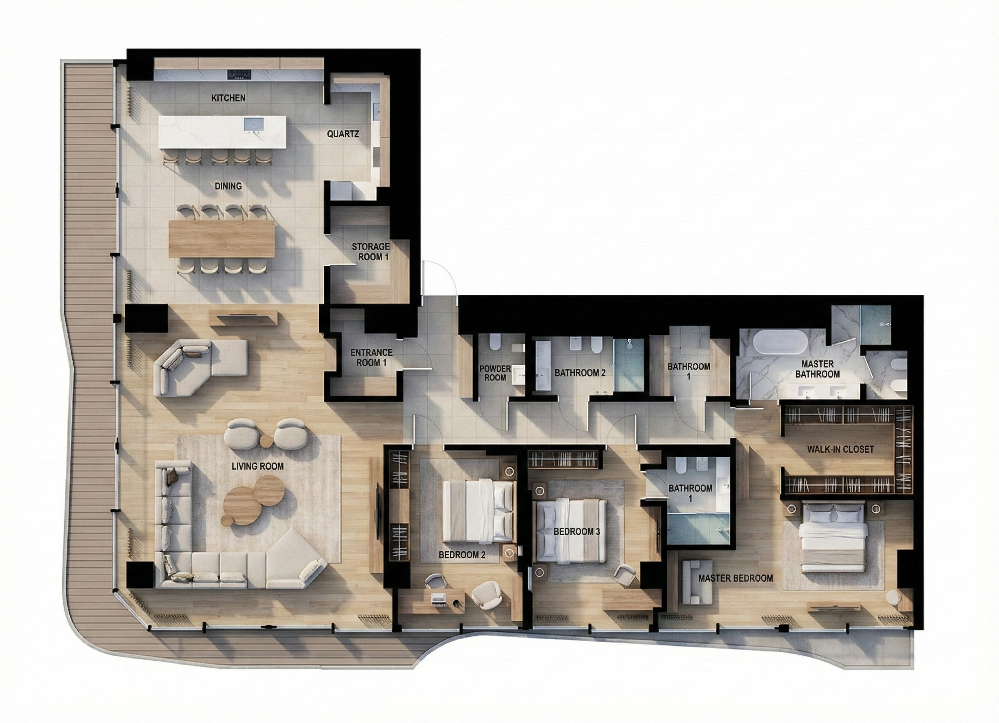

<div align="center">


# Awesome Nano Banana Spatial Design

> Professional prompts for spatial designers powered by Gemini 3 Pro Image
 
<!-- Language Switcher -->
**English** | [简体中文](./README.zh-CN.md)

[](https://opensource.org/licenses/MIT)
[](CONTRIBUTING.md)

</div>

---

## 🎯 Quick Navigation

**Jump to Workflow Stage:**  
[🎨 Concept Ideation](#-concept-ideation) • [📐 Space Planning](#-space-planning) • [🔧 Technical to Visual](#-technical-to-visual) • [🎨 Material & Styling](#-material--styling) • [🖼️ Scene Rendering](#-scene-rendering) • [⚙️ Specialized Tasks](#%EF%B8%8F-specialized-tasks)

> **📌 Disclaimer**: All images used in case examples are for educational and research purposes only. Input images are sourced from publicly available architectural drawings or created specifically for demonstration. This repository does not claim ownership of referenced images and they are used under fair use principles for non-commercial educational purposes.

---

## 🎨 Concept Ideation
*From zero to creative concepts*

**Cases in this stage:**  
[1.1 Hand Sketch to Rendering](#) • [1.2 Multi-Style Concept Comparison](#) • [1.3 Mood Board Generation](#)

---

## 📐 Space Planning
*Layout optimization & circulation design*

**Cases in this stage:**  
[▶ 2.1 CAD Floor Plan to Client-Friendly View](#21-cad-floor-plan-to-client-friendly-view) • [2.2 Furniture Layout Variations](#) • [2.3 Circulation Analysis](#)

---

### 2.1 CAD Floor Plan to Client-Friendly View

Convert technical CAD floor plans into photorealistic colored top-down visualizations with realistic furniture and clear room labels for client presentation.

#### Input: CAD Floor Plan


---

#### Output: Natural Language Prompt



**Prompt:**
```
Transform the provided CAD floor plan into a photorealistic colored top-down visualization for client presentation. Add realistic furniture, clear room labels, and material-appropriate flooring for each space. Use soft natural lighting and maintain architectural accuracy.
```

**Parameters:**
```json
{
  "model": "gemini-3-pro-image-preview",
  "imageSize": "2K"
}
```

---

#### Output: JSON-Structured Prompt



**Detailed JSON Prompt:**

<details>
<summary>Click to expand full JSON specification</summary>

```json
{
  "task": "cad_to_colored_topview",
  "output_requirements": {
    "view_type": "orthographic_top_down",
    "style": "photorealistic",
    "lighting": {
      "type": "natural_daylight",
      "time": "10:00_AM",
      "quality": "soft_diffused",
      "color_temperature": "5500K"
    }
  },
  "space_analysis": {
    "rooms": [
      {
        "id": "living_room",
        "label": "LIVING ROOM",
        "flooring": {
          "material": "engineered_wood",
          "species": "light_oak",
          "color": "#D4B896",
          "plank_width": "150mm",
          "grain_visibility": "high"
        },
        "furniture": [
          {"item": "sectional_sofa", "material": "linen_fabric", "color": "#C7B8A3"},
          {"item": "chaise_lounge", "placement": "corner_near_window"},
          {"item": "coffee_table", "material": "walnut", "size": "120x60cm"},
          {"item": "ottoman_stools", "quantity": 2, "shape": "round"},
          {"item": "tv_console", "material": "walnut", "length": "180cm"},
          {"item": "area_rug", "size": "200x300cm", "color": "warm_beige"}
        ]
      },
      {
        "id": "dining_area",
        "label": "DINING AREA",
        "flooring": {
          "material": "porcelain_tile",
          "size": "60x60cm",
          "color": "#E8DCC8",
          "finish": "polished"
        },
        "furniture": [
          {"item": "dining_table", "size": "180x90cm", "seats": 8},
          {"item": "dining_chairs", "quantity": 8, "material": "oak_upholstered"}
        ]
      },
      {
        "id": "kitchen",
        "label": "KITCHEN",
        "flooring": {"material": "porcelain_tile", "same_as": "dining_area"},
        "furniture": [
          {"item": "kitchen_island", "countertop": "white_quartz", "size": "240x90cm"},
          {"item": "bar_stools", "quantity": 4},
          {"item": "sink", "type": "undermount", "visible_from_top": true}
        ]
      },
      {
        "id": "master_bedroom",
        "label": "MASTER BEDROOM",
        "flooring": {"material": "engineered_wood", "same_as": "living_room"},
        "furniture": [
          {"item": "queen_bed", "headboard": "upholstered_linen"},
          {"item": "bedside_tables", "quantity": 2, "material": "walnut"},
          {"item": "wardrobe", "type": "built_in", "finish": "white_matte"}
        ]
      },
      {
        "id": "bedroom_2",
        "label": "BEDROOM 2",
        "flooring": {"material": "engineered_wood", "same_as": "living_room"},
        "furniture": [
          {"item": "single_bed", "size": "120x200cm"},
          {"item": "desk", "size": "120x60cm", "material": "light_oak"},
          {"item": "wardrobe", "type": "standalone", "color": "white"}
        ]
      },
      {
        "id": "master_bathroom",
        "label": "BATHROOM",
        "flooring": {
          "material": "porcelain_tile",
          "style": "marble_look",
          "size": "30x60cm",
          "color": "#F5F5F5"
        },
        "fixtures": [
          {"item": "bathtub", "type": "freestanding_or_alcove"},
          {"item": "toilet", "type": "wall_hung", "color": "white"},
          {"item": "vanity_sink", "type": "integrated_counter"}
        ]
      },
      {
        "id": "entrance",
        "label": "ENTRANCE",
        "flooring": {"material": "porcelain_tile", "same_as": "kitchen"}
      },
      {
        "id": "balcony",
        "label": "BALCONY",
        "flooring": {
          "material": "composite_decking",
          "color": "#8B8B8B",
          "finish": "wood_grain_texture"
        }
      }
    ]
  },
  "text_rendering": {
    "room_labels": {
      "font_family": "Helvetica_Neue",
      "font_weight": "medium",
      "color": "#333333",
      "placement": "centered_in_room",
      "style": "uppercase_clean"
    }
  },
  "output_specs": {
    "aspect_ratio": "match_input",
    "resolution": "2K",
    "quality": "presentation_grade"
  }
}
```

</details>

---

#### 💡 Tips

- **Verify JSON Completeness**: Before submitting, ensure all rooms from your CAD plan are included in the JSON. Missing furniture (like ottomans or chaise lounges) will not appear in the output.
- **Material Consistency**: Keep the same flooring material for connected spaces (e.g., kitchen + dining + entrance) for visual flow.
- **Room Label Clarity**: JSON prompt produces more precise text rendering. If labels are unclear with natural language, use the JSON specification.
- **Style Variations**: To change design styles, modify:
  - Furniture materials (e.g., `"linen_fabric"` → `"leather"`)
  - Flooring colors (e.g., `"#D4B896"` → darker/lighter tones)
  - Overall atmosphere (`"modern_residential"` → `"luxury"`, `"minimalist"`)

---

## 🔧 Technical to Visual
*CAD/drawings to photorealistic visualization*

**Cases in this stage:**  
[3.1 Elevation to Street View](#) • [3.2 Section to Interior Perspective](#)

---

## 🎨 Material & Styling
*Material refinement & cost optimization*

**Cases in this stage:**  
[4.1 Material Scheme Comparison](#) • [4.2 Material Downgrade for Budget](#)

---

## 🖼️ Scene Rendering
*Final presentation quality renders*

**Cases in this stage:**  
[5.1 Multi-Angle Interior](#) • [5.2 Day/Night Lighting](#)

---

## ⚙️ Specialized Tasks
*Special use cases & advanced features*

**Cases in this stage:**  
[6.1 Multilingual Signage](#) • [6.2 Seasonal Variations](#) • [6.3 On-Site Quick Solutions](#)

---

## 📚 Resources

- 📖 [CASE_TEMPLATE.md](./CASE_TEMPLATE.md) - Template for creating new use cases
- 🤝 [CONTRIBUTING.md](./CONTRIBUTING.md) - How to contribute new cases

---

## License

This project is licensed under the MIT License - see the [LICENSE](LICENSE) file for details.

---

<div align="center">

**Made with ❤️ for Designers**

Powered by **Gemini 3 Pro Image**

</div>
