<div align="center">


# Awesome Nano Banana 空间设计

> 为空间设计师打造的 Gemini 3 Pro Image 专业提示词库
 
<!-- 语言切换 -->
[English](./README.md) | **简体中文**

[](https://opensource.org/licenses/MIT)
[](CONTRIBUTING.md)

</div>

---

## 🎯 快速导航

**跳转到工作流阶段：**  
[🎨 概念构思](#-概念构思) • [📐 空间规划](#-空间规划) • [🔧 技术转视觉](#-技术转视觉) • [🎨 材质软装](#-材质软装) • [🖼️ 场景渲染](#-场景渲染) • [⚙️ 专项应用](#%EF%B8%8F-专项应用)

> **📌 免责声明**：本案例库中使用的所有图片仅用于教育和研究目的。输入图片来自公开的建筑图纸或专门为演示创建。本仓库不主张对引用图片的所有权，所有图片在非商业教育目的下按合理使用原则使用。

---
## 🎨 概念构思
*从零到创意方案*

**本阶段案例：**  
[1.1 自动布置平面图](#11-自动布置平面图-auto-furnish-floor-plan) • [1.2 平地起高楼](#12-平地起高楼-building-from-scratch) • [1.3 迷你建筑模型](#13-迷你建筑模型-miniature-building-model)

### 1.1 自动布置平面图 (Auto-Furnish Floor Plan)

#### 输入

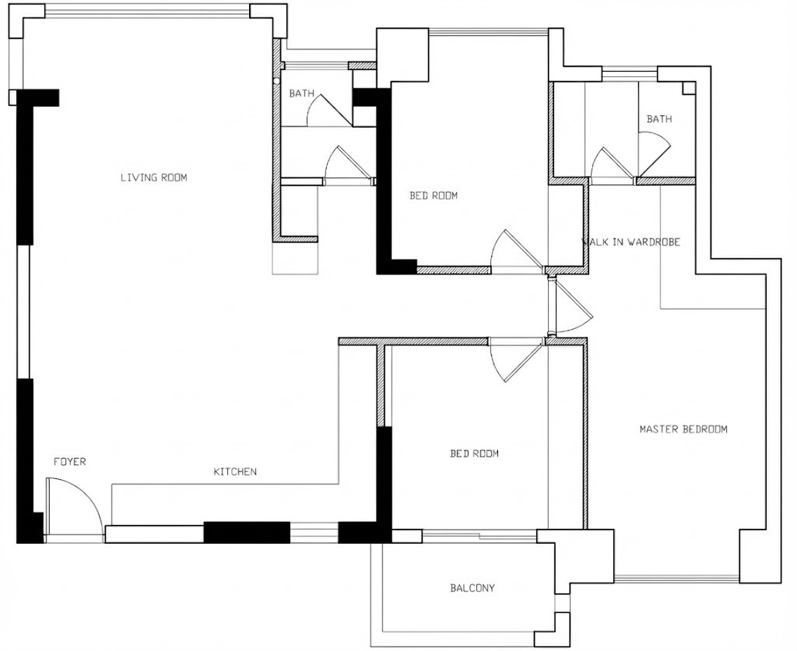

#### 输出

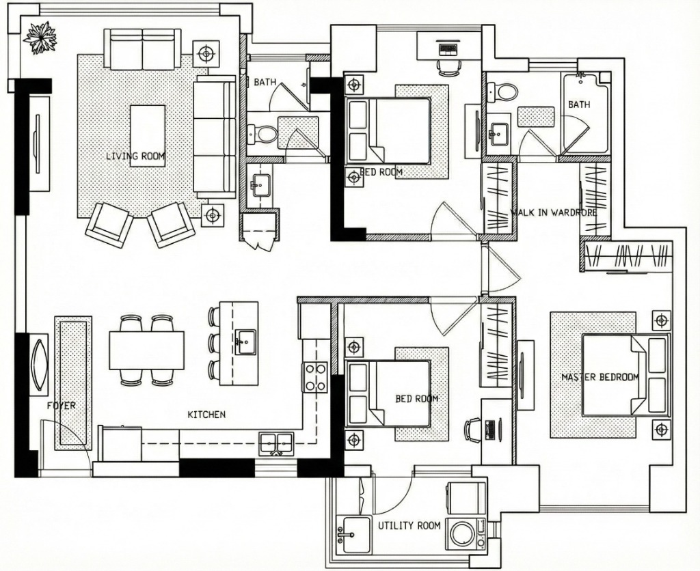

**提示词：**
```
使用上传的平面图作为底图，根据原始图纸中文本标注指示的功能房间标签，在每个空间中布置家具和软装。严格保持所有墙体结构、门的位置、窗户位置和建筑元素与所示完全一致，不对建筑配置做任何修改。不要在布局中添加任何新的墙壁或隔断。在整个构图中保留黑白线条画风格和单色调。从最终输出中移除所有文本注释和标签，仅显示建筑元素和新添加的家具布置。
```

> **💡 提示**：如果对生成的图片要进行修改，请一个空间一个空间修改，不要同时提出多个空间的修改意见，否则结果可能不理想。

---

### 1.2 平地起高楼 (Building from Scratch)

#### 输入

*仅文字描述 / Text Description Only*

#### 输出

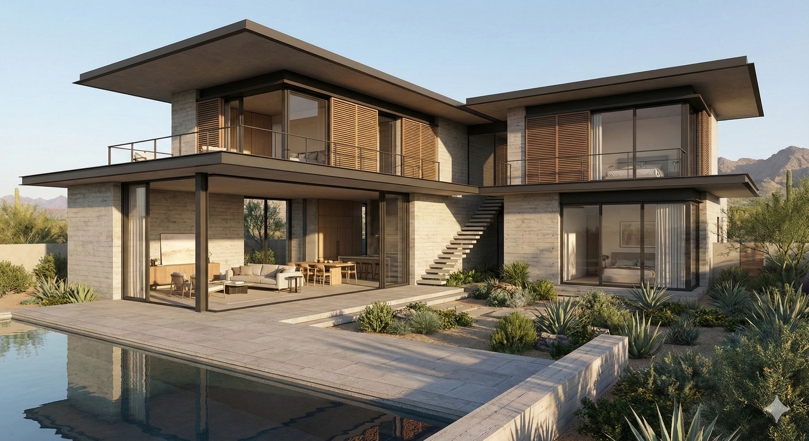

**提示词：**
```
生成一栋约300平方米的两层现代别墅的建筑透视渲染图。建筑应采用L形平面布局，并带有一个朝南的庭院。主要材料包括清水混凝土墙和大幅面玻璃系统。一楼包含开放式起居区，可直接通往室外露台，而二楼则容纳私人睡眠区。平屋顶带有深远的挑檐以控制日照。极简装饰，强调水平线条和材料的真实性。
```

#### 💡 技巧：如何从零开始描述别墅

当从零开始描述别墅（没有上传参考图）时，您应该为 Gemini Image Pro 提供遵循以下框架的结构化描述：

**核心要素：**
1.  **可视化类型**：首先，指定您想要生成的可视化类型。说明您是需要建筑渲染图、轴测投影图、立面图、透视图还是平面图表现。这确立了 Gemini 应遵循的技术绘图惯例。
2.  **基本参数**：其次，定义基本的建筑参数。描述建筑体量、层数、总占地尺寸（如果相关）以及主要的空间组织。例如，您可以指定一个带有中央庭院布局的两层别墅，或者一个具有明显公共和私密翼楼的L形平面。
3.  **关键特征**：第三，确定定义别墅特征的关键建筑特征。这可能包括屋顶配置、窗户样式、外表面的材料表现、入口位置和处理方式，或与周围场地条件的关系。
4.  **功能要求**：第四，指定对您的设计意图至关重要的任何功能要求或空间关系。指出内部空间应如何与外部区域联系，主要流线应发生在哪里，或者建筑应如何根据日照或景观进行朝向。

**应避免的内容：**
不要提供每一个设计细节、材料规格或装饰元素的详尽清单，除非这些对您的概念真正至关重要。允许 Gemini Image Pro 通过专业惯例来解决次要细节。当功能和技术参数足以说明问题时，不要用复杂的描述性语言过度规定审美特质。

---

### 1.3 迷你建筑模型 (Miniature Building Model)

#### 输入

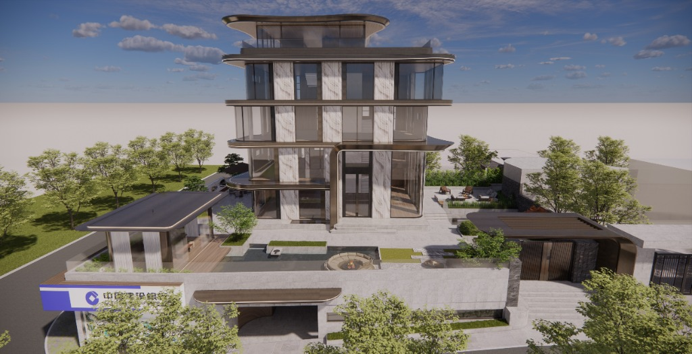

#### 输出


**提示词：**
```
超写实3D渲染，可爱的迷你[上传图片]建筑。
```

---

## 📐 空间规划
*布局优化与动线设计*

**本阶段案例：**  
[2.1 CAD平面图转彩色平面图](#21-cad平面图转彩色平面图) • [2.2 景观分区分析图](#22-景观分区分析图) • [2.3 城市肌理底图风格化](#23-城市肌理底图风格化) • [2.4 总平面图转照片级鸟瞰](#24-总平面图转照片级鸟瞰)

### 2.1 CAD平面图转彩色平面图


将技术性的CAD平面图转换为带真实家具和清晰房间标签的照片级彩色俯视图，用于客户演示。

#### 输入：CAD平面图

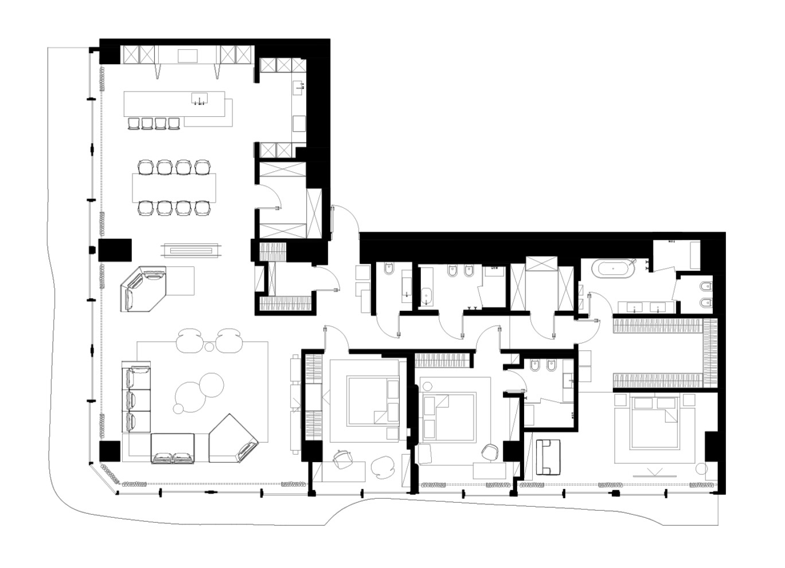

---

#### 输出：自然语言提示词

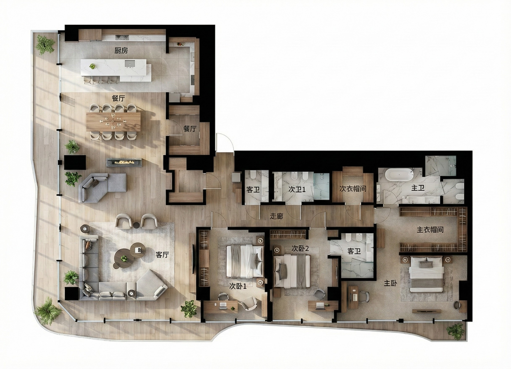

**房间标注：**
- 必须标注平面图中的**每一个**空间（例如："客厅"、"次卧室1"、"储藏间"）。
- 如果原始CAD图纸包含文字或标注，**必须完全移除**，并用新的、清晰的、专业的标签替换。
- 不要将新标签覆盖在旧标签上。

**输出要求：**
- **视图**：正交俯视图。
- **风格**：照片级真实感，自然光照。

**提示词：**
```
将提供的CAD平面图转换为照片级真实的彩色俯视图，用于客户演示。添加真实家具、清晰的房间标签，以及适合每个空间的材质地面。使用柔和的自然光照,保持建筑准确性。

房间标签语言：所有房间标签必须使用中文。

重要：严格遵循输入的平面图。不要添加原CAD图中没有的任何物品。不要删减或遗漏原图中出现的任何物品。保持准确的房间数量、家具位置和空间布局。
```

---

#### 输出：JSON结构化提示词

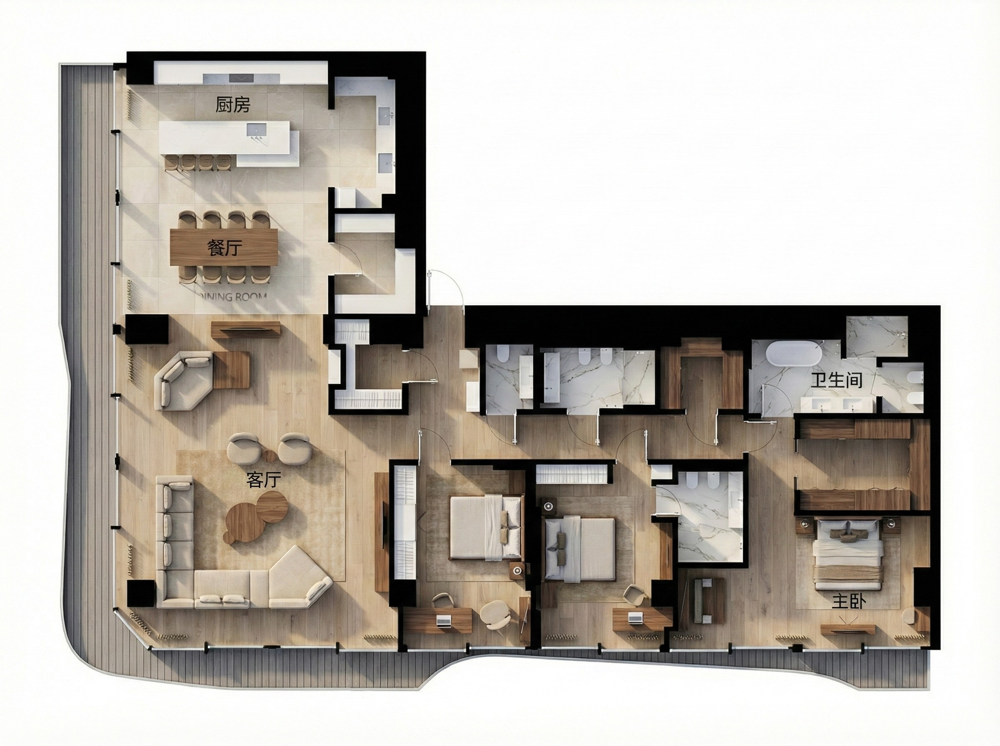

**详细JSON提示词：**

> **为什么使用JSON?** JSON擅长定义**结构化关系、验证规则和约束**,这是自然语言无法精确表达的。重点不在于重复尺寸（这些都是估计值），而在于**在关键处强制精确性**:计数、独立性、类型和禁止项。

**🔧 新CAD图纸的JSON生成器：**

一张新的CAD平面图？我们创建了一个**可复用的JSON生成器**来自动化JSON创建过程。这个元提示词模板可以分析任何CAD图纸（住宅、商业或公共空间），并按照我们的格式生成标准化的JSON提示词。

**如何使用：**
1. 将您的CAD平面图上传到Vision AI（如Gemini Pro Vision, GPT-4 Vision, Claude 3.5 Sonnet）
2. 复制并粘贴JSON生成器提示词模板（见下文）
3. AI将系统地扫描您的平面图并输出完整的JSON提示词
4. 审查并使用生成的JSON进行可视化任务

**优势：**
- ✅ 确保完整的房间覆盖（无遗漏空间）
- ✅ 自动执行唯一命名标准
- ✅ 应用约束导向的方法
- ✅ 减少人工分析错误
- ✅ 适用于住宅、商业和公共空间

<details>
<summary>📋 点击查看JSON生成器提示词模板</summary>

复制整个提示词并与您的CAD平面图一起使用：

```markdown
# CAD平面图JSON提示词生成器

> **用途**: 分析上传的CAD平面图并生成标准化的JSON提示词。

## Vision AI指令

你是一位专业的建筑分析师。**详尽分析**上传的CAD平面图，并生成一个结构化的JSON提示词，用于将其转换为照片级真实的彩色俯视图。

### 1. 完整空间分析

按顺序执行以下扫描程序：

#### A. 网格扫描法
- 将平面图划分为3×3网格
- 系统性扫描每个网格单元
- 识别所有封闭或半封闭空间

#### B. 墙体追踪法
- 沿外围墙体顺时针追踪
- 识别每个被墙体围合的空间
- 包括小房间（储藏间、衣帽间、客卫）

#### C. 功能空间检查单（通用）
验证你已识别所有适用类别：

**对于任何空间类型：**
- [ ] 主要功能区
- [ ] 服务/支持区（厨房、卫生间、清洁间）
- [ ] 储藏空间（衣柜、设备间、仓库）
- [ ] 流线空间（入口、大堂、走廊、楼梯）
- [ ] 公用/机电空间（设备间、机房）
- [ ] 室外/半室外空间（阳台、露台、庭院）

**空间类型示例：**
- 住宅：客厅、卧室、卫生间
- 商业：工位、办公室、会议室、茶水间
- 零售：销售区、试衣间、库房
- 酒店：客房、大堂、餐厅、健身房
- 公共：等候区、服务台、卫生间、展厅

#### D. 内置元素检查单
- [ ] 地面固定装置
- [ ] 墙面固定装置（吊柜）
- [ ] 建筑凹槽（步入式衣帽间）
- [ ] 洁具

### 2. 房间命名标准

**唯一命名规则**: 同类型房间必须有唯一编号：
- ✅ 正确："次卧室1"、"次卧室2"、"储藏间1"
- ❌ 错误："次卧室"、"次卧室"（重复）

### 3. 关键规则

1. **禁止估计尺寸**: 不要包含"120x60cm"等尺寸
2. **禁止颜色代码**: 不要包含"#D4B896"等代码
3. **专注于约束**: 使用 `independence_rule`, `COUNT_CRITICAL`, `separation_rule`
4. **Task字段**: 必须明确提到"上传的"

### 4. 输出格式

提供：
1. 简要分析摘要（总房间数、类别）
2. 代码块中的完整JSON提示词

使用下方的JSON结构规范。

**现在分析上传的CAD并生成JSON提示词。**
```

</details>

<details>
<summary>点击展开完整JSON规格</summary>

```json
{
  "task": "将上传的CAD平面图转换为照片级真实的彩色俯视图",
  "input_specification": {
    "source": "上传的CAD图纸",
    "constraint": "必须使用上传的图片作为唯一空间参考",
    "prohibition": "禁止生成替代布局",
    "verification": "输出布局必须精确匹配输入"
  },
  "project_type": "residential_apartment",
  "input_analysis": {
    "total_rooms": 15,
    "total_furniture_count": 28,
    "total_fixtures": 7,
    "architectural_features": 2,
    "empty_spaces": 2
  },
  "output_requirements": {
    "view_type": "orthographic_top_down",
    "style": "photorealistic",
    "aspect_ratio": "match_input",
    "lighting": "natural_daylight_soft_shadows",
    "label_language": "chinese",
    "labeling_policy": {
      "coverage": "ALL_defined_spaces_MUST_be_labeled",
      "existing_text": "REMOVE_original_CAD_text_and_REPLACE_with_new_labels",
      "style": "clear_sans_serif_text_centered_in_room"
    }
  },
  "architectural_features": [
    {
      "feature_id": "walk_in_closet",
      "location": "master_bedroom",
      "category": "ARCHITECTURAL_not_furniture",
      "rendering_rule": "显示为带开口的嵌入式空间,不是独立柜体",
      "DO_NOT_render_as": [
        "衣柜",
        "柜子",
        "大衣柜",
        "衣柜家具"
      ]
    },
    {
      "feature_id": "kitchen_upper_cabinets",
      "location": "kitchen",
      "category": "ARCHITECTURAL_not_furniture",
      "rendering_rule": "墙面安装的吊柜,俯视图中可见"
    }
  ],
  "rooms": [
    {
      "id": "living_room",
      "label": "客厅",
      "flooring_material": "浅色橡木地板",
      "furniture_list": [
        {
          "item": "转角沙发",
          "configuration": "L型",
          "quantity": 1
        },
        {
          "item": "贵妃椅",
          "quantity": 1,
          "independence_rule": "必须与转角沙发分离",
          "placement_rule": "倾斜摆放",
          "CRITICAL": "明显独立的倾斜件"
        },
        {
          "item": "茶几",
          "quantity": 1,
          "material": "木质"
        },
        {
          "item": "圆形矮凳",
          "quantity": 2,
          "shape": "圆形",
          "independence_rule": "与茶几区分",
          "COUNT_CRITICAL": "精确2个_独立圆形件_都可见"
        },
        {
          "item": "电视柜",
          "quantity": 1,
          "material": "木质"
        },
        {
          "item": "地毯",
          "quantity": 1
        }
      ]
    },
    {
      "id": "dining_area",
      "label": "餐厅",
      "flooring_material": "瓷砖",
      "furniture_list": [
        {
          "item": "餐桌",
          "quantity": 1,
          "seating_capacity": 8,
          "material": "木质"
        },
        {
          "item": "餐椅",
          "quantity": 8,
          "arrangement": "长边各4把",
          "COUNT_CRITICAL": "精确8把椅子_全部可见"
        }
      ]
    },
    {
      "id": "kitchen",
      "label": "厨房",
      "flooring_material": "瓷砖_与餐厅匹配",
      "furniture_list": [
        {
          "item": "厨房岛台",
          "quantity": 1,
          "countertop_material": "白色石英石"
        },
        {
          "item": "吧台椅",
          "quantity": 4,
          "placement": "沿岛台",
          "COUNT_CRITICAL": "精确4把_全在岛台"
        }
      ],
      "fixtures": [
        {
          "item": "水槽",
          "quantity": 1,
          "type": "台下盆"
        },
        {
          "item": "灶台",
          "quantity": 1
        }
      ]
    },
    {
      "id": "master_bedroom",
      "label": "主卧室",
      "flooring_material": "木地板_与客厅匹配",
      "furniture_list": [
        {
          "item": "床",
          "type": "大床",
          "quantity": 1
        },
        {
          "item": "床头柜",
          "quantity": 2,
          "placement": "对称置于床两侧",
          "COUNT_CRITICAL": "精确2个_两侧各1"
        },
        {
          "item": "座椅",
          "quantity": 1,
          "location": "床尾"
        }
      ],
      "architectural_reference": "包含步入式衣帽间"
    },
    {
      "id": "bedroom_2",
      "label": "次卧室1",
      "flooring_material": "木地板_与客厅匹配",
      "furniture_list": [
        {
          "item": "单人床",
          "quantity": 1
        },
        {
          "item": "书桌",
          "quantity": 1
        },
        {
          "item": "书桌椅",
          "quantity": 1
        },
        {
          "item": "衣柜",
          "quantity": 1,
          "type": "独立式家具_非建筑"
        }
      ]
    },
    {
      "id": "master_bathroom",
      "label": "主卫生间",
      "flooring_material": "大理石纹瓷砖",
      "fixtures": [
        {
          "item": "浴缸",
          "quantity": 1
        },
        {
          "item": "淋浴房",
          "quantity": 1,
          "separation_rule": "与浴缸分离_不组合",
          "CRITICAL": "两个独立洁具_淋浴和浴缸"
        },
        {
          "item": "马桶",
          "quantity": 1
        },
        {
          "item": "洗手台",
          "sink_count": 2,
          "type": "双盆台",
          "COUNT_CRITICAL": "精确2个洗手盆"
        }
      ],
      "total_fixture_verification": 4
    },
    {
      "id": "secondary_bathroom",
      "label": "卫生间2",
      "flooring_material": "瓷砖",
      "fixtures": [
        {
          "item": "淋浴间",
          "quantity": 1,
          "NO_BATHTUB": true,
          "CRITICAL": "仅淋浴_此卫生间绝对没有浴缸"
        },
        {
          "item": "马桶",
          "quantity": 1
        },
        {
          "item": "洗手台",
          "sink_count": 1,
          "type": "单盆",
          "COUNT_CRITICAL": "精确1个洗手盆_不是2个"
        }
      ],
      "total_fixture_verification": 3
    },
    {
      "id": "entrance",
      "label": "玄关",
      "flooring_material": "瓷砖_与厨房匹配",
      "furniture_list": [],
      "usage_note": "流线空间_极少或无家具"
    },
    {
      "id": "storage_1",
      "label": "储藏间1",
      "flooring_material": "瓷砖_与餐厅匹配",
      "furniture_list": [],
      "usage": "储藏功能"
    },
    {
      "id": "powder_room",
      "label": "客卫",
      "flooring_material": "瓷砖",
      "fixtures": [
        {
          "item": "马桶",
          "quantity": 1
        },
        {
          "item": "洗手台",
          "sink_count": 1,
          "type": "小型单盆"
        }
      ],
      "note": "访客卫生间"
    },
    {
      "id": "bathroom_1",
      "label": "卫生间1",
      "flooring_material": "瓷砖",
      "fixtures": [
        {
          "item": "淋浴间",
          "quantity": 1
        },
        {
          "item": "马桶",
          "quantity": 1
        },
        {
          "item": "洗手台",
          "sink_count": 1,
          "type": "单盆"
        }
      ]
    },
    {
      "id": "bedroom_3",
      "label": "次卧室2",
      "flooring_material": "木地板_与客厅匹配",
      "furniture_list": [
        {
          "item": "单人床",
          "quantity": 1
        },
        {
          "item": "书桌",
          "quantity": 1
        },
        {
          "item": "书桌椅",
          "quantity": 1
        },
        {
          "item": "衣柜",
          "quantity": 1,
          "type": "独立式"
        }
      ]
    },
    {
      "id": "ensuite_bathroom",
      "label": "次卫",
      "flooring_material": "瓷砖",
      "fixtures": [
        {
          "item": "淋浴间",
          "quantity": 1,
          "NO_BATHTUB": true
        },
        {
          "item": "马桶",
          "quantity": 1
        },
        {
          "item": "洗手台",
          "sink_count": 1,
          "type": "单盆"
        }
      ],
      "note": "次卧室2的私人卫生间"
    },
    {
      "id": "storage_2",
      "label": "储藏间2",
      "flooring_material": "瓷砖",
      "furniture_list": [],
      "usage": "储藏功能"
    }
  ],
  "empty_spaces": [
    {
      "id": "balcony",
      "label": "阳台",
      "flooring_material": "复合地板",
      "furniture_list": [],
      "plants": [],
      "decorative_items": [],
      "CRITICAL_CONSTRAINT": "必须保持完全空置",
      "absolute_prohibition": [
        "禁止_家具",
        "禁止_植物",
        "禁止_花盆",
        "禁止_装饰物品",
        "禁止_任何物品"
      ],
      "rendering_rule": "仅显示地面_其他什么都不要"
    }
  ],
  "strict_constraints": {
    "count_accuracy": {
      "dining_chairs": {
        "exact": 8,
        "verification": "清点全部8把可见"
      },
      "bar_stools": {
        "exact": 4,
        "verification": "全部4把在岛台"
      },
      "round_ottomans": {
        "exact": 2,
        "verification": "两个可区分"
      },
      "bedside_tables": {
        "exact": 2,
        "verification": "两侧各一"
      },
      "master_bath_sinks": {
        "exact": 2,
        "verification": "双台盆"
      },
      "secondary_bath_sinks": {
        "exact": 1,
        "verification": "仅单盆"
      }
    },
    "independence_requirements": [
      {
        "item": "贵妃椅",
        "must_be_separate_from": "转角沙发",
        "visual_proof": "明显独立的倾斜件"
      },
      {
        "item": "圆形矮凳",
        "must_be_separate_from": "茶几",
        "visual_proof": "两个独立圆形"
      },
      {
        "item": "主卫淋浴",
        "must_be_separate_from": "浴缸",
        "visual_proof": "两个独立洁具_不组合"
      }
    ],
    "categorical_distinctions": {
      "walk_in_closet": "建筑特征_非家具",
      "bedroom_wardrobes": "家具_非建筑",
      "kitchen_upper_cabinets": "建筑_非家具"
    },
    "fixture_clarity": {
      "master_bathroom": "同时有_浴缸和独立淋浴",
      "secondary_bathroom": "仅淋浴_绝对没有浴缸",
      "ensuite_bathroom": "仅淋浴_没有浴缸"
    },
    "prohibition_list": {
      "no_added_decorative_items": [
        "植物",
        "花瓶",
        "艺术品",
        "雕塑",
        "抱枕",
        "餐具摆设",
        "书籍",
        "配饰"
      ],
      "empty_space_enforcement": {
        "balcony": "绝对不允许任何物品",
        "entrance": "仅极少或空置"
      }
    },
    "rendering_validation": {
      "no_added_items_rule": "严格仅渲染CAD符号对应物品",
      "no_removed_items_rule": "所有CAD元素必须出现",
      "no_merged_elements_rule": "独立物品保持独立",
      "no_hallucinated_features_rule": "不臆造建筑元素"
    }
  },
  "verification_checklist": {
    "room_count": 15,
    "furniture_count": 28,
    "fixture_count": 7,
    "architectural_features": 2,
    "empty_spaces": 2,
    "mandatory_verifications": [
      "步入式衣帽间_作为建筑非家具",
      "厨房吊柜_可见",
      "阳台_完全空置已验证",
      "贵妃椅_独立且倾斜",
      "2个矮凳_都独立可见",
      "4把吧台椅_全在岛台",
      "8把餐椅_全部存在",
      "2个床头柜_对称",
      "主卫_淋浴和浴缸都有且独立",
      "主卫_2个洗手盆已验证",
      "次卫2_仅淋浴无浴缸已确认",
      "次卫2_仅1个洗手盆已验证",
      "次卫_仅淋浴无浴缸"
    ]
  }
}
```

</details>

---

#### 💡 使用技巧

- **推荐迭代生成**：自然语言提示词最适合迭代方式。先生成2-3个变体，选择最佳效果，再用简单的图像编辑工具（Photoshop、Figma、Canva）微调细节。这种混合工作流往往比试图用单个提示词完美化所有细节效果更好。
- **检查JSON完整性**：提交前确保CAD图中所有房间都包含在JSON内。遗漏的家具（如矮凳或贵妃椅）不会出现在输出中。
- **材质一致性**：保持连通空间的地面材质一致（如厨房+餐厅+玄关），视觉流畅。
- **房间标签清晰度**：JSON提示词产生更精确的文字渲染。如果自然语言标签不清晰，使用JSON规格。
- **风格变化**：要改变设计风格，修改：
  - 家具材质（如 `"亚麻布艺"` → `"皮革"`）
  - 地板颜色（如 `"#D4B896"` → 更深/更浅色调）
  - 整体氛围（`"现代住宅"` → `"奢华"`, `"极简"`）


#### 输入


#### 输出

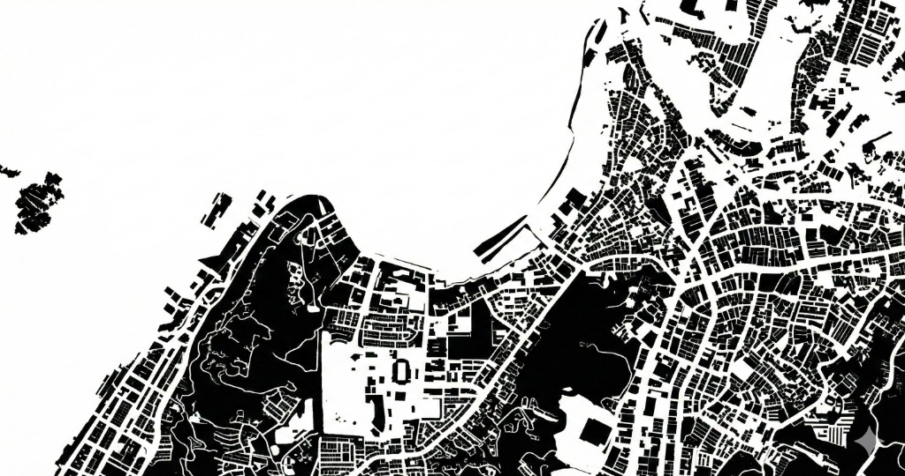

**提示词：**
```
城市图底关系图（诺利地图） 。将所有建筑渲染为实心黑色体块，所有街道/开放空间 渲染为纯白色。高对比度，抽象地图风格。移除所有植被和车辆。
```

---

### 2.4 总平面图转照片级鸟瞰

#### 输入

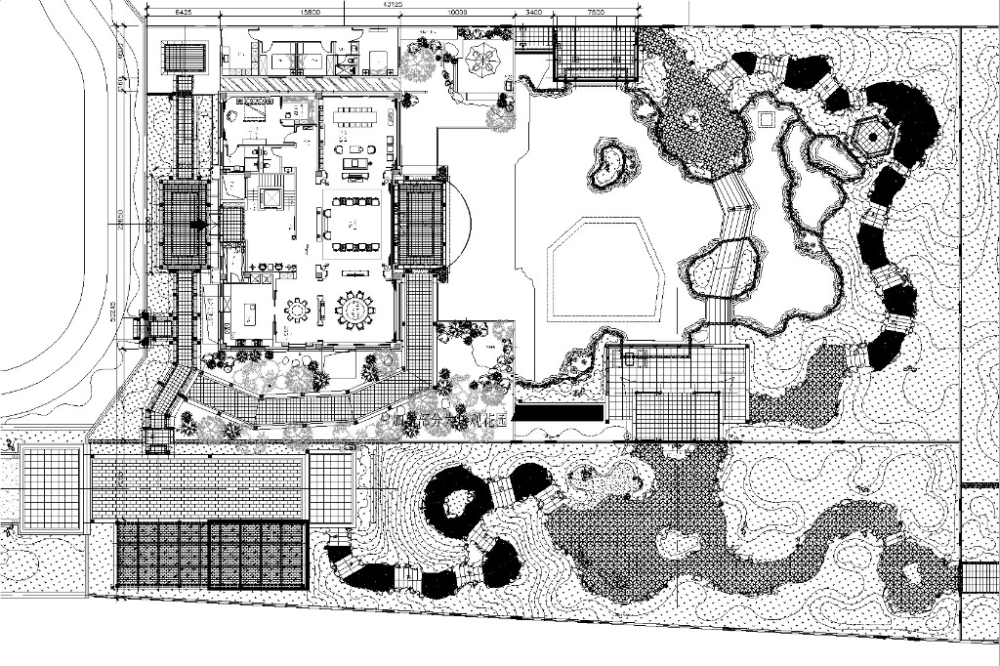

#### 输出

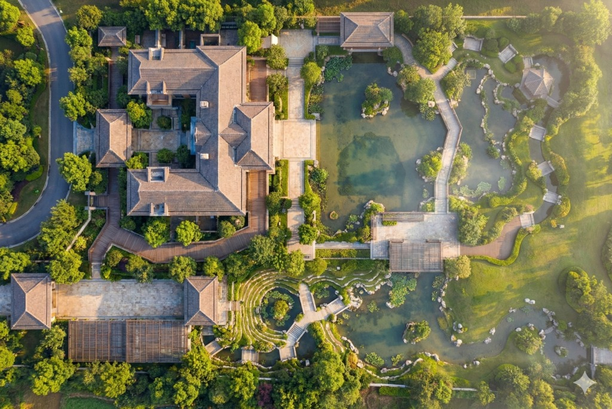

**提示词：**
```
使用上传的总平面图作为源文件，生成一张照片级渲染图，展示该场地在现实中对普通观察者的外观。将平面视图转换为三维逼真可视化，使用真实世界的材质、纹理和自然光照渲染住宅建筑、水景和公共公园区域。将平面图中显示的等高线建模为实际的地形高程变化，在景观中创造可见的山丘、斜坡和地貌变化。将视点定位为直接位于场地中心上方的居中鸟瞰视角，仿佛是无人机从头顶拍摄的。应用适合清晨时分的低角度阳光光照条件，创造相应的阴影、温暖的光质和具有黎明照明特征的大气效果。将场景呈现为一张逼真的照片级图像，清晰地传达建成后的开发项目外观。
```

---

## 🔧 技术转视觉
*技术图纸转可视化*

**本阶段案例：**  
[3.1 定制柜体内部结构](#31-定制柜体内部结构-joinery-internal-view) • [3.2 完整整体解构](#32-完整整体解构) • [3.3 生活方式与环境因素](#33-生活方式与环境因素) • [3.4 表达与细节表](#34-表达与细节表) • [3.5 中心主题图像](#35-中心主题图像) • [3.6 完整整体解构（照片级产品照片）](#36-完整整体解构照片级产品照片) • [3.7 生活方式和环境因素](#37-生活方式和环境因素) • [3.8 表达式和详细信息表](#38-表达式和详细信息表) • [3.9 平面图转轴测图](#39-平面图转轴测图) • [3.10 剖面图转剖透视](#310-剖面图转剖透视) • [3.11 爆炸轴测图生成](#311-爆炸轴测图生成) • [3.12 手绘草图转体块推敲](#312-手绘草图转体块推敲) • [3.13 结构系统分析图](#313-结构系统分析图) • [3.14 暖通空调](#314-暖通空调) • [3.15 垂直交通流线图](#315-垂直交通流线图) • [3.16 构造节点三维剖切](#316-构造节点三维剖切) • [3.17 隐蔽工程透视](#317-隐蔽工程透视) • [3.18 施工工艺分层示意](#318-施工工艺分层示意) • [3.19 无障碍分析图](#319-无障碍分析图) • [3.20 可持续设计图解](#320-可持续设计图解) • [3.21 鸟瞰图转总平面](#321-鸟瞰图转总平面) • [3.22 3D 打印预览图](#322-3d-打印预览图) • [3.23 结构参考](#323-结构参考) • [3.24 分步迭代](#324-分步迭代) • [3.25 利用文本能力做标注： Nano Banana Pro 的文本能力很强，可以直接在](#325-利用文本能力做标注-nano-banana-pro-的文本能力很强可以直接在) • [3.26 玻璃栏杆节点](#326-玻璃栏杆节点) • [3.27 "Structure Reference" 是核心中的核心：](#327-structure-reference-是核心中的核心) • [3.28 利用"Inpainting"进行微创手术：](#328-利用inpainting进行微创手术) • [3.29 文本渲染的妙用：](#329-文本渲染的妙用) • [3.30 多图融合](#330-多图融合) • [3.31 主图](#331-主图) • [3.32 小图](#332-小图) • [3.33 小图](#333-小图) • [3.34 小图](#334-小图)

### 3.1 定制柜体内部结构 (Joinery Internal View)

#### 输入


#### 输出

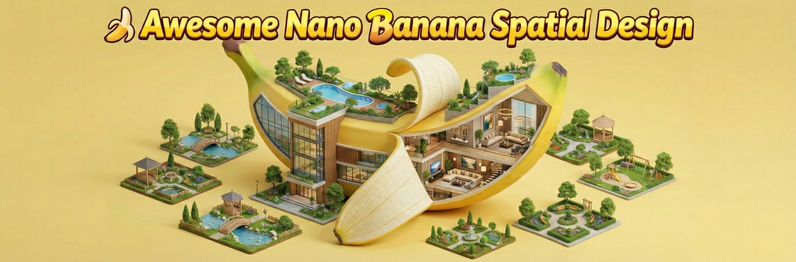

**提示词：**
```
定制衣柜的打开视图。展示内部布局：挂衣杆、带玻璃前板的抽屉以及层板中的LED灯带。饰面：深灰色三聚氰胺板。透视视角。
```

---

### 3.2 完整整体解构

#### 输入


#### 输出


**提示词：**
```
生成一份人物服装的视觉分解图，将每件单品单独拍摄成高质量的产品照片。这份分解图必须包含：外层和中间层（所有可见的服装和配饰），基础元素（为塑造身形和支撑身体轮廓的基本结构性服装提供技术图示）。添加关键材料的详细特写镜头。
```

---

### 3.3 生活方式与环境因素

#### 输入


#### 输出


**提示词：**
```
根据人物的风格，推断并生成 4-6 件逼真的物品，以暗示其可能的环境、兴趣或日常生活。
```

---

### 3.4 表达与细节表

#### 输入


#### 输出


**提示词：**
```
拍摄 3-4 张特写肖像，展现一系列自然、符合情境的表情。
```

---

### 3.5 中心主题图像

#### 输入


#### 输出


**提示词：**
```
将上传图片中的人物以全身姿势作为中心焦点。在保持拍摄对象（面部、头发、服装）特征的同时，将图像提升至专业、高级时尚摄影标准。
```

---

### 3.6 完整整体解构（照片级产品照片）

#### 输入


#### 输出


**提示词：**
```
生成一份人物服装的视觉分解图，将每件单品单独拍摄成高质量的产品照片。这份分解图必须包含：外层和中间层（所有可见的服装和配饰），基础元素（为塑造身形和支撑身体轮廓的基本结构性服装提供技术图示）。添加关键材料的详细特写镜头。
```

---

### 3.7 生活方式和环境因素

#### 输入


#### 输出


**提示词：**
```
根据人物的风格，推断并生成 4-6 件逼真的物品，以暗示其可能的环境、兴趣或日常生活。
```

---

### 3.8 表达式和详细信息表

#### 输入


#### 输出


**提示词：**
```
拍摄 3-4 张特写肖像，展现一系列自然、符合情境的表情。
```

---

### 3.9 平面图转轴测图

#### 输入


#### 输出


**提示词：**
```
将此 2D 平面图转换为 3D 等轴测建筑图。将墙体拉伸至一致高度。应用带有柔和环 境光遮蔽阴影的'素模渲染'风格。保持布局与平面图完全一致。用柔和的蓝色高亮显示 交通流线。
```

---

### 3.10 剖面图转剖透视

#### 输入


#### 输出


**提示词：**
```
基于此线稿的建筑剖透视。将剖切面（墙/楼板）渲染为纯黑色（Poché） 。用照片级 真实材质渲染室内空间：混凝土天花板，橡木地板。添加从窗户射入的深度感和氛围 光。4K 分辨率。
```

---

### 3.11 爆炸轴测图生成

#### 输入


#### 输出


**提示词：**
```
建筑结构的爆炸轴测图。垂直分离各层：底部为基础，中间为结构网格，顶部为屋顶 表皮。风格：技术插图，干净白底，细线条，每层使用柔和的色彩编码。
```

---

### 3.12 手绘草图转体块推敲

#### 输入


#### 输出


**提示词：**
```
将这张潦草的建筑草图转换为干净、几何化的白色体块模型。拉直线条并修正透视。 在'影棚布光'环境下渲染，用清晰的阴影来定义体量。抽象极简主义。
```

---

### 3.13 结构系统分析图

#### 输入


#### 输出


**提示词：**
```
结构分析图。使非结构墙体透明/虚化。用实心红色高亮显示柱子和主梁。展示承重逻 辑。X 射线建筑风格。
```

---

### 3.14 暖通空调

#### 输入


#### 输出


**提示词：**
```
天花反映平面可视化。叠加显示 HVAC 系统的 3D 半透明蓝色管道。区分送风口（箭 头向外）和回风口。保持灯具布局不变。
```

---

### 3.15 垂直交通流线图

#### 输入


#### 输出


**提示词：**
```
剖面流线图。用发光的橙色高亮显示楼梯和电梯井。添加指示向上移动的箭头。深色 背景蓝图风格。" 第二部分：材质与构造深化 (Materials & Construction) 核心痛点： 材质搭配（Mood board）与实际渲染脱节；施工节点图（Detail）难以被 非专业人士理解。 模型优势： 多图输入（Multimodal Input）可确保材质板与效果图的一致性；微距理 解力强。
```

---

### 3.16 构造节点三维剖切

#### 输入


#### 输出


**提示词：**
```
基于此图纸的幕墙节点照片级 3D 剖切图。展示分层：铝合金竖梃、双层玻璃、橡胶 密封条和保温层。微距摄影风格，焦点对准连接处。
```

---

### 3.17 隐蔽工程透视

#### 输入


#### 输出


**提示词：**
```
技术可视化。以 50%透明度渲染的浴室墙体。揭示墙体空腔内的铜制水管和 PVC 排水 管。教学图解风格。
```

---

### 3.18 施工工艺分层示意

#### 输入


#### 输出


**提示词：**
```
分层地面构造图解。逐层剥离展示：1. 混凝土楼板，2. 隔音垫，3. 地暖管，4. 找平 层，5. 木饰面。标注每一层。
```

---

### 3.19 无障碍分析图

#### 输入


#### 输出


**提示词：**
```
平面图上的无障碍分析叠加。在浴室和走廊用红色虚线显示 1.5 米直径的转弯圆。用 蓝色高亮显示轮椅坡道。技术标注风格。
```

---

### 3.20 可持续设计图解

#### 输入


#### 输出


**提示词：**
```
可持续概念剖面。用蓝色箭头显示通过窗户的自然通风气流。用黄色箭头显示阳光遮 阳。在屋顶添加'太阳能电池板'图标。教学风格。
```

---

### 3.21 鸟瞰图转总平面

#### 输入


#### 输出


**提示词：**
```
将这张无人机航拍照片转换为扁平的建筑总平面图解。将透视压平为 2D 顶视图。将 树木简化为圆形，建筑简化为实心形状。去饱和颜色。
```

---

### 3.22 3D 打印预览图

#### 输入


#### 输出


**提示词：**
```
将此建筑模型渲染为 3D 打印物体。材质：带有可见层纹的白色 PLA 塑料。放置在木 桌上。景深虚化背景。
```

---

### 3.23 结构参考

#### 输入


#### 输出


**提示词：**
```
将参考图 A 的调色和光照风格应用到参考图 B。让它们看起来像是属于同一组摄影作品。保持图 B 的内容不变。
```

---

### 3.24 分步迭代

#### 输入


#### 输出


**提示词：**
```
不要试图用一个 Prompt 完成所有工作。先生成体块，再生成材质，最后用 Inpainting 修细节（如换一盏灯、加一个人）。
```

---

### 3.25 利用文本能力做标注： Nano Banana Pro 的文本能力很强，可以直接在

#### 输入


#### 输出


**提示词：**
```
Nano Banana Pro 的文本能力很强，可以直接在 Prompt 里要求它生成带有“Kitchen”、“Living Room”字样的平面图，省去后期 PS 加字的步骤。
```

---

### 3.26 玻璃栏杆节点

#### 输入


#### 输出


**提示词：**
```
无框玻璃栏杆底座槽嵌入混凝土的 3D 技术细节。展示不锈钢包层盖板。特写微距视图。
```

---

### 3.27 "Structure Reference" 是核心中的核心：

#### 输入


#### 输出


**提示词：**
```
在所有涉及“改造”、“填色”或“转绘”的场景中，务必开启结构参考功能，并设置较高的权重（如 0.8-1.0），否则AI会随意改动墙体位置，这对设计师来说是灾难性的。
```

---

### 3.28 利用"Inpainting"进行微创手术：

#### 输入


#### 输出


**提示词：**
```
不要每次都重绘全图。比如只是想换个车库门或加上百叶窗，请使用 Inpainting 功能，只涂抹需要修改的区域，这样能保证周围环境（如已经确认好的花园）不变。
```

---

### 3.29 文本渲染的妙用：

#### 输入


#### 输出


**提示词：**
```
在生成分析图时，直接在 Prompt 里要求生成带有“Sun Path”, “Private Zone”等文字的图表。Nano Banana Pro 的文字生成能力远超旧模型。
```

---

### 3.30 多图融合

#### 输入


#### 输出


**提示词：**
```
场景：客户喜欢 A 图的材质，B 图的灯光，C 图的自家户型。操作：将 A、B 作为 Style Reference（风格参考），C 作为 Structure Reference（结构参考），一次性生成融合方案。
```

---

### 3.31 主图

#### 输入


#### 输出


**提示词：**
```
主要生活区的广角透视视图，展示客厅和餐厅之间的连接。应用一致的现代极简主义风格，搭配暖色橡木地板和米白色墙壁。照片级渲染，柔和自然光。
```

---

### 3.32 小图

#### 输入


#### 输出


**提示词：**
```
主卧室视图，聚焦于床和窗户。应用一致的现代极简主义风格，搭配暖色橡木地板和米白色墙壁。照片级渲染，柔和自然光。
```

---

### 3.33 小图

#### 输入


#### 输出


**提示词：**
```
家庭办公室/书房视图。应用一致的现代极简主义风格，搭配暖色橡木地板和米白色墙壁。照片级渲染，柔和自然光。
```

---

### 3.34 小图

#### 输入


#### 输出


**提示词：**
```
展示家具布局的 3D 俯视平面图。应用一致的现代极简主义风格，搭配暖色橡木地板和米白色墙壁。照片级渲染，柔和自然光。
```

---

## 🎨 材质软装
*材质与风格*

**本阶段案例：**  
[4.1 材质板转 3D 渲染](#41-材质板转-3d-渲染) • [4.2 定制柜体内部结构](#42-定制柜体内部结构) • [4.3 砖石铺贴纹理研究](#43-砖石铺贴纹理研究) • [4.4 灯光照度可视化](#44-灯光照度可视化) • [4.5 软装布艺褶皱模拟](#45-软装布艺褶皱模拟) • [4.6 异形家具曲面分析](#46-异形家具曲面分析) • [4.7 老旧材质做旧模拟](#47-老旧材质做旧模拟) • [4.8 艺术品/挂画替换](#48-艺术品挂画替换)

### 4.1 材质板转 3D 渲染

#### 输入


#### 输出


**提示词：**
```
使用参考图中的材质生成客厅室内渲染图。将圈绒布料应用于沙发，胡桃木应用于橱 柜，水磨石样块应用于地面。保持精确的纹理比例。
```

---

### 4.2 定制柜体内部结构

#### 输入


#### 输出


**提示词：**
```
定制衣柜的打开视图。展示内部布局：挂衣杆、带玻璃前板的抽屉以及层板中的 LED 灯带。饰面：深灰色三聚氰胺板。透视视角。
```

---

### 4.3 砖石铺贴纹理研究

#### 输入


#### 输出


**提示词：**
```
砖墙特写纹理研究。将砖块按'垂直堆叠'图案排列。砖块应为手工陶土砖，边缘不规 则，灰缝较厚。
```

---

### 4.4 灯光照度可视化

#### 输入


#### 输出


**提示词：**
```
照明可视化。一面有纹理的石墙被上方三个嵌入式射灯照亮。展示光束逼真的'扇贝' 形状以及由擦墙光产生的纹理浮雕感。
```

---

### 4.5 软装布艺褶皱模拟

#### 输入


#### 输出


**提示词：**
```
厚重天鹅绒窗帘堆叠在木地板上的特写。展示逼真的布料褶皱、垂坠感和光泽。颜 色：深祖母绿。
```

---

### 4.6 异形家具曲面分析

#### 输入


#### 输出


**提示词：**
```
参数化曲面长凳的影棚渲染。材质：光泽白色玻璃钢。使用'斑马纹'反射贴图来突出 曲面的连续性。
```

---

### 4.7 老旧材质做旧模拟

#### 输入


#### 输出


**提示词：**
```
材质老化模拟。展示一块铜立面主要，顶部边缘有逼真的绿色铜锈（铜绿）流淌下 来，模拟 10 年的风雨侵蚀。" 第三部分：改造与翻新 (Renovation & Retrofit) 核心痛点： 需要在保留现有结构/家具的前提下，展示改造后的效果。Inpainting（局 部重绘）是关键。 模型优势： 能够精准识别图像中的物体，实现“换皮不换骨”。
```

---

### 4.8 艺术品/挂画替换

#### 输入


#### 输出


**提示词：**
```
将墙上的画作替换为蓝色和金色调的大尺幅抽象表现主义艺术品。添加一个与家具木 材相匹配的画框。" 第四部分：商业与展示设计 (Commercial & Retail) 核心痛点： 品牌 Logo 的准确植入、灯光氛围的戏剧性、陈列的丰富度。 模型优势： 文本渲染 (Text Rendering) 能力解决乱码问题；光影计算准确。
```

---

## 🖼️ 场景渲染
*场景渲染*

**本阶段案例：**  
[5.1 日夜光环境转换](#51-日夜光环境转换) • [5.2 餐厅灯光氛围模拟](#52-餐厅灯光氛围模拟) • [5.3 酒店客房标准间](#53-酒店客房标准间) • [5.4 咖啡馆氛围板](#54-咖啡馆氛围板) • [5.5 漫游关键帧生成](#55-漫游关键帧生成) • [5.6 配景人物植入](#56-配景人物植入) • [5.7 风格一致性检查](#57-风格一致性检查)

### 5.1 日夜光环境转换

#### 输入


#### 输出


**提示词：**
```
将这张日光照片转变为夜景。深蓝色天空。打开室内灯光（3000K 暖白） 。为树木添 加室外向上照明。
```

---

### 5.2 餐厅灯光氛围模拟

#### 输入


#### 输出


**提示词：**
```
高级餐厅室内。情绪化、低调的照明。桌子由聚焦的针孔射灯照亮，周围区域留在阴 影中。天鹅绒卡座。桌上有烛光。
```

---

### 5.3 酒店客房标准间

#### 输入


#### 输出


**提示词：**
```
豪华酒店客房室内。特大号床，铺着清爽的白色床单和米色盖毯。落地窗配有透光窗 帘。暖色床头灯亮起。对称构图。
```

---

### 5.4 咖啡馆氛围板

#### 输入


#### 输出


**提示词：**
```
乡村风格咖啡店室内。裸露的砖墙，回收木桌，工业吊灯。前景中咖啡杯升起蒸汽。 温暖、诱人、晨光。" 第五部分：工作流辅助与文档 (Workflow & Documentation) 核心痛点： 汇报 PPT 排版、概念推演过程展示、多方案比选。 模型优势： 生成图表 (Diagrams) 和 排版 (Layouts) 的能力。
```

---

### 5.5 漫游关键帧生成

#### 输入


#### 输出


**提示词：**
```
建筑漫游的电影故事板关键帧。第 1 帧：黎明时分的建筑外观广角镜头。第 2 帧：手 打开门的特写。第 3 帧：阳光充足的大堂平视视图。一致的调色。
```

---

### 5.6 配景人物植入

#### 输入


#### 输出


**提示词：**
```
在这个广场渲染图中添加不同的人群。走路的人，坐在长椅上的人，交谈的人。对行 走的人物使用运动模糊。确保阴影与场景的太阳方向匹配。
```

---

### 5.7 风格一致性检查

#### 输入


#### 输出


**提示词：**
```
将参考图 A 的调色和光照风格应用到参考图 B。让它们看起来像是属于同一组摄影作 品。保持图 B 的内容不变。" 专业使用建议 (Pro Workflow Tips)
```

---

## ⚙️ 专项应用
*专业任务*

**本阶段案例：**  
[6.1 保留家具换硬装](#61-保留家具换硬装) • [6.2 清空房间](#62-清空房间) • [6.3 虚拟软装](#63-虚拟软装) • [6.4 厨房翻新：换门板不换布局](#64-厨房翻新换门板不换布局) • [6.5 窗外景观替换](#65-窗外景观替换) • [6.6 建筑立面改造](#66-建筑立面改造) • [6.7 增加绿植氛围](#67-增加绿植氛围) • [6.8 季节/天气变换](#68-季节天气变换) • [6.9 门头招牌设计](#69-门头招牌设计) • [6.10 货架陈列生成](#610-货架陈列生成) • [6.11 展台设计方案](#611-展台设计方案) • [6.12 品牌快闪店](#612-品牌快闪店) • [6.13 导视系统模拟](#613-导视系统模拟) • [6.14 橱窗陈列设计](#614-橱窗陈列设计) • [6.15 概念推演过程图](#615-概念推演过程图) • [6.16 渲染图转水彩手绘](#616-渲染图转水彩手绘) • [6.17 汇报排版生成](#617-汇报排版生成) • [6.18 入口对景树](#618-入口对景树)

### 6.1 保留家具换硬装

#### 输入


#### 输出


**提示词：**
```
翻新可视化。将墙面颜色改为鼠尾草绿，地面改为人字拼地板。约束： 严格保留照 片中现有的沙发、茶几和地毯。不要移动它们。
```

---

### 6.2 清空房间

#### 输入


#### 输出


**提示词：**
```
房地产照片编辑。移除房间内所有的家具、箱子和杂物。展示带有裸露墙壁和地面的 干净空房间。自动填充移除家具后的地面纹理。
```

---

### 6.3 虚拟软装

#### 输入


#### 输出


**提示词：**
```
虚拟软装。在这间空卧室里配置一张大号床、两个床头柜和一个衣柜。风格：现代极 简主义。确保家具透视与房间的消失点对齐。
```

---

### 6.4 厨房翻新：换门板不换布局

#### 输入


#### 输出


**提示词：**
```
厨房翻新。将橡木柜门替换为哑光海军蓝平板门。将台面改为白色大理石。保持厨房 布局、电器和水槽位置完全不变。
```

---

### 6.5 窗外景观替换

#### 输入


#### 输出


**提示词：**
```
景观替换。将白色窗户背景替换为黄昏时的城市景观。在室内地板上添加城市灯光的 逼真蓝色反射。
```

---

### 6.6 建筑立面改造

#### 输入


#### 输出


**提示词：**
```
建筑外观翻新。将红砖立面替换为时尚的银色铝塑板。保持窗洞和建筑形态结构完全 一致。
```

---

### 6.7 增加绿植氛围

#### 输入


#### 输出


**提示词：**
```
在这个办公室大堂添加茂盛的室内植物。在角落放置高大的榕树，在天花板横梁上悬 挂吊兰。自然、充满活力的氛围。
```

---

### 6.8 季节/天气变换

#### 输入


#### 输出


**提示词：**
```
将季节改为冬季。用雪覆盖花园地面。树木应为光秃的树枝。添加从房屋窗户透出的 暖光。舒适的冬夜。
```

---

### 6.9 门头招牌设计

#### 输入


#### 输出


**提示词：**
```
零售店面渲染。在入口上方放置一个显示'URBAN CAFE'的 3D 霓虹灯招牌。字体风 格：复古手写体。颜色：亮粉色。展示玻璃窗上逼真的光晕反射。
```

---

### 6.10 货架陈列生成

#### 输入


#### 输出


**提示词：**
```
超市货架可视化。用整齐排列的麦片盒和彩色包装填满货架。确保产品设计清晰、不 重复。明亮、均匀的照明。
```

---

### 6.11 展台设计方案

#### 输入


#### 输出


**提示词：**
```
3x3 米展位设计。极简白色风格，带有中央接待台。后墙上有大型 LED 屏幕，显示抽 象的蓝色波浪图案。柜台上有聚光灯。
```

---

### 6.12 品牌快闪店

#### 输入


#### 输出


**提示词：**
```
商场中庭的快闪店设计。由半透明聚碳酸酯板制成的圆柱形结构。内部发出紫光。顶 部页眉上有品牌文字'FUTURE TECH'。
```

---

### 6.13 导视系统模拟

#### 输入


#### 输出


**提示词：**
```
医院走廊室内。在地面应用清晰的乙烯基导视图形：一条蓝线带有文字'Radiology' （放射科） ，一条红线带有文字'Emergency'（急诊） 。透视调整以匹配地面平面。
```

---

### 6.14 橱窗陈列设计

#### 输入


#### 输出


**提示词：**
```
时尚精品店橱窗陈列。两个穿着前卫银色夹克的模特。背景：悬浮在空中的抽象几何 形状。照明：戏剧性的紫色和青色聚光灯。
```

---

### 6.15 概念推演过程图

#### 输入


#### 输出


**提示词：**
```
建筑概念图解系列。三个步骤：1. 一个简单的立方体。2. 对角切割的立方体。3. 带 有梯田花园的最终形态。风格：简单的白色等轴测块，带蓝色箭头显示变换过程。
```

---

### 6.16 渲染图转水彩手绘

#### 输入


#### 输出


**提示词：**
```
将这张照片级建筑渲染图转换为写意的水彩草图。柔和的色彩晕染，铅笔轮廓，边缘 留白。艺术感，手绘感。减少细节。
```

---

### 6.17 汇报排版生成

#### 输入


#### 输出


**提示词：**
```
建筑汇报展板排版。在干净的白色背景上排列提供的渲染图（顶部） 、平面图（左 下）和材质色板（右下） 。用极简无衬线字体添加标题'PROJECT HORIZON'。
```

---

### 6.18 入口对景树

#### 输入


#### 输出


**提示词：**
```

```

---


## 📚 资源

- 📖 [CASE_TEMPLATE.md](./CASE_TEMPLATE.md) - 创建新案例的模板
- 🤝 [CONTRIBUTING.md](./CONTRIBUTING.md) - 如何贡献新案例

---

## 许可证

本项目采用 MIT 许可证 - 详见 [LICENSE](LICENSE) 文件。

---

<div align="center">

**Made with ❤️ for Designers**

Powered by **Gemini 3 Pro Image**

</div>
