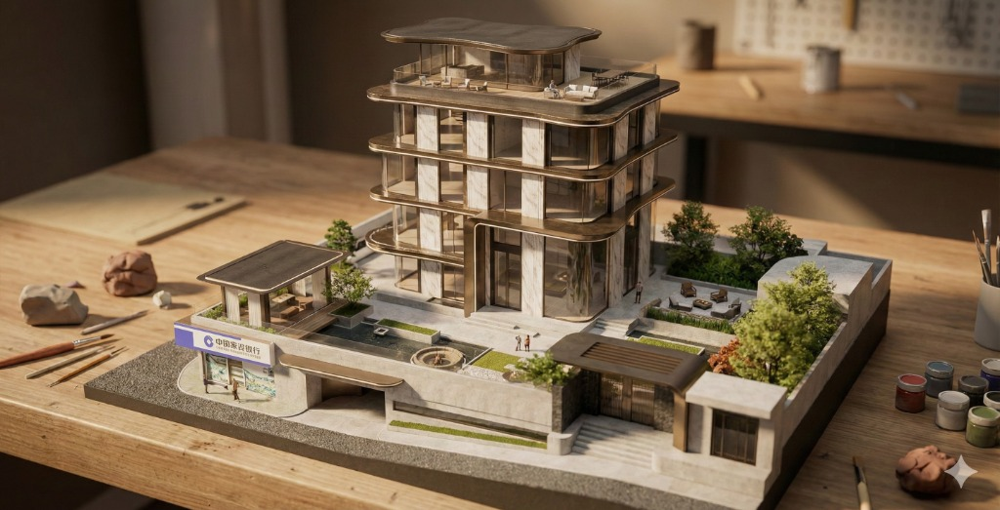

# 3D Storefront Render / 3D 店铺渲染图

## 效果预览 / Preview

> Transform an uploaded building exterior image into a cute, miniature 3D render.
>
> 将上传的建筑外观图改造成可爱的迷你3D渲染图。


*Input: Building Exterior / 输入：建筑外观*


*Output: Miniature 3D Render / 输出：迷你3D渲染*

---

## 提示词 / Prompt

### English Version

```
Ultra-realistic 3D render of a cute, miniature [Uploaded images] building.
```

### 中文版

```
超写实3D渲染，可爱的迷你[上传图片]建筑。
```

---

## 标签 / Tags

`#concept-ideation` `#3d-render` `#storefront` `#miniature`
`#概念构思` `#3D渲染` `#店铺` `#微缩模型`
