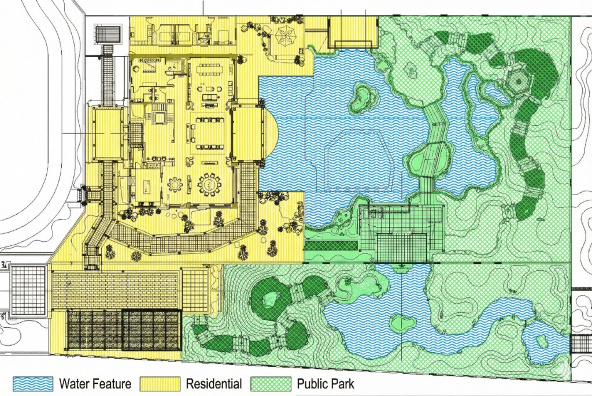

# Case 2.2: Landscape Zoning Map `[Original]`

> **Site analysis diagram.**
>
> Overlay color-coded zones on the site plan: Green for 'Public Park', Blue for 'Water Feature', Yellow for 'Residential'. Use hatch patterns and legends. Vector graphic style.


*Input: Site Plan CAD / 输入：总平面CAD*


*Output: Landscape Zoning Analysis / 输出：景观分区分析图*

---

## 📝 Prompt / 提示词

**English:**
```markdown
Site analysis diagram. Overlay color-coded zones on the site plan: Green for 'Public Park', Blue for 'Water Feature', Yellow for 'Residential'. Use hatch patterns and legends. Vector graphic style.
```

**中文:**
```markdown
场地分析图。在总平面图上叠加颜色编码的分区：绿色代表“公共公园”，蓝色代表“水景”，黄色代表“住宅区”。使用填充图案和图例。矢量图形风格。
```

## 🏷️ Tags
`#space-planning` `#landscape-design` `#site-analysis` `#zoning-map` `#diagram`
