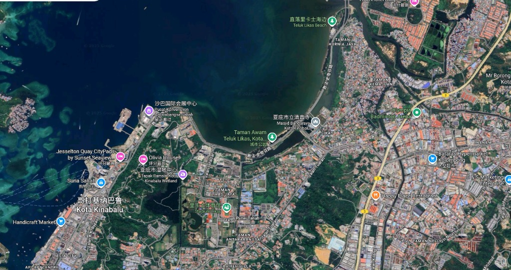

# Case 2.3: Urban Fabric Stylization `[Original]`

> **Urban figure-ground diagram (Noli map).**
>
> Render all buildings as solid black masses and all streets/open spaces as pure white. High contrast, abstract map style. Remove all vegetation and cars.


*Input: Satellite Map / 输入：卫星地图*


*Output: Urban Figure-Ground Diagram (Noli Map) / 输出：城市图底关系图（诺利地图）*

---

## 📝 Prompt / 提示词

**English:**
```markdown
Urban figure-ground diagram (Noli map). Render all buildings as solid black masses and all streets/open spaces as pure white. High contrast, abstract map style. Remove all vegetation and cars.
```

**中文:**
```markdown
城市图底关系图（诺利地图）。将所有建筑渲染为实心黑色体块，所有街道/开放空间渲染为纯白色。高对比度，抽象地图风格。移除所有植被和车辆。
```

## 🏷️ Tags
`#space-planning` `#urban-design` `#site-analysis` `#noli-map` `#figure-ground`
