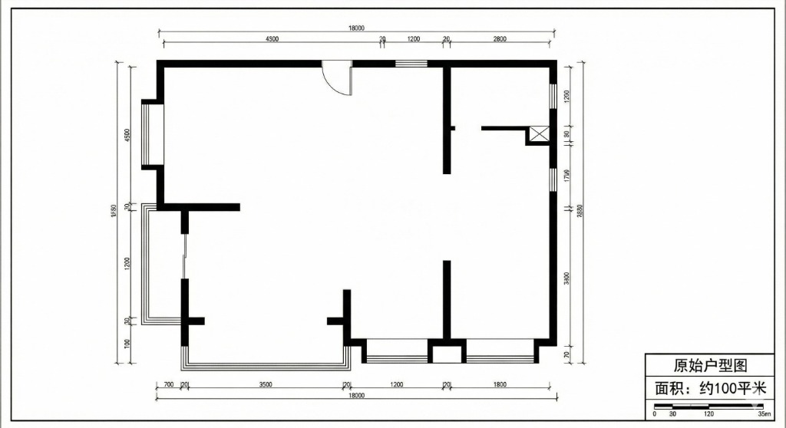
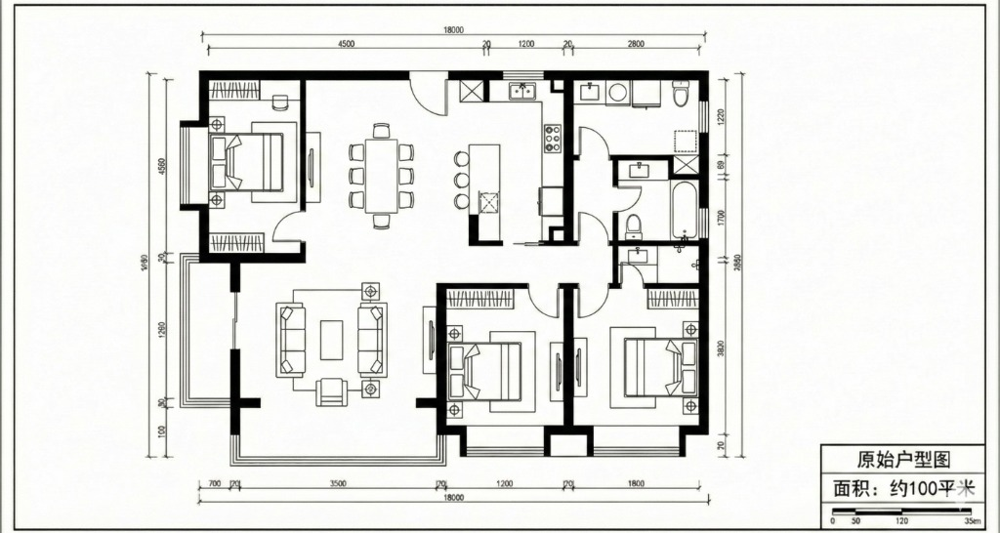

# 3.3 Elevation to Render / 立面图转渲染

## 效果预览 / Preview

> **Note**: Convert 2D technical elevation drawings into photorealistic material renderings.
>
> **注意**: 将2D技术立面图转换为照片级材质渲染图。

---

> ⚠️ **Placeholder Assets**: The images below are currently placeholders. Please replace them with actual CAD elevation drawings and corresponding renders.
>
> ⚠️ **占位资源**：以下图片当前为占位符。请替换为实际的 CAD 立面图和对应的渲染图。

---

### Input

*CAD Elevation Drawing / CAD 立面图*

### Output

*Material Visualization / 材质可视化*

---

## 提示词 / Prompt

### 中文版

```
将这张2D CAD立面图转换为照片级室内渲染，严格遵循图纸的几何结构和比例：

画面理解：
1.这不仅是线条图，通过光影将其转化为真实的立体空间
2.识别图中的家具、柜体、层板和装饰面板

材质定义：
- 电视墙/主背景：[指定材质，如：白色大理石 / 木饰面 / 艺术涂料]
- 柜体/收纳：[指定材质，如：深灰色哑光烤漆 / 玻璃柜门]
- 层板：[指定材质，如：胡桃木 / 金属薄板]
- 地面/踢脚：[指定材质]

光影氛围：
- 添加柔和的室内照明
- 激活柜体内的灯带（如果有线性设计）
- 营造现代极简或轻奢氛围
- 确保材质具有真实的反射和纹理质感

严格保真：
- 保持所有物体的位置、尺寸和比例与CAD图纸完全一致
- 不要添加图纸上不存在的大型家具

输出：正面视角的写实室内立面效果图
```

### English Version

```
Transform this 2D CAD elevation drawing into a photorealistic interior rendering, strictly following the geometry and proportions:

SCENE UTNDERSTANDING:
1. Interpret the 2D lines as a real 3D space with depth and shadow
2. Identify furniture, cabinetry, shelves, and decorative panels

MATERIAL DEFINITION:
- Main Wall/Background: [Specify: e.g., White Marble / Wood Veneer / Textured Paint]
- Cabinetry: [Specify: e.g., Dark Grey Matte Lacquer / Glass Doors]
- Shelving: [Specify: e.g., Walnut Wood / Thin Metal]
- Floor/Baseboard: [Specify Material]

LIGHTING & ATMOSPHERE:
- Apply soft interior lighting
- Activate integrated LED strips within cabinetry (if linear patterns exist)
- Create a Modern Minimalist or Luxury atmosphere
- Ensure realistic reflections and textures

STRICT FIDELITY:
- Maintain exact position, size, and aspect ratio of all elements matching the CAD
- Do not add large furniture not present in the drawing

OUTPUT: Photorealistic frontal interior elevation render.
```

---

## Tips / 使用技巧

### 中文

- **技巧1**: **材质映射** - 提示词中最关键的部分是明确告诉 AI 哪一块区域也就是图纸上的哪个矩形应该是什么材质。
- **技巧2**: **灯光暗示** - 即使图纸上没有画光影，提示词中加入"LED strips"（灯带）可以让柜体看起来更立体高级。

### English

- **Tip 1**: **Material Mapping** - The most critical part is explicitly telling AI which area (shape in the drawing) corresponds to which material.
- **Tip 2**: **Lighting Hints** - Even if the drawing has no shading, adding "LED strips" or "integrated lighting" makes cabinetry look more 3D and premium.

---

## 标签 / Tags

`#立面转渲染` `#CAD转效果图` `#室内立面` `#材质可视化`

`#elevation-to-render` `#cad-to-render` `#interior-elevation` `#material-visualization`

---

**Last Updated**: 2026-01-21
**Version**: 1.0
