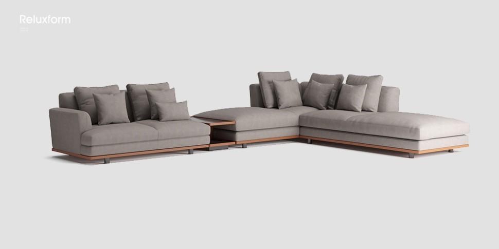
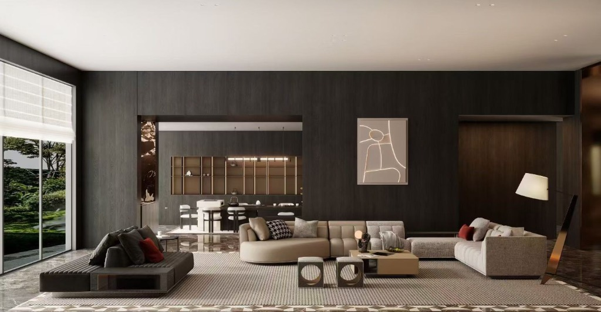

# Furniture Replacement / 家具替换

## 效果预览 / Preview

> Replace specific furniture items in a scene with a provided reference while maintaining perspective and lighting.
>
> 使用参考图替换场景中的特定家具，同时保持透视和光照。


*Input 1: Reference Furniture / 家具产品照片*


*Input 2: Target Scene / 室内场景照片*


*Output: Furniture Replaced / 家具替换后*

---

## 提示词 / Prompt

**English:**
```markdown
Using the first uploaded image as the furniture reference and the second uploaded image as the target interior scene, replace the [specify furniture item: sofa/coffee table/bed/dining table/chairs/cabinet/side table/etc.] in the target scene with the furniture shown in the reference image. Position the reference furniture in the same spatial location as the original furniture, matching the perspective angle and viewing position of the target scene. Scale the reference furniture appropriately to fit the spatial context and maintain proportional relationships with surrounding elements. Apply the target scene's existing lighting conditions, shadows, and reflections to the newly placed furniture to ensure natural integration. Preserve all other elements in the target scene completely unchanged, including walls, flooring, other furniture pieces, decorative items, architectural features, and spatial configuration.
```

**中文:**
```markdown
使用第一张上传的图片作为家具参考，第二张上传的图片作为目标室内场景，将目标场景中的 [指定家具：沙发/茶几/床/餐桌/餐椅/柜子/边几等] 替换为参考图中显示的家具。将参考家具放置在与原始家具相同的空间位置，匹配目标场景的透视角度和观看位置。适当缩放参考家具以适应空间语境并保持与周围元素的比例关系。将目标场景现有的光照条件、阴影和反射应用于新放置的家具，以确保自然融合。保持目标场景中的所有其他元素完全不变，包括墙壁、地板、其他家具、装饰物品、建筑特征和空间配置。
```

---

## 💡 Tips / 使用技巧

### 使用说明（Translation Notes）
上传顺序说明：

*   第一张图：家具产品照片（可以是产品图、实拍照片、或其他场景中的家具）
*   第二张图：需要替换家具的室内场景照片

填写参数说明：
在提示词中的 `[specify furniture item]` 位置填入具体要替换的家具类型：

**起居空间家具：**
*   `sofa` - 沙发
*   `coffee table` - 茶几/咖啡桌
*   `side table/end table` - 边几/角几
*   `armchair` - 单人扶手椅
*   `TV stand/media console` - 电视柜
*   `bookshelf/shelving unit` - 书架/置物架

**餐厅家具：**
*   `dining table` - 餐桌
*   `dining chairs` - 餐椅
*   `sideboard/buffet` - 餐边柜

**卧室家具：**
*   `bed/bed frame` - 床/床架
*   `nightstand/bedside table` - 床头柜
*   `dresser` - 梳妆台/五斗柜
*   `wardrobe` - 衣柜

**其他家具：**
*   `desk` - 书桌/办公桌
*   `office chair` - 办公椅
*   `console table` - 玄关台
*   `ottoman/pouf` - 脚凳/坐墩
*   `bench` - 长凳

**示例应用：**
*   如果要替换沙发：
    `"...replace the sofa in the target scene..."`
*   如果要替换茶几：
    `"...replace the coffee table in the target scene..."`
*   如果要替换一组餐椅：
    `"...replace the dining chairs in the target scene..."`

---

## 标签 / Tags

`#furniture-replacement` `#product-viz` `#interior-design` `#virtual-staging`
`#家具替换` `#产品可视化` `#室内设计` `#虚拟软装`

---

**Last Updated**: 2025-12-06
**Version**: 1.0
